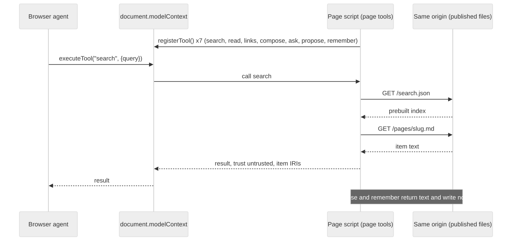

# Architecture guide — the system in pictures

**Summary.** A Bundle (a folder of Markdown files) is built by a deterministic engine
into a knowledge node: static files that any host can serve. People, agents, a
browser's own agent and other nodes find the node through one discovery document and
read its surfaces; every change comes back as a proposal a person ratifies. Inside, the
engine is five bounded contexts and one supporting context behind ports and adapters.
Conformance is a chain from a rule to a vector to a run anyone can repeat. This page
walks through those pictures one at a time, in plain words.

**Who this is for:** an architect, a developer, or anyone who wants to see how the
parts meet. **Read after:** [START-HERE.md](START-HERE.md). **Read next:**
[CODE-ORIENTATION.md](CODE-ORIENTATION.md) for the code, [ARCHITECTURE-DDD.md](ARCHITECTURE-DDD.md)
for the domain model, [PLAN.md](PLAN.md) for the decisions.

Every picture has its Mermaid source in [diagrams/](diagrams/README.md) (the truth) and a
rendered copy in [diagrams-rendered/](diagrams-rendered/) for viewers that cannot draw
Mermaid. The rules of `spec/` win over every picture.

---

## 1. The system in one picture

Source: [diagrams/arch-system-overview.md](diagrams/arch-system-overview.md).

- **Where knowledge is written.** People edit Markdown; agents propose changes. The
  folder is the Bundle: `content/` holds the items, `agsc.config.json` the settings
  (AGSC-01-01…04).
- **The engine.** `agsc lint` checks, `agsc build` writes the node, `agsc ci` builds
  twice and compares the bytes, then verifies (AGSC-09-08).
- **The node.** Static files only (AGSC-00-02): HTML pages, the graph in four RDF
  syntaxes, `llms.txt`, a chunk export, a search index, skill packs, boards, and one
  discovery document at `/.well-known/knowledge-linkset` that names every machine file
  with its SHA-256 digest (AGSC-06-07, AGSC-06-08). Every page points at that document
  through the registered relation `describedby` (AGSC-06-25).
- **Readers.** A person reads pages; an agent or crawler starts at the discovery
  document; a browser's own agent calls the seven tools the page registers
  (AGSC-09-16); a local assistant runs `agsc mcp` over the Bundle (AGSC-09-13).
- **Other nodes.** A node names its peers; a *client* walks from one node to the next.
  A node never fetches another node (AGSC-11-13).
- **Changes.** Only as proposals — a pull request or a channel message — that a person
  ratifies, directly or through a standing rule the person recorded (AGSC-08-08).

## 2. Three zoom levels (C4)

**Level 1 — the context.** Who uses the system, and which outside systems it touches.

Source: [diagrams/arch-c4-context.md](diagrams/arch-c4-context.md). The forge (a git
host with pull requests and CI) is where review happens; the host only serves files;
other tools' formats come in and go out through import and export. Nothing outside is
reached during a build (AGSC-04-03).

**Level 2 — the containers.** The runnable parts of this distribution.

Source: [diagrams/arch-c4-container.md](diagrams/arch-c4-container.md). `agsc` has
sixteen verbs (AGSC-09-07). `agsc-host` is a separate helper for hosting. The nine
checkers in `tools/` import nothing from the engine, so what they check is the
standard itself and a built node, not the engine's opinion of them (AGSC-09-90).

**Level 3 — the components of the engine.**

Source: [diagrams/arch-c4-component.md](diagrams/arch-c4-component.md).

| Context | Owns | Folder |
|---|---|---|
| Knowledge | items, links, the graph and its four RDF views, chunks, adoption, the content version | `src/knowledge/` |
| Governance & Provenance | provenance, lints, gates, the derived ledger, boards, agent lanes | `src/governance/` |
| Composition | selection and closure, the Harness, skill packs | `src/composition/` |
| Distribution | every route, page, header and surface of a built node | `src/distribution/` |
| Boundary | peers and federation, visibility, the agent-surface contract | `src/boundary/` |
| Interchange (supporting) | foreign formats in and out | `src/interchange/` |

The **ports** are four interfaces — FileSystem, Clock, ProcessRunner, Network — and the
**adapters** implement them over Node. Knowledge, Governance and Composition never touch
a file, a process, a clock or the network; only the application layer builds adapters.
Two architecture tests enforce this: `tests/arch/context-boundaries.test.js` and
`tests/arch/core-purity.test.js`. [src/README.md](../src/README.md) §2 has the full map.

## 3. The build pipeline

`agsc build` runs its steps in a fixed order — discover the files in code-point order,
parse, validate, resolve links, compile diagrams, write the graph, the search index,
the pages, the discovery files, NOW and the digests — and `agsc ci` adds the second
build and the byte comparison, then derives and re-verifies the ledger from the git
history.

Source: [diagrams/algo-build-pipeline.md](diagrams/algo-build-pipeline.md). The build
instant comes from `SOURCE_DATE_EPOCH` or the last commit, never the wall clock
(AGSC-04-09), which is why two builds, on two machines, give the same bytes
(AGSC-04-01, AGSC-04-02).

## 4. One page tool call

Source: [diagrams/flow-page-tool-call.md](diagrams/flow-page-tool-call.md). The page
registers the seven tools only when the browser offers `document.modelContext`; without
it, the page works unchanged. A tool reads the node's own published files from the same
origin — no other host, no key, no cookie (AGSC-06-05) — and answers what the local
tool server answers for the same input over the published items; vector `cli-0003`
proves it call by call. `propose` and `remember` return text and write nothing
(AGSC-09-16).

## 5. The conformance chain

Source: [diagrams/flow-conformance-chain.md](diagrams/flow-conformance-chain.md).

1. A **rule** in `spec/` says what MUST hold, with a permanent id.
2. A **vector** in `tests/vectors/` pins it: an input and the expected bytes or error
   code (AGSC-09-04, AGSC-09-05).
3. A **runner** in any language runs the vectors of one Level (AGSC-10-15) and writes a
   report (AGSC-09-03).
4. The **checkers** check the specification, the vectors and a built node without
   importing the engine (AGSC-09-90).
5. A **claim** names one Level and one released version and rests on a green run
   (AGSC-10-01); the reference engine claims nothing before 1.0.0 (AGSC-10-05).

[RULE-COVERAGE.md](RULE-COVERAGE.md) lists, for every active rule, the checks that
verify it.

## 6. The release flow

Source: [diagrams/flow-release.md](diagrams/flow-release.md). The maintainer runs the
checks locally (`node tools/release` is a dry run that never publishes), then pushes
the specification's tag and the engine's `v` tag on one commit. Only the `v` tag starts
`.github/workflows/release.yml`, which re-runs the gates, packs once, attests the
tarballs and publishes exactly those, with no stored token.

## 7. Where a node can live

A node is a set of files, and so is its build; neither depends on a transport. It can
live on a web host, a local machine, a git repository, a content-addressed network such
as IPFS, a small device, or a store anchored in a ledger with a web interface in front.

Source: [diagrams/arch-node-hosting.md](diagrams/arch-node-hosting.md).

- **What the place must do.** Conformance is claimed for an HTTPS origin: the discovery
  document and the routes are served there, with the response headers the build wrote
  (AGSC-06-17, AGSC-11-03, AGSC-11-05) — by the place itself or by a web interface in
  front of it.
- **How the place is told.** A *hosting profile* — a plugin of the deployment-profile
  kind (AGSC-00-24) — translates the build's header and redirect rules for one kind of
  place. `agsc-host list` shows the seven built-in profiles, each with what it claims
  and what it cannot do. Cloudflare Pages is the reference profile.
- **A ledger as an anchor.** The `ledger-anchor` profile writes a record of one build —
  the bundle hash, the content version (AGSC-04-25), the ledger head — that a ledger can
  carry; `agsc-host verify-anchor` checks a build against it. The ledger does not serve
  the node.
- **Honest limits.** No rule of version 1.x pins a transport other than HTTP. Some
  places cannot set response headers (GitHub Pages, a bare IPFS gateway) and need
  something in front; the profile says so.

The full table, profile by profile, is in [CONNECTORS.md](CONNECTORS.md#where-a-node-can-live);
a conformance claim names its profile ([CONFORMANCE-STATEMENTS.md](CONFORMANCE-STATEMENTS.md)).

## 8. More pictures

[diagrams/README.md](diagrams/README.md) indexes every diagram: the combiner, the
ledger, the item and proposal life cycles, the domain schema, the ontology mapping, the
user flows, the CI lanes, the agent lane, the migration, and how the specification's
chapters depend on one another.
