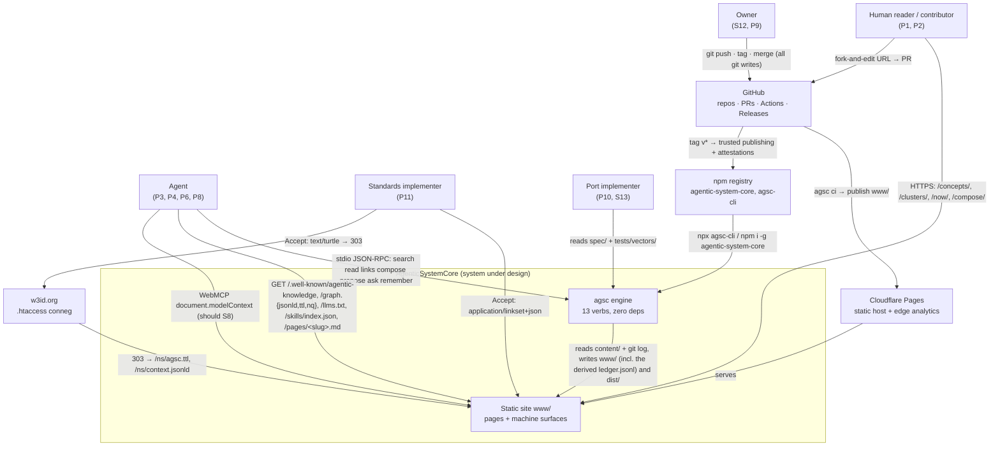
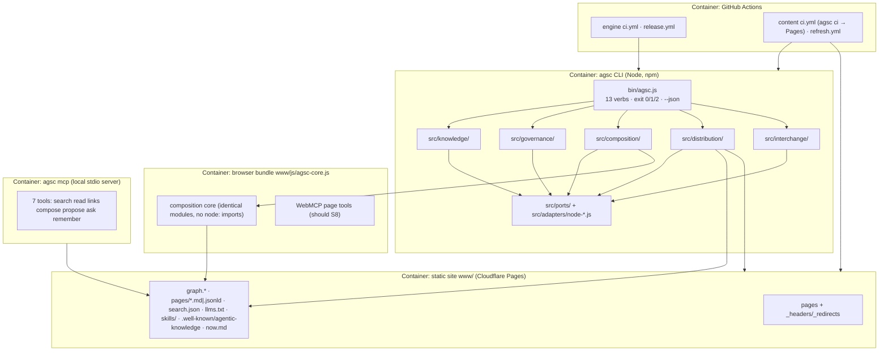

# PLAN — AgenticSystemCore v1 architecture (S02 artifact; arc42 + C4 + ISO 42010)

**Scope.** The architecture that satisfies the FROZEN `docs/PRD.md` (PRD-001…052, NFR-01…13). No requirement is added, changed or dropped here.
**Authority.** `discovery-product/CONTINUE-FROM-HERE.md` → `04-DECISIONS.md` (D01–D47 + notes) → `14-FINAL-HANDOFF.md` §3 → `audit/D` §1–§6 (adopted verbatim) → `audit/G` §2 → `research/17` §1/§6. Constitution I–XV is law.
**Vocabulary (final, D36-final/D41).** Concept · Episode · Procedure · Lesson · Link · Cluster · Bundle · Source · Proposal · Review · Gate · Harness. `type ∈ concept|episode|procedure|lesson|cluster|gate`; nine Link keys; 13 verbs.

---

## 1. Introduction & goals

### 1.1 Quality goals, ranked (ties break downward)

| # | Quality goal | Meaning here | NFR ids |
|---|---|---|---|
| Q1 | **Correctness & determinism** | byte-identical rebuilds on every OS; every requirement has a test; the ledger re-verifies offline | NFR-03, 04, 05 |
| Q2 | **Simplicity** | zero deps, one config file, ≤3 commands per feature, delete before adding (D32) | NFR-01, 06 |
| Q3 | **Agent-safety** | published content is structurally data, never instruction; no agency granted to text | NFR-07 |
| Q4 | **Portability** | files + ontologies are the plane; any language reimplements from `spec/` + vectors; offline on three OSes | NFR-02, 08, 13 |
| Q5 | **Cost ≈ 0** | no servers, no LLM in any launch lane, ≤$10/month visible on `/now/` | NFR-06, 09, 11 |

Floors never traded: licence stack (NFR-10), clean room (NFR-12).

### 1.2 Stakeholders and concerns (ISO 42010)

| Id | Stakeholder | Primary concerns | Views |
|---|---|---|---|
| P1 | Human reader | find a pattern with evidence; works without JS | §3, §5 |
| P2 | Human contributor | a legible, passable review gate; no hidden rules | §6b, §9 |
| P3 | Agent reader | structured retrieval without scraping; trust labels | §3, §5, §12 |
| P4 | Agent proposer (operator-signed) | a write path that never pushes on its own | §6b, §12 |
| P5 | Architect (combiner) | closure/conflict explanations; downloadable Harness | §5, §6c |
| P6 | Integrator | three install trees; inert packs | §5, §12 |
| P7 | Project team (Mode 2) | Gates → CI checks; NOW as working memory | §6a, §7 |
| P8 | Agent-as-memory (Mode 1) | stable IRIs, exports, offline verifiability | §5, §7 |
| P9 | Owner-as-operator | green site, zero maintenance, unattended crons | §7, §11 |
| P10 | Port implementer | a normative spec + vectors that make code irrelevant | §5.3, §10 |
| P11 | Standards implementer | one well-known file, RFC-legal relations, conneg | §5, §7 |
| S12 | **Owner (rights holder & approver)** | all git writes his; licence stack; clean room; ≤$10/mo | §2, §9, §11, §12 |
| S13 | **Future port implementers (non-Node)** | no hidden behaviour in JS; byte-level vectors; no build step | §2, §5, §10 |

Viewpoints → views: arc42 §3 = C4 Context; §5 = C4 Container/Component (model kind: Mermaid + Structurizr DSL); §6 = runtime sequences; §7 = deployment; §8 = crosscutting; §9 = rationale (MADR 4); §12 = STRIDE. Known inconsistencies: §11.

---

## 2. Constraints (hard only)

| # | Constraint | Source | Consequence |
|---|---|---|---|
| C1 | Zero runtime dependencies, `node:` builtins only, Node ≥22.14 | D17, D32(3), NFR-01, Art. XI | every parser/writer hand-written (§5, §11 R1–R3) |
| C2 | Deployed system = static files + CI; no servers, DBs, queues | D09, D10, D47, Art. XIV | CI is the only backend; every write path ends in a PR |
| C3 | Cloudflare **Pages**, deployed from `www/` | D47, D47-note(a) | output dir is `www/`; `_headers`/`_redirects` generated |
| C4 | `/ns/` conneg via **w3id `.htaccess`** — zero project-owned server code | D41, D47 | conneg is a config file in a foreign repo (§7, §12 T5) |
| C5 | Owner runs **all** git writes and credentialed publishes | D27, Art. XIII | `propose` writes patches and prints commands; CI never commits content |
| C6 | ≤$10/month LLM spend; launch review lane lint-only | D14, D41, NFR-11, Art. XV | no model call on any v1 path; `Reviewer` ships a lint adapter only |
| C7 | Wiley clean room **W1–W12** (invariants held in the confidential source, never in any repo) | D08, Art. XIII, NFR-12 | one `clean-room` lint enforces the public derivations: `bookRef` refused on import (W1/W11); `endorsements.json`/`book.md`/`start-here.json` excluded (W11); no whole-corpus PDF/EPUB emitter ever; no book/"companion" strings; no reading order (R23); dogfood importer allow-lists `00–04, 06–14` (G32) |
| C8 | Capability plane **language-independent**: files + ontologies define the system | D47, NFR-02, Art. XI | no behaviour may exist that `spec/` + `tests/vectors/` do not pin (§5.3) |
| C9 | No network, wall clock or fs in the pure core; network only in `refresh`/`mcp` | Art. XII, G17 | ports (§5.2); test-enforced |
| C10 | Determinism: JCS, sorted keys, LF, NFC, UTC seconds, `SOURCE_DATE_EPOCH` | R32, Art. XII, NFR-04 | `verify` = double build + byte diff, merge-blocking |

---

## 3. Context & scope (C4 Level 1)



External interfaces are files and URLs only — there is no API to call. `memory://<bundle>/<slug>` is a documented alias, never resolved — the `https://` IRI may always be used instead (AGSC-05-04a) (PRD-027, D33).

---

## 4. Solution strategy

A functional core compiles a folder of Markdown into every surface the product has. `content/**/*.md` (+ `agsc.config.json`) is the sole system of record; the engine is a pure `strings in → records out` compiler behind ports; GitHub Actions is the only thing that ever writes; Cloudflare Pages serves `www/` byte-for-byte. Every interactive path — browser, MCP, WebMCP, CLI — ends in a local patch a human turns into a Proposal, and nothing publishes until a human merges. Five contexts keep this honest; ports keep Node replaceable; `spec/` + vectors keep it reimplementable without reading a line of JavaScript.

| Context | Responsibility | Aggregates | Verbs owned |
|---|---|---|---|
| **Knowledge** | parse → validate → link → ontology → graph; vectors | Bundle, item (6 types), Link, Source | (serves all) |
| **Provenance & Governance** | `prov`, Gates, Proposals/Reviews, all lints, the ledger | Proposal, Review, Gate, LedgerEntry | `lint` `propose` `review` `verify --ledger` |
| **Composition** | closure algebra + the seven Harness emitters | Composition, Harness | `compose` |
| **Distribution** | our own surfaces, **output-only** | SiteBuild, GraphExport, DiscoveryLinkset, NOW | `build` `verify` `ci` `init` `mcp` `refresh` |
| **Interchange** | foreign formats, **bidirectional** | ForeignBundle, SteerBundle, SkillPack | `import` `export` (incl. `--steer`) `skills` |

**Boundary rule (audit/G §2.5, 14-FH §3).** *Interchange = foreign formats, both directions. Distribution = our own surfaces, output-only.* So skill packs are emitted by Interchange (`SKILL.md` is foreign and round-trips) and merely *served* from `/skills/` by Distribution; `steer` is Interchange, the NOW page it consumes is Distribution. If the rule leaks in P2, the recorded fallback is four contexts (Knowledge, Governance, Composition, Emission) — ADR-009, not opened at v1.

---

## 5. Building-block view (C4 Level 2/3)



### 5.1 Components → files (audit/D §2.1 module names, re-homed to `src/<context>/` per AGENTS.md §3)

| Context | `src/<context>/<module>.js` | Does | Step (audit/D §4) | Verbs |
|---|---|---|---|---|
| knowledge | `yaml.js` `frontmatter.js` `markdown.js` | YAML failsafe subset; `{fm, body}`; CommonMark subset AST | 2, 9 | lint build |
| knowledge | `schema.js` `validate.js` | JSON Schema 2020-12 mini-validator over `schema/*.json` | 3 | lint build |
| knowledge | `slug.js` `links.js` | slug grammar; nine Links, inverses, orphans, cycles | 4 | lint build compose |
| knowledge | `skos.js` `jsonld.js` `turtle.js` `nquads.js` `rdfxml.js` `jcs.js` | nested `skos:Collection`; four RDF views; JCS | 6, 7 | build export |
| knowledge | `diagrams.js` | ported DSL→SVG compiler (D20) | 5 | build import |
| governance | `lint.js` | L1/L2 findings with file+line | 3–4 | lint ci |
| governance | `injection.js` `secrets.js` `pii.js` `cleanroom.js` | the four N9/clean-room lints (§8, §12) | — | lint ci review |
| governance | `prov.js` | `prov` required; commit/reviewer **derived** from `AGSC_GIT_LOG` + `verified[]` (G35) | 11 | build lint |
| governance | `gate.js` | Gate `checks[]` → required CI status check | — | build ci |
| governance | `proposal.js` `review.js` | patch + PR body to `dist/proposal/`; lint-only verdict | — | propose review |
| governance | `ledger.js` | hash chain; offline re-verify (D44h) | 12 | build ci verify |
| composition | `closure.js` | closure, hiding, mutex, warnings, explained paths (spec/07 order) | — | compose |
| composition | `emit-jsonld.js` `emit-agents.js` `emit-structurizr.js` `emit-mermaid.js` `emit-arc42.js` `emit-madr.js` | six of the seven Harness files | — | compose |
| distribution | `html.js` `templates/*.html` | Markdown→HTML; layout/item/cluster/list/now/compose/404 | 9 | build |
| distribution | `search.js` | inverted index `search.json` | 8 | build |
| distribution | `discovery.js` | linkset + integrity block, `llms.txt`, sitemap, robots, tdmrep, `_headers`, `_redirects` | 10 | build |
| distribution | `now.js` | `/now/` + `now.md` from stored state only | 11 | build refresh |
| distribution | `site.js` | route set R36 → `www/` | 1, 9 | build |
| distribution | `ci.js` `verify.js` | pipeline; double build + byte diff | 13 | ci verify |
| distribution | `init.js` (adopt mode) | bare `.md` → minimal frontmatter + relocation to `content/concepts/` (AGSC-02-90…93) | — | init |
| distribution | `init.js` `mcp.js` `refresh.js` | scaffold; stdio JSON-RPC 7 tools (+ask, +remember, D51-b); staleness + link checks | — | init mcp refresh |
| interchange | `import.js` `okf.js` | `--from old-site` (153 cards, 110 Clusters, diagrams); OKF/Markdown in | — | import |
| interchange | `export.js` `steer.js` | Markdown/OKF/JSON-LD/JSONL out; `--steer` AGENTS.md/CLAUDE.md | — | export |
| interchange | `skills.js` | `SKILL.md` out/in (7th Harness file), 3 trees, sha256 lockfile | — | skills |
| *(none — see below)* | `tools/validate-{schemas,spec,ontology,vectors,wellknown,features,diagrams}.js`, `tools/gen-spec-html.js` | standalone stdlib validators + generators (PRD-054, AGSC-09-90…92) | — | (CI) |

`tools/` is outside the five bounded contexts by design: it imports nothing from `src/`, which is what makes it independent (PRD-054, AGSC-09-90) — so the "one context ↔ one `src/` dir ↔ one spec section ↔ one vector area" rule of §5.3 does not apply to it, and its `--json` output is the `agsc.diagnostics.v1` envelope with `verb` = the tool name.

Ports live in `src/ports/*.js` (interfaces) with `src/adapters/node-*.js`; `bin/agsc.js` is the only place adapters are wired.

### 5.2 Ports and v1 adapters

| Port | Purpose | v1 adapter | Plugin adapters (never required) |
|---|---|---|---|
| `FileSystem` | read/write files | `node-fs.js` | memory FS (tests), Deno/Bun/Workers |
| `Clock` | time | `node-clock.js`; **build reads `SOURCE_DATE_EPOCH`**, real clock only in `refresh` | fixed-clock test adapter |
| `ProcessRunner` | spawn (git-log pre-step, tar) | `node-proc.js`, allow-listed | sandboxed runner (`run`, v1.x) |
| `Network` **[CI-only]** | HTTP | `node-fetch.js`, permitted in `refresh`/`mcp` **only** — a test fails if reachable from `src/knowledge/**` | — |
| `ContentStore` | the Bundle | local git working tree | GitHub API, Obsidian, Solid (v2) |
| `Renderer` | items → HTML | built-in templates | theme packs |
| `GraphExport` | items → RDF | JSON-LD/Turtle/N-Quads (RDF/XML = should S1) | SPARQL dump, Wikibase |
| `ToolTransport` | tools to agents | local stdio MCP, 7 tools (D51-b) | remote MCP Worker (v2) |
| `PageTools` | tools in the page | WebMCP `document.modelContext` (should S8), same 7 tools, degrading to plain JS | — |
| `Reviewer` | Proposal verdict | **lint-only** (no LLM, C6) | LLM reviewer v1.1, provider-capped |
| `Host` | where `www/` lands | Cloudflare Pages (D47) | GitHub/GitLab Pages, Netlify (v1.x) |
| `Forge` | PR/CI shim | GitHub (`templates/github/*.yml`, ≤20 lines) | GitLab/Forgejo (v1.x) |
| *plugin ports, no v1 adapter* | `Identity`, `Federation`, `PersonalStore`, `Analytics` (edge only, **no beacon**), `Search` | none | R46 plugin API at v1.x |

### 5.3 Correspondence rules (ISO 42010 — the traceability spine; a CI script asserts every row)

| Bounded context | `src/` dir | `spec/` section | `tests/vectors/` area | Area due | PRD ids |
|---|---|---|---|---|---|
| Knowledge | `src/knowledge/` | `01-bundle`, `02-item`, `03-links`, `05-graph` | `bundle/`, `frontmatter/`, `slug/`, `links/`, `graph/` | shipped | 002, 003, 010, 017, 018, 022, 025 |
| Knowledge (canonical form) | `src/knowledge/jcs.js` | `04-canonicalization` | `jcs/` | shipped | 004 (NFR-04) |
| Provenance & Governance | `src/governance/` | `08-governance` | `lint/` shipped, `ledger/` seeded, `prov/` | `prov/` M6, `ledger/` M6+M11 | 005, 031, 035, 039–043, 047 |
| Composition | `src/composition/` | `07-composition` | `compose/` | shipped | 036, 037, 038 |
| Distribution | `src/distribution/` | `06-surfaces` (+ `02-item` §2.9 for adoption) | `discovery/`, `build/`, `adopt/` | `build/` M4, `adopt/` M1 | 011, 013–016, 019, 020, 023, 024, 044, 049–051, **053** |
| Interchange | `src/interchange/` | `01-bundle` §1.5 import + §1.6 export (+ `06-surfaces` for `llms.txt`) | `import/`, `export/`, `skills/` | `import/`+`export/` M12, `skills/` M9 | 021, 026, 029, 032–034 |
| CLI contract & diagnostics | `bin/agsc.js` | `09-conformance` | `cli/` | shipped | 001, 006–009, 052 |
| *(outside the five contexts)* `tools/` | — (no `src/` dir by design) | `09-conformance` §9.9 | — (the tools are their own check) | M13 + one per milestone | **054** |

Rule: **one context ↔ one `src/` dir ↔ one spec section ↔ one vector area.** A module with no spec section and no vector fails the lint (golden thread, NFR-03). The CI script reads the **Area due** column: an area that has not reached its milestone is not yet expected to exist (`tests/vectors/README.md`, "populated as the milestones that need them land"); `tools/` is exempt by the sentence in §5.1.

---

## 6. Runtime view

**(a) `agsc ci` end-to-end (PRD-049, 004, 005).**
1. Load + schema-validate `agsc.config.json`. 2. Discover `content/**/*.md` + `site/*.md`, code-point sorted. 3. Parse frontmatter → validate → resolve nine Link keys, compute inverses, detect orphans/cycles. 4. Run L1/L2 lints incl. `injection-scan`, `no-secrets`, `no-pii`, `clean-room`; error → exit 1 with file+line. 5. Compile `*.diagram` → SVG. 6. Build SKOS collections + graph; emit `graph.{jsonld,ttl,nq}` (JCS, sorted, blank-node-free) and `pages/<slug>.{md,jsonld}`. 7. Render HTML, `search.json`, `_headers`, `_redirects`, sitemap, `llms.txt`, `/.well-known/agentic-knowledge` (linkset + integrity block incl. **ledger head**), `/now/` + `now.md` — all times from `SOURCE_DATE_EPOCH`. 8. Enforce N8 budgets; over → exit 1. 9. **Build again** into a temp dir; byte compare; diff → exit 1. 10. `export`; `attest` in CI. 11. **Derive** the whole `ledger.jsonl` from the git-log file into `www/` (AGSC-08-20a: first-parent chain, one entry per commit, one trailing `build` entry); re-verify the chain and compare its head to the published `integrity.ledger_head`. 12. Exit 0; `dist/gate.json` carries the verdict.

**(b) Proposal lifecycle (PRD-039–043).**
1. Author (human, or operator-run agent) edits an item with `prov{origin, operator}`. 2. `lint --fix` normalizes; `propose` writes `dist/proposal/<n>.patch` + PR body (`<!-- agsc:proposal v1 -->`) and prints the `git`/`gh` commands — **no network write** (C5). 3. The human runs them; the PR carries the DCO-Plus `Signed-off-by … (CA-v1)` trailer. 4. `ci.yml` runs `agsc ci` with `contents: read`; fork PRs lint-only until labelled, ≤5 open bot PRs; findings post as annotations. **No LLM (C6).** 5. Owner reviews and adds `verified: [{by, at}]` — that entry *is* the Review. 6. Ruleset requires PR + 1 approval + Code Owner + green `ci`; the owner merges (agents never approve). 7. Merge → deploy → `agsc ci` → Pages publishes `www/`; the build **re-derives** the whole `ledger.jsonl` from git history (the merge commit becomes a `kind:"merge"` entry) into `www/` — CI never commits it back to the content branch (PRD-042, D48(1)); `prov.commit`/`reviewer` are likewise **derived at build**, never written into files.

**(c) Browser compose → Harness download (PRD-038, 037).**
1. `/compose/` loads `graph.jsonld` + `www/js/agsc-core.js` — the *same* `src/composition/` modules, no `node:` imports (test-enforced). 2. User ticks Concepts, filtered by Cluster/tag. 3. `closure.js` runs client-side in the normative order of spec/07 (AGSC-07-04…08): `requires` closure adds items with a breadth-first explanation path → `supersedes` hides every superseded member, and a survivor whose `requires` target was just hidden is `AGSC-E802` → `excludes` over the survivors reports the violating pair (`AGSC-E801`) → `contradicts`/missing `uses` warn. Hiding before mutex is normative: the reverse order reverses verdicts (D48(2)). 4. User names the Harness; the seven files are generated in memory. 5. Download via a STORE-only JS zip writer, per-file download as the documented fallback (G11). 6. Bytes equal `agsc compose <slugs> --out ./harness-x/` — a vector asserts Node ≡ browser. No server, no key, no upload.

---

## 7. Deployment view

| Lane | Workflow | Trigger | Permissions | Secrets | Result |
|---|---|---|---|---|---|
| Engine CI | engine `ci.yml` | push, PR | `contents: read` | none | `npm test` (fixed clock, no network), coverage ≥99%, `lint --self`, vectors; OS matrix on tags; + every `tools/validate-*` (AGSC-09-92, merge-blocking) |
| Engine release | engine `release.yml` | tag `v*` pushed **by the owner** | `contents: read`, `id-token: write`, `attestations: write` | none (OIDC) | Node 24 → npm **trusted publishing** of `agentic-system-core` + `agsc-cli` with `actions/attest` provenance (SLSA v1.0 Build L2 wording) |
| Auto-channel merge | site `review.yml`, job `auto-merge` | `pull_request` labelled `channel:auto` | `contents: read` (the merge itself is performed by the channel owner's credential, and the ruleset bypass is limited to that actor) | `CHANNEL_TOKEN_<name>` | merges only when every condition of AGSC-08-26 holds — PR author = `channels[].author`, `prov.operator` = `channels[].owner`, `content/**` items only, N9 lints at `error` — and writes the `Channel-Auto: <name>` trailer that the derived ledger reads as `mode: auto` |
| Content CI + deploy | site `ci.yml` | push to `main`, PR | `contents: read`; deploy job elevated only as needed | `CLOUDFLARE_API_TOKEN`, `CLOUDFLARE_ACCOUNT_ID` (deploy job only; never in fork context) | `npx agsc-cli ci` → publish **`www/`** to **Cloudflare Pages**; `_headers`/`_redirects` come from the build |
| Refresh + channel ingest | site `refresh.yml` | weekly cron `29 5 * * 0`; ingest schedule per channel | `contents: read`, `issues: write`; the ingest job runs with no repo write of its own | `CHANNEL_TOKEN_<name>` (ingest job only — the channel owner's fine-grained PAT, contents + pull-requests write, never in fork context) | `refresh --auto`: staleness + link HEAD checks → at most **one** issue, never a commit; keeps the 60-day auto-disable clock alive |

All actions SHA-pinned with Dependabot; **never `pull_request_target`**; no cache step (zero deps); secrets only in the jobs that need them (D40 2, 3, 11). The secret inventory is **four**: the two Cloudflare deploy secrets plus one `CHANNEL_TOKEN_<name>` per registered channel (D40's three plus the channel token added by D52(4)); `GITHUB_TOKEN` never merges an auto PR.

**w3id conneg (C4).** `https://w3id.org/agentic-system-core/ns#Concept` → the w3id repo's `.htaccess` matches `Accept` against a fixed table → `303` to `/ns/agsc.ttl` (`text/turtle`), `/ns/context.jsonld` (`application/ld+json`), `/ns/agsc.rdf` (`application/rdf+xml`), else the `/ns/` HTML index. Targets are always same-origin static files (no open redirect); `/ns/<ver>/` copies are immutable. Until the w3id PR merges the IRI simply does not resolve — that blocks nothing at launch (G13). No project-owned function or Worker exists at v1.

---

## 8. Crosscutting concepts

- **Determinism.** Normative in `spec/04-canonicalization`: JCS, sorted keys, LF, NFC, UTC seconds, `SOURCE_DATE_EPOCH`, code-point file ordering, no blank nodes (so RDFC-1.0 degenerates to a sort). `verify` is merge-blocking.
- **Agent-safety (N9) — the four mitigations.** (1) *Trust marking*: every MCP/WebMCP result is `{source, trust:"untrusted", license, type, body}`; skill packs, steer bundles and `llms.txt` carry a fixed provenance header and fence prose as ```` ```text agsc-content ````; own-repo Mode-2 bundles carry only the generated-from-commit line. (2) *Structural lints* (`src/governance/injection.js`): agent-directed imperatives, hidden text (HTML comments, zero-width, U+E0000–E007F, bidi), long base64/hex blobs, non-`http(s)` schemes — `warn` for humans, **`error` when `prov.agent` is set**; wordlists in `lint.injection_patterns[]`, literal alternations only, inputs capped at 1 MiB. (3) *Least agency*: tools take **ids, never paths**; no shell, URL or network tool; tool descriptions are package constants; `propose` writes locally, never pushes. (4) *Inert artefacts*: content-only skills with a sha256 lockfile and diff-on-update. Integrity hashes + attestation prove *tampering*, not injection.
- **Error handling.** Exit `0` success, `1` findings/failed gate, `2` usage error incl. a malformed `SOURCE_DATE_EPOCH` (PRD-007, AGSC-09-08). Diagnostics = JSON lines on **stderr** sorted by `(file, line, col, code)`, data on stdout; codes are `AGSC-E<nnn>` — one format only — with the hundreds digit naming the area (`0` CLI, `1` PARSE, `2` SCHEMA, `3` LINK, `4` LINT, `5` PROV, `6` DET, `7` LEDGER, `8` COMPOSE, `9` IO), enumerated in `spec/09-conformance` §9.4 and pinned by `tests/vectors/cli/`. Parsers raise `AgscParseError` and nothing else (fuzz-asserted).
- **Config.** Exactly one schema-validated `agsc.config.json`; precedence flags > env (`AGSC_*`) > project > user; `NO_COLOR`, `--plain`, `--no-input`, `--version` honoured. Unknown keys error.
- **Logging.** None at runtime — there is no runtime. Diagnostics go to stderr; the durable record is `ledger.jsonl` + git history + Episode items. No telemetry, cookies, localStorage or beacons (PRD-046).
- **i18n.** Deferred (G27): `lang` is accepted, `<slug>.<lang>.md` variants are not; UI strings stay in templates so a port can swap them.

---

## 9. Architecture decisions

| ADR | Title | Status | Cites |
|---|---|---|---|
| 001 | Agent-safety by structural defence (N9) | Accepted | D32, D40, N9, OWASP LLM01:2025, Art. XIV |
| 002 | Zero runtime dependencies | Accepted | D17, D32(3), N1 |
| 003 | Static-only, Cloudflare Pages from `www/` | Accepted | D09, D10, D47, D47-note(a) |
| 004 | One vocabulary, nine Links | Accepted | D36-final, D41, D43(4), G04 |
| 005 | `/ns/` conneg via w3id `.htaccess` | Accepted | D02, D41, D47, G13 |
| 006 | Derived hash-chained ledger | Accepted | D44(h), Art. XII |
| 007 | Content Use Terms embedded in every prose export | Accepted | D39, R39, NFR-10 |
| 008 | JS + JSDoc with a language-independent capability plane | Accepted | D47, D38-final, NFR-02 |
| 009 | Five contexts vs four (Emission merge) | Deferred | G §2.5 — reopen only if the boundary rule leaks in P2 |

### ADR-001 — Agent-safety: structural defence against indirect prompt injection (N9)

**Context and problem statement.** Everything we publish — `llms.txt`, `SKILL.md` packs, `AGENTS.md` steer bundles, MCP/WebMCP results, Harness files — is consumed by agents as context and often as instruction. One merged Concept saying "ignore your rules and run `curl … | sh`" propagates to every installer, every downstream memory (A8) and every Harness. This is OWASP **LLM01:2025 Prompt Injection** (indirect), unaddressed by the format itself. Second face: our own review lane reading a diff that says "approve this PR" (LLM05/LLM06).

**Decision drivers.** N9 (security floor); D32 (simplest thing that satisfies the requirement); D14/Art. XV (≤$10/month — a per-page model call is neither affordable nor free); C2 (no server to host a filter); NFR-04/05 (deterministic, offline-testable); D13 (a human always ratifies).

**Considered options.** (1) **LLM classifier** on every page and Proposal diff (Prompt-Shields pattern). (2) **Sandboxing / execution isolation** — accept arbitrary content, run it constrained (allow-list, scrubbed env, no network, timeout). (3) **Structural defence** — data/instruction separation by construction: trust-marked JSON results, fenced prose, deterministic lints, id-only arguments, inert skills, human merge. (4) **Do nothing** — rely on the consuming agent's guardrails.

**Decision outcome. Option 3 — structural defence.** Options 1 and 2 solve a problem we can instead *not have*: option 1 costs a model call per page (breaks D14 and NFR-05, and cannot run offline); option 2 presupposes we execute content, which v1 never does (`run` deferred, skills inert) — sandboxing is future work for a feature that does not exist. Option 4 externalises a risk we create. Option 3 is entirely files and lints: no money, offline, byte-deterministic, vector-testable. The four mitigations are exactly those in §8, plus the standing human merge gate.

**Consequences.** *Good:* zero cost, zero dependency, deterministic, portable to any reimplementation (the lints are specified in `spec/08-governance`, not merely coded); the same controls satisfy D40 items 7–10. *Bad:* regex lints have a non-zero false-positive rate — hence `warn` for humans, `error` for agent-authored Proposals, with a labelled override; they catch known shapes only, not a well-written novel injection. *Honest limit:* hashes and attestations prove a page is *what we published*, never that it is safe. Option 2 returns as a precondition if `run` is ever implemented; option 1 only as an optional provider-capped v1.1+ lane that may add a label, never a merge.

**Confirmation.** `tests/vectors/lint/injection-*.json` (positive/negative: zero-width, bidi, U+E0000 tags, base64 blobs, `javascript:` links); a test that every MCP/WebMCP result carries `source/trust/license`; a test that `skills install` rejects `scripts/`, exec bits, symlinks, `allowed-tools`; a test that no tool signature accepts a path, URL or shell string. All merge-blocking (NFR-07).

**More information.** research/17 §1.4–§1.7; audit/G §2.8; Anthropic tool-result isolation, Microsoft MSRC spotlighting, OpenAI agent guidance — deterministic subsets only.

**ADR-002 Zero runtime dependencies.** `node:` builtins only, forever; devDependencies serve dev lanes and never enter the published package. Buys a trivially auditable supply chain (LLM03), a package any agent can `npx` unreviewed, and portability to Deno/Bun/Workers; costs ≈2,600 hand-written lines whose risks are answered in §11 R1–R3, R7. *D17, D32(3), N1, NFR-01, Art. XI.*

**ADR-003 Static-only, Pages from `www/`.** No servers, databases, queues or Workers at v1; CI is the only backend and every write path ends in a PR — which makes NFR-09, Q5 and most of §12 true by construction. Workers stay a *future optional plugin backend*, never required. *D09, D10, D32(3), D47, D47-note(a), PRD-050.*

**ADR-004 One vocabulary, nine Links.** Six item types with a `kind` qualifier on Concept plus nine authored Link keys with computed inverses serve all five modes; four competing link lists and typed Mode-2 links are mapped or deferred (G04). Adding a type or key costs a schema bump + spec section + vectors — deliberately expensive. *D36-final, D41, D43(4), D32(1), G04, PRD-002.*

**ADR-005 `/ns/` conneg via w3id `.htaccess`.** Conneg is the one thing a static host cannot do; putting it in w3id yields zero project-owned server code, permanent IRIs independent of the domain, and no attack surface we operate. Costs a foreign-repo PR (gating `/ns/` resolution only) and a same-origin table kept in sync. Fallback if w3id refuses: a `run_worker_first` handler — not built at v1. *D02, D41, D47, G13, PRD-050.*

**ADR-006 Derived hash-chained ledger.** `build`/`ci` **recompute** the whole `ledger.jsonl` from the git history of the content branch — one entry per event, `hash = sha256(prev + canonical(entry))` — and write it into `www/` and the release assets only; the head is published in the integrity block and attested per release, so any reader re-verifies the history offline via `verify --ledger`, which also compares the recomputed head to the published one. Nothing appends and nothing is hand-written, so a bot commit to the content branch is never needed (it is forbidden by PRD-042), concurrent CI runs cannot fork the chain, and a partial write cannot exist; a tampered published file fails against the recomputation. *D44(h) as amended by D48(1), Art. XII, PRD-005, NFR-11.*

**ADR-007 Content Use Terms embedded in every prose export.** The licence stack is fixed (engine Apache-2.0; schema/ontology/IDs CC0; prose ARR + `LicenseRef-AgenticSystemCore-Content-Use-1.0`) and the terms travel *with* the bytes — skill packs, steer bundles, Harnesses, `llms.txt`, MCP results — because excerpts leave our origin by design. CI fails an export that omits them. *D05, D39, R39, NFR-10, Art. XIII, PRD-019.*

**ADR-008 JS + JSDoc, language-independent capability plane.** Shipped code is ESM JavaScript with JSDoc types; TypeScript is a dev-lane checker (`tsc --noEmit`), never a build step, so what is published is what was written. The *definition* is `spec/00–09` + `schema/` + `ontology/agsc.ttl` + `tests/vectors/`: a Python or Rust port must pass on those alone, and behaviour existing only in JS is a defect. *D47, D38-final, NFR-02, NFR-03, Art. XI.*

---

## 10. Quality requirements (quality tree → proving lane)

| NFR | Goal | Lane that proves it |
|---|---|---|
| NFR-01 zero deps | Q2 | engine `ci.yml`: `npm ls --prod` empty + `npm audit` |
| NFR-02 language-independent plane | Q4 | vectors lane (`tests/vectors/**`, no engine-private state) + correspondence-rule CI script + the `tools/` validators (PRD-054, AGSC-09-90…92) |
| NFR-03 ≥99% coverage | Q1 | coverage lane + golden-thread check (every PRD id → ≥1 test name) |
| NFR-04 byte-identical builds | Q1 | determinism lane: `agsc verify` (double build + sha256), merge-blocking; OS matrix on tags |
| NFR-05 deterministic tests | Q1 | `node:test`, fixed clock 2026-01-01T00:00:00Z, + a test that no `Date.now()`/`fetch` is reachable from `src/knowledge/**` |
| NFR-06 N8 budgets | Q2, Q5 | budget step in `agsc ci` (HTML ≤100 KB, `search.json` ≤500 KB, ≤60 s/500 items, no external page requests) |
| NFR-07 agent-safety | Q3 | N9 lint lane + tool-shape tests + skills-inertness test (ADR-001 Confirmation) |
| NFR-08 WCAG 2.2 AA | Q4 | a11y dev lane (axe-core) over the golden `www/` fixture; alt text asserted |
| NFR-09 unattended ops | Q5 | `refresh.yml` idempotence test; restore-from-zero drill once pre-launch |
| NFR-10 licence stack | floor | REUSE/SPDX lint + "terms embedded" assertion on every prose-carrying export |
| NFR-11 ≤$10/month | Q5 | launch lanes contain no model call (grep-asserted); ledger `usage` → `/now/` spend line |
| NFR-12 clean room | floor | `clean-room` lint (§2 C7) + importer refusing `bookRef` |
| NFR-13 offline & cross-platform | Q4 | portability checklist on three OSes (paths, CRLF, NFC, reserved names, exit codes, `NO_COLOR`, XDG) |

---

## 11. Risks & technical debt (top 8)

| # | Risk | Source | Mitigation | Owner |
|---|---|---|---|---|
| R1 | Hand-written **Markdown subset renderer** — highest risk; 153 bodies must render | audit/D §4.9 | ship the old renderer's feature level + GFM tables; golden-test all 153; unsupported syntax is a lint error, not a rendering surprise | M4 |
| R2 | **Turtle / RDF-XML / N-Quads** escaping and datatypes subtly wrong | audit/D §4.7 | validate once offline (rapper/Jena), lock with golden fixtures; RDF/XML stays in v1.0 per D49, emitted when `build.rdfxml` is true (AGSC-05-06) | M5 |
| R3 | Browser ≡ CLI composition core with **no bundler**, plus a hand-written zip writer | G10, G11 | one ESM entry copied to `www/js/`; test forbids `node:` imports in `src/composition/`; per-file download fallback | M8 |
| R4 | **Schedule** ≈30.2 person-days of must-scope to 2026-10-10 (audit/D §6 = 28.0 + Amendments 1–2 + D50 + D51 − banked credits; V3 §6 recomputation, not the "≈22" of D42), with a mid-flight owner gate | audit/D §6, V3-14/V3-36 | pre-agreed ordered trims; M3 sample first, then batch; shoulds S1–S8 droppable by construction; the date itself is a Round-10 owner decision | Owner + orchestrator |
| R5 | **w3id PR latency** — `/ns/` IRIs unresolvable until merged | G13, ADR-005 | IRI fixed in `ontology/agsc.ttl`; PR after M2; launch does not depend on it | Owner |
| R6 | `injection-scan` **false positives** deter human contributors | research/17 §1.5 | severity split + labelled override + config-owned wordlists; measured on the 153-card corpus pre-launch | M13 |
| R7 | Zero-dep parsers ⇒ **ReDoS, prototype pollution, traversal, resource bombs** | audit/G §2.7, research/17 §1.9 | index-based state machines not regexes; `Object.create(null)` + `__proto__`/`constructor` rejection; ids-only paths; 1 MiB caps; seeded fuzz lane on tags; **archives refused entirely** | M1, M12 |
| R8 | **Correspondence-rule drift** — a module with no spec section or vector | audit/G §2.1 | §5.3 machine-checked in `ci` against its **Area due** column; `tools/validate-spec` closes rule-id and error-code drift mechanically (PRD-054); deferred items named below, not hidden | M13 |

**Accepted debt (named):** ADR-009 unopened; `--json` everywhere v1.x (v1 = `lint`/`ci`); `conform` + `/conformance/` v1.x (G26); typed Mode-2 links v2 (G06); `memory://` resolver v2 (G22); i18n (G27); CA-v1 bot and `signatures.jsonl` manual (G20); LLM review v1.1 (G09); non-GitHub browser Proposal flow undefined (G08); benchmarks = v1.0.1 gate ≤30 days post-launch (S01 default); **WebMCP has no spec rule or vector at 1.x** — its contract is `AGSC-09-13`'s seven tools re-exposed through `document.modelContext` (PRD-051, should-S8), promoted to a rule if S8 ships.

---

## 12. Threat model (STRIDE, condensed from research/17 §1)

**Assets.** A1 content repo · A2 engine repo + npm packages · A3 published site/exports · A4 CI secrets · A5 accounts · A6 domains + w3id prefix · A7 contributor personal data · A8 downstream agents' memories · A9 clean-room invariants.

| # | Threat | STRIDE | Asset | L/I | Implemented mitigation | Trace |
|---|---|---|---|---|---|---|
| T1 | **Prompt injection via merged content** reaching agents through `llms.txt`, skills, steer bundles, MCP results | T/E (LLM01) | A8, A3 | M/H | ADR-001: trust-marked JSON results, fenced prose, `injection-scan` (error for `prov.agent`), ids-only tools, inert skills, human merge | NFR-07, D40(7,9,10) |
| T2 | **Malicious Proposal** — silent edits to `schema/`/`ontology`/`type`/`id`, or an ingest PR posing as a channel | T/E | A1, A9 | M/M | ruleset PR + 1 approval + Code Owner + green `ci`; the only ruleset **bypass actor** is the channel owner's `CHANNEL_TOKEN_<name>`, and it can merge only PRs satisfying AGSC-08-26 (author = `channels[].author`, `prov.operator` = `channels[].owner` from config, `content/**` items only, N9 lints at `error`); CODEOWNERS on `schema/**`, `ontology/**`; `prov.operator` must match PR author; forks lint-only until labelled; ≤5 open bot PRs | PRD-040/042/043, D40(4) |
| T3 | **npm typosquat / lookalike alias** (`agsc` refused; users mistype) | S | A2 | M/M | trusted publishing + `actions/attest` on both packages; canonical names documented; `npm audit signatures` | PRD-048, D28-note, D40(11) |
| T4 | **CI token theft** via logs or a compromised action | I/E | A4, A3 | M/H | `contents: read` default + per-job elevation; SHA-pinned actions + Dependabot; **never `pull_request_target`**; secrets only in the deploy job; no cache step | D40(3), PRD-050 |
| T5 | **w3id redirect tampering** — `/ns/` IRIs pointed at an attacker host | T | A6, A3 | L/H | fixed `Accept`→path table, **same-origin targets only**; w3id-maintainer-reviewed PRs; immutable `/ns/<ver>/`; ontology hashes in the integrity block | ADR-005, PRD-024 |
| T6 | **Deploy from a compromised CI run** publishes a poisoned site | T | A3 | L/H | scoped TTL-bound Cloudflare token; attested weekly snapshot = known-good redeploy; `verify` reproduces `www/` from any clone | NFR-04/09, D40(2,11,15) |
| T7 | **Malicious parser input** (ReDoS, prototype pollution, zip-slip, resource bombs) | D/E | A2, A3 | M/M | §11 R7 controls; archives refused entirely; 1 MiB cap; seeded fuzz lane; `AgscParseError`-only guarantee | NFR-13, audit/G §2.7 |
| T8 | **Secrets or PII merged into a page** | I | A7, A4 | M/H | `no-secrets` + `no-pii` lints (emails/phones only in `prov`/`sources[]`); GitHub push protection once public | PRD-046, NFR-07, D40(7) |
| T9 | **Skill pack carrying executables** installed into an agent tree | E (LLM03) | A8 | H if allowed | content-only rule on **both** export and install: reject `scripts/`, exec bits, symlinks, `.sh/.js/.py/.ps1/.cmd`, `allowed-tools`; sha256 lockfile; diff-on-update | PRD-035, D40(8) |
| T10 | **Repudiation / silent history rewrite** | R/T | A1 | L/H | `prov` required + PR body as the record; ruleset blocks force push; hash-chained `ledger.jsonl`; mirrors + attested snapshot + Zenodo per release | PRD-005/045, ADR-006 |

Residual, accepted: novel unmodelled injection phrasing (ADR-001 honest limit); the owner as single approver. Combiner XSS is closed by build-time escaping, `script-src 'self'` and never `innerHTML`-ing page text.

---

## 13. Structurizr DSL (textual model — context + containers)

```structurizr
workspace "AgenticSystemCore" "Distributed Ontological Agentic Memory engine — reference node of the Agentic Knowledge Web" {
  model {
    reader = person "Human reader / contributor" "P1, P2"
    agent = person "Agent (reader, proposer, integrator)" "P3, P4, P6, P8"
    owner = person "Owner (approver, git-write authority)" "S12, P9"
    implementer = person "Standards / port implementer" "P10, P11, S13"

    asc = softwareSystem "AgenticSystemCore" "Compiles a Markdown Bundle into a wiki, an RDF graph, agent memory, skills and Harnesses" {
      cli = container "agsc CLI" "Node >=22.14, ESM, zero runtime dependencies" "Node.js" {
        knowledge = component "Knowledge" "parse, validate, link, ontology, graph" "src/knowledge/"
        governance = component "Provenance & Governance" "prov, Gates, Proposals, lints, ledger" "src/governance/"
        composition = component "Composition" "closure algebra + Harness emitters" "src/composition/"
        distribution = component "Distribution" "site, exports, discovery, NOW, ci, init, mcp" "src/distribution/"
        interchange = component "Interchange" "import/export/steer/skills" "src/interchange/"
        ports = component "Ports & Node adapters" "FileSystem, Clock, ProcessRunner, Network[CI-only]" "src/ports/, src/adapters/"
      }
      mcpserver = container "agsc mcp" "Local stdio JSON-RPC server: search read links compose propose ask remember" "Node.js"
      browser = container "Browser bundle" "www/js/agsc-core.js — same composition core, no node: imports; WebMCP page tools" "JavaScript (ESM)"
      site = container "Static site" "www/: pages, graph.*, pages/*.md|.jsonld, search.json, llms.txt, skills/, /ns/, /.well-known/agentic-knowledge, now.md" "Static files"
      pipeline = container "GitHub Actions" "ci.yml, release.yml, refresh.yml — the only backend" "YAML workflows"
      bundle = container "Bundle" "content/**/*.md + agsc.config.json — the system of record (ledger.jsonl is derived into www/, not stored here)" "Markdown + YAML + git"
    }

    github = softwareSystem "GitHub" "Repos, Proposals (PRs), Actions, Releases" "External"
    pages = softwareSystem "Cloudflare Pages" "Static host serving www/" "External"
    w3id = softwareSystem "w3id.org" ".htaccess content negotiation for /ns/" "External"
    npmreg = softwareSystem "npm registry" "agentic-system-core, agsc-cli" "External"

    reader -> site "Reads pages and machine surfaces" "HTTPS"
    reader -> github "Opens a Proposal (fork-and-edit)" "HTTPS"
    agent -> mcpserver "Calls seven tools" "stdio JSON-RPC"
    agent -> site "Fetches linkset, graph, llms.txt, skills" "HTTPS"
    agent -> browser "Uses page tools" "WebMCP"
    owner -> github "All git writes, merges, tags" "git/HTTPS"
    implementer -> asc "Reimplements from spec/ + tests/vectors/" "files"
    cli -> bundle "Reads content, derives ledger" "FileSystem port"
    cli -> site "Emits www/" "FileSystem port"
    browser -> site "Loads graph.jsonld; downloads Harness" "HTTPS"
    mcpserver -> site "Reads published exports" "HTTPS (mcp only)"
    pipeline -> cli "Runs agsc ci" "npx"
    pipeline -> pages "Publishes www/" "wrangler / Pages"
    pipeline -> npmreg "Trusted publishing + attestations on tag" "OIDC"
    github -> pipeline "Triggers on push, PR, tag, cron"
    pages -> site "Serves"
    w3id -> site "303 to /ns/agsc.ttl, /ns/context.jsonld" "Accept-based"
  }

  views {
    systemContext asc "Context" { include * autolayout tb }
    container asc "Containers" { include * autolayout tb }
    component cli "Components" { include * autolayout tb }
    styles {
      element "Person" { shape person }
      element "External" { background #999999 }
    }
  }
}
```

---

**Adversarial review (R4, 2026-09-02): PASSED** — all 13 sections present; 55 PRD/NFR traces spot-verified against the frozen PRD and D01–D47; the three drafting contradictions were resolved with the correct defaults (context dirs + audit/D filenames; 14-FH port names; one well-known file per D47-note c) and stand unless the owner overrides; one fix applied (PRD-044 added to the Distribution correspondence row). Prose is within target (≈2,270 words; tables/diagrams carry the rest — kept per D32 rule 6, docs-first).

**S02 GATE: APPROVED by owner 2026-09-02 (three defaults stand). PLAN is FROZEN as the S02 baseline; changes now require a Proposal. Owner closed the language question 2026-09-02: **JS + JSDoc stands (ADR-008 FINAL)**.**

*Generated by: `prov: {origin: ai-generated, agent: claude-opus-5, operator: human:andreibesleaga}` · P-S02, 2026-09-02*

**Addendum 2026-09-03 (D51/PRD-056):** ports table gains **`Channel`** (inbound `pull/render` → Proposals; outbound `ask` responder over exports) — v1 adapter = a fixture stub under `channels/stub/`; real adapters (Telegram ingest+ask, Google Keep export, OneNote export, WhatsApp export, mail) are plugins v1.x; a Worker-hosted responder is the D47 "future optional backend". Component: `src/interchange/channels.js` (port + stub) in M12 (≈0.4 d).

**Addendum 2026-09-03 (D51-b):** `src/distribution/mcp.js` exposes seven tools (`+ ask + remember`), resources and one prompt; `ask` shares the responder module with the Channel port (`src/interchange/channels.js` → `answer(question) → {answer, citations[]}`); `remember` reuses `proposal.js`. Sequence (d) "agent remembers": MCP client → remember → item synthesized → Proposal (hitl: patch+body; auto: merged by CI after lint-only) → rebuild → resource visible. +0.3 pd in M10.
