# Specification orientation — how the chapters fit, and how to read a rule

**Summary.** The specification is twelve chapters of numbered rules in `spec/`, three
JSON Schemas in `schema/`, one ontology in `ontology/` and a set of conformance vectors
in `tests/vectors/`. Together those four folders define the format; nothing else does.
This page says how the chapters depend on one another, which ones each kind of reader
needs and in what order, which lists the specification closes, how a rule is written
and amended, and how vectors and Levels turn rules into something anyone can check.

**Who this is for:** anyone about to read `spec/` for the first time — an implementer, a
reviewer, a contributor. **Read after:** [START-HERE.md](START-HERE.md). **Read next:**
[spec/00-overview.md](../spec/00-overview.md), then the path for your role below.

---

## 1. The four parts of the standard

| Part | Folder | What it fixes | Checked by |
|---|---|---|---|
| Rules | `spec/00-overview.md` … `spec/11-boundary.md` | what MUST, SHOULD and MAY hold | `tools/validate-spec` |
| Schemas | `schema/item.schema.json`, `bundle.schema.json`, `config.schema.json` | the shape of an item, of the Bundle root and of the configuration | `tools/validate-schemas` |
| Vocabulary | `ontology/agsc.ttl` | the classes and properties of the published graph | `tools/validate-ontology` |
| Vectors | `tests/vectors/<area>/*.json` | the exact bytes or error codes expected for given inputs | `tools/validate-vectors` |

`node tools/count-artifacts --json` derives every count — rules, error codes, vectors,
ontology terms — from these files. No document types a count by hand; where a page
states one, it names the command and the date.

## 2. How the chapters depend on one another

Source: [diagrams/spec-chapter-dependencies.md](diagrams/spec-chapter-dependencies.md).

| Chapter | About | Builds on |
|---|---|---|
| 00 Overview | scope, terms, conformance classes, versions, compatibility, plugin kinds | — |
| 01 Bundle | the folder, the configuration, paths, import and export, channels, agents | 00 |
| 02 Item | frontmatter keys, the six types, status, body, adoption | 01 |
| 03 Links | the fourteen Link keys, inverses, cycles, orphans | 02 |
| 04 Canonicalization | canonical JSON, Unicode, ordering, the build instant, the content version | 02 |
| 05 Graph | the ontology and the four RDF views | 03, 04 |
| 06 Surfaces | the route set, pages, discovery document, agent text files, search, chunks, headers | 04, 05 |
| 07 Composition | selection, closure, the Harness, skill packs | 03 |
| 08 Governance | provenance, lints, gates, the ledger, channels, agent lanes | 02 |
| 09 Conformance | the command line, the diagnostics envelope, error codes, vectors, checkers | 06, 08 |
| 10 Implementation profiles | the four Levels, foreign knowledge bases, peers, hosting, the live board | 09 |
| 11 Boundary | parameters, cross-origin access, federation, contribution, agent surfaces, visibility, retirement | 06, 10 |

[plain/](plain/README.md) has one short page per chapter in plain words.

## 3. Reading order for each kind of reader

- **Implementer of a reader (Level 1).** 00 → `tests/vectors/README.md` → 01 → 02 → 03
  → 04 → 09 → 10. Run the `frontmatter`, `slug`, `links`, `lint` and `jcs` vector
  areas while you read. [IMPLEMENTERS-GUIDE.md](IMPLEMENTERS-GUIDE.md) §2 has the detail.
- **Implementer of a writer (Level 2).** The reader's path, then 05 → 06 → 08 (the
  ledger) → 11.
- **Publisher at Level 0 (a CMS or wiki export, no engine).** 00 → 02 (the frontmatter
  keys) → 06 (the discovery document and `llms.txt`) → 10 (Level 0). The ten-step path is
  in [IMPLEMENTERS-GUIDE.md](IMPLEMENTERS-GUIDE.md).
- **Architect.** 00 → 07 (composition) → 08 (governance) → 10 (Levels, the live board)
  → 11 (the boundary).
- **Security reviewer.** 11 → 08 (the lints and agent lanes) → 06 (headers) →
  [SECURITY-CONSIDERATIONS.md](SECURITY-CONSIDERATIONS.md).
- **Standards reviewer.** 00 → 06 (discovery, the well-known name, the profile) → 09 →
  the Internet-Draft in `internet-draft/` → [PROTOCOLS.md](PROTOCOLS.md).

## 4. The closed lists

A closed list means a conforming tool uses exactly these members at 1.x and a new
member is a change to the specification, never a local extension.

| List | Where |
|---|---|
| the six item types: concept, episode, procedure, lesson, cluster, gate | AGSC-00-05, AGSC-00-06 |
| the fourteen Link keys (nine core, five engineering) | AGSC-03-01 |
| the configuration keys (`additionalProperties` false; vendor keys start with `x-`) | AGSC-01-18, `schema/config.schema.json` |
| the route set a writer emits, and nothing else | AGSC-06-01 |
| the three machine-readable licence dialects | AGSC-06-18 |
| the seven files of a Harness | AGSC-07-12 |
| the sixteen verbs of the command line | AGSC-09-07 |
| the seven tools of the tool surface | AGSC-09-13 |
| the error-code registry, `AGSC-E<nnn>`; codes are permanent | `spec/09-conformance.md` §9.4, AGSC-09-15 |
| the vector areas | AGSC-09-04 |
| the eight plugin kinds | AGSC-00-24 |
| the nine task states (from Agent2Agent) | AGSC-02-99 |
| the names reserved to version 1.1 | AGSC-00-25 |

## 5. How a rule is written

A rule is one list item that starts with its id in bold, then the requirement, then a
bracket that traces it:

> **AGSC-00-02** This specification defines a file format, a graph projection, a set of
> published surfaces, a governance contract and a CLI contract. It does not define a
> network protocol, a server, a database or a reasoner. [design]

- **The id** is `AGSC-<chapter>-<number>`, sometimes with a letter (`AGSC-01-26a`) for a
  rule inserted after its neighbour. An id is permanent: it is never reused or
  renumbered. A retired rule keeps its id with a note "(retired at rc.N …)".
- **The key words** MUST, MUST NOT, SHOULD, SHOULD NOT and MAY mean what BCP 14 (RFC
  2119, RFC 8174) says, and only in capitals. Every sentence with MUST or SHOULD
  belongs to a rule with an id; `tools/validate-spec` fails otherwise.
- **The bracket** at the end names why the rule exists: a product requirement
  (`[PRD-055]`, `[NFR-07]`, defined in `docs/PRD.md`) or `[design]` for a rule that
  follows from the design itself.
- **Amendment notes.** A rule changed after a release candidate carries a dated note in
  the rule, for example "(amended at rc.5: …)" or "*(stated at rc.6, 2026-09-24: …)*",
  that says what changed and why. The old wording stays readable in the tagged release.
- **Error codes.** A rule that makes a fault detectable names the code a tool reports;
  every code has one row in the registry that names the rule raising it.

## 6. How vectors and Levels work

- **A vector** is one JSON file, one case: an input, the expected bytes or error code,
  the one rule it proves, and a level — `required`, `optional` or `withdrawn`
  (AGSC-09-04). A negative case states a code, never a message (AGSC-09-05). A released
  vector is never edited: a wrong one is withdrawn and a new one replaces it
  (AGSC-00-16). Format: [tests/vectors/README.md](../tests/vectors/README.md).
- **A Level** is a class of implementation and the set of vector areas it must pass
  (AGSC-10-01, AGSC-10-15):

| Level | Name | Adds | Vector areas it adds |
|---|---|---|---|
| 0 | Publisher | static files any CMS or wiki export can produce | `frontmatter`, `slug`, `bundle`, `discovery` |
| 1 | Reader | parsing, validation, links, error codes | `links`, `lint`, `jcs` |
| 2 | Writer/Exporter | every surface, canonical bytes, import and export, the ledger | `graph`, `build`, `adopt`, `ledger`, `import`, `export`, `skills`, `chunks`, `boards`, `boundary` |
| 3 | Full engine | composition, governance, the command line | all |

- **A claim** names one Level and one version and rests on a green run of that Level's
  set: a required vector that is skipped counts as a failure (AGSC-09-02); a withdrawn
  vector counts for nothing. How to word a claim:
  [CONFORMANCE-STATEMENTS.md](CONFORMANCE-STATEMENTS.md).

## 7. Versions

`spec_version` is SemVer (AGSC-00-14). A MINOR only adds; a reader accepts any Bundle
of its own MAJOR and ignores, but keeps, what it does not know (AGSC-00-15, §0.6). The
version of this draft is stated on the first line of `spec/00-overview.md`, which is
the one place to read it.
