# Algorithm — `agsc build` (13 steps) inside `agsc ci`

```mermaid
flowchart TD
  subgraph BUILD["agsc build — 13 steps (audit/D S4)"]
    S1["1 Discover: content/**/*.md + site/*.md,\ncode-point sorted (fs port)"]
    S2["2 Parse frontmatter:\nYAML failsafe subset -> {fm, body}"]
    S3["3 Validate: JSON Schema mini-validator\n(type/enum/const/pattern/required/oneOf/$ref)"]
    S4["4 Resolve links: nine Link keys,\ninverses, orphans, cycles"]
    S5["5 Diagrams: content/diagrams/*.diagram -> SVG\n(ported DSL compiler)"]
    S6["6 Ontology/SKOS: clusters ->\nskos:Collection + skos:ConceptScheme; ns/agsc.ttl; shapes"]
    S7["7 Graph exports: graph.jsonld/.nq/.ttl/.rdf (JCS,\nsorted, blank-node-free) + pages/<slug>.md|.jsonld"]
    S8["8 Search index: search.json\n(tokenizer + inverted index)"]
    S9["9 HTML render: Markdown subset renderer\n+ templates -> pages"]
    S10["10 Discovery files: /.well-known/agentic-knowledge,\nllms.txt, sitemap.xml, robots.txt, _headers, _redirects"]
    S11["11 NOW page: counts, stale list, drafts,\nopen proposals -> now/index.html + now.md"]
    S12["12 Manifests/hashes: sha256 of graph.nq\n+ every pages/*.md -> integrity block"]
    S13["13 Determinism check (ci only):\nbuild twice into temp dirs, byte compare"]
    S1 --> S2 --> S3 --> S4 --> S5 --> S6 --> S7 --> S8 --> S9 --> S10 --> S11 --> S12 --> S13
  end

  DIFF{"S13: byte-identical\nacross both builds?"}
  S13 --> DIFF
  DIFF -- "no" --> FAIL1["exit 1 (AGSC-DET-nnn)"]
  DIFF -- "yes" --> EXPORT["agsc ci: export; attest (CI only)"]
  EXPORT --> LEDGER["Append ONE ledger.jsonl line\n{ts, kind:'build', ref, actor, prev, hash}\nhash = sha256(prev + canonical(entry))"]
  LEDGER --> REVERIFY["Re-verify the hash chain\n(agsc verify --ledger)"]
  REVERIFY --> GATE["exit 0; dist/gate.json carries the verdict"]

  FAIL1 --> DONE1(("stop"))
  GATE --> DONE2(("stop"))
```

Steps 1–13 are `agsc build`'s own pipeline (audit/D §4, "Build pipeline internals"); N8 budget
enforcement (HTML ≤100 KB/page, `search.json` ≤500 KB, ≤60 s/500 items) is checked inline during
steps 7–9 and is a lint-style failure, not a numbered step. `agsc ci` wraps `build` with the
double-build byte-compare (already step 13 internally), then `export`/`attest`, the single ledger
append, and offline chain re-verification (PLAN.md §6(a) steps 9–12; D44(h)).

Trace: PRD-004, PRD-005, PRD-020, NFR-04 · audit/D §4 (13-row table) · PLAN.md §6(a), ADR-006, D44(h).
