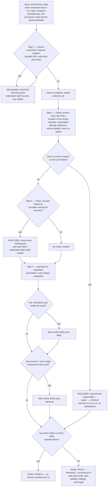

# Algorithm — combiner closure (`closure.js`, PLAN §6(c) step 3)

Order is the normative order of `spec/07-composition.md` (AGSC-07-04…08) and of PLAN.md §6(c)
step 3: `requires` closure → `supersedes` hiding (with the AGSC-07-05a hard-dependency guard) →
`excludes` mutex over the **survivors** → `contradicts`/`uses` warnings. The order is not cosmetic:
evaluating `excludes` before hiding lets an item that Step 2 removes invalidate a composition that is
in fact valid — `tests/vectors/compose/compose-0001` is exactly that case. The same module runs
identically in the CLI (`src/composition/closure.js`) and in the browser (`www/js/agsc-core.js`, no
`node:` imports) — a vector asserts the two are byte-identical for the same input (PRD-038).

Trace: PRD-036, PRD-037, PRD-038 · D48(2) · audit/D §1.3 (Link "Combiner semantics" column) · PLAN.md §6(c).
