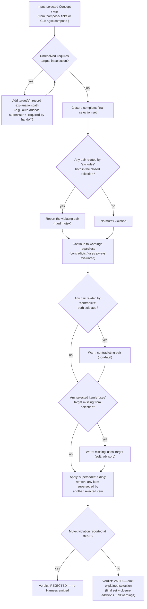

# Algorithm — combiner closure (`closure.js`, PLAN §6(c) step 3)

Order follows PLAN.md §6(c) step 3 exactly: `requires` closure (hard, adds targets with an
explanation path) → `excludes` mutex check (hard, blocking) → `contradicts`/`uses` warnings (soft,
non-blocking, both always evaluated) → `supersedes` hiding (removes superseded items from the final
set). The same module runs identically in the CLI (`src/composition/closure.js`) and in the browser
(`www/js/agsc-core.js`, no `node:` imports) — a vector asserts the two are byte-identical for the same
input (PRD-038).

Trace: PRD-036, PRD-037, PRD-038 · audit/D §1.3 (Link "Combiner semantics" column) · PLAN.md §6(c).
