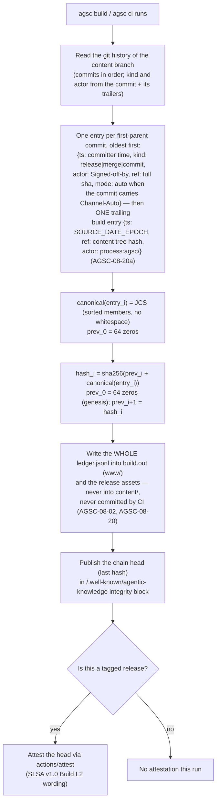
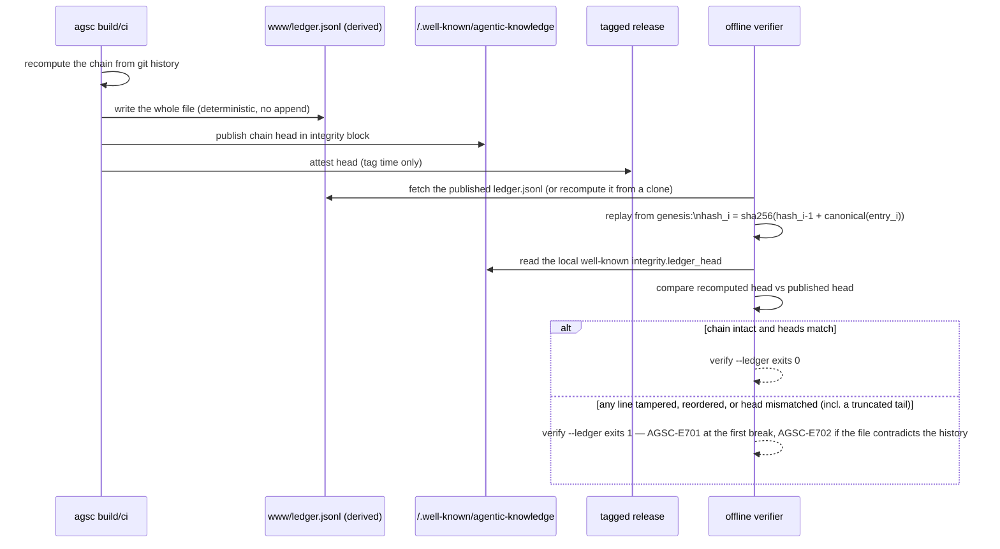

# Algorithm — hash-chained derived ledger (D44(h) as amended by D48(1), ADR-006)

## Derivation algorithm

## Offline re-verification (`agsc verify --ledger`)

The ledger is a **derived artefact**, not a stored one (D48(1)): `build`/`ci` recompute the entire
file from git history plus the facts of the run and write it only into the build output and the
release assets. Nobody appends, so there is no bot commit (AGSC-08-02), no two-runner append race and
no partial-write recovery case — two builds of the same history produce the same bytes. Tampering with
any line breaks every subsequent hash, so `verify --ledger` fails deterministically at the first broken
link; the head comparison against `integrity.ledger_head` additionally catches a truncated tail, which
line-linkage alone cannot see. The published head is what an attestation signs at release time; it is
the only durable claim of "this history has not been altered since publication."

Trace: PRD-005, NFR-11 · D44(h), D48(1) · PLAN.md §6(a) steps 9–11, ADR-006, §12 T10.
