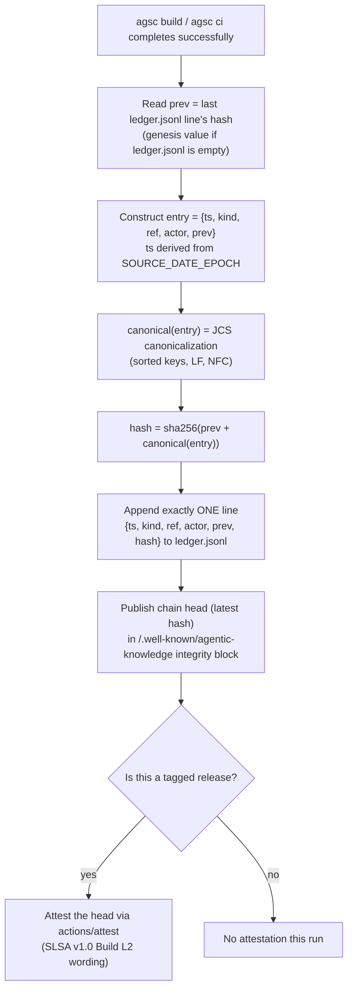
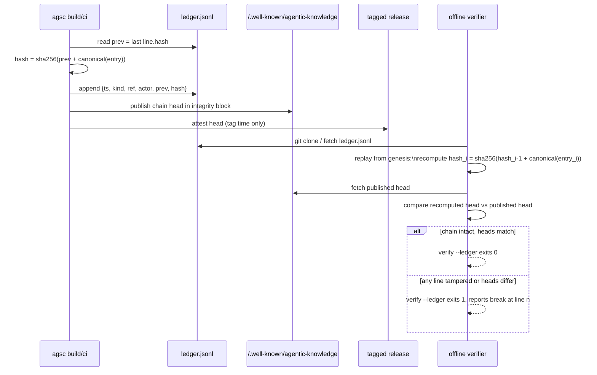

# Algorithm — hash-chained ledger append (D44(h), ADR-006)

## Append algorithm

## Offline re-verification (`agsc verify --ledger`)

One line per event (`kind ∈ build|proposal|merge|review|refresh|release`), written only by
`agsc build`/`ci`, never by hand. Never rewritten: tampering with any earlier line breaks every
subsequent hash, so `verify --ledger` fails deterministically at the first broken link — no network
needed, the whole check runs against the local clone. The published head in the integrity block is
what an attestation signs at release time; it is the only durable claim of "this history has not been
altered since publication."

Trace: PRD-005, NFR-11 · D44(h) · PLAN.md §6(a) steps 9–11, ADR-006, §12 T10.
