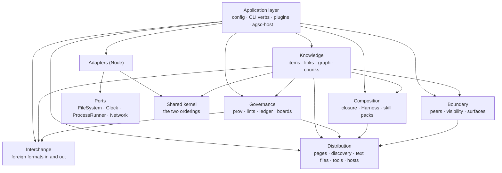

# Architecture — C4 level 3: the engine's components

**What this shows.** Inside the engine: five bounded contexts, one supporting context,
the application layer, and the ports and adapters that are the only way out to files,
processes, the clock and the network. Arrows are the only permitted `require`
directions; `tests/arch/context-boundaries.test.js` enforces them.

Trace: AGSC-04-01 and AGSC-04-03 (determinism: the pure core, no network), AGSC-00-24
(where each plugin kind attaches), AGSC-09-07.
