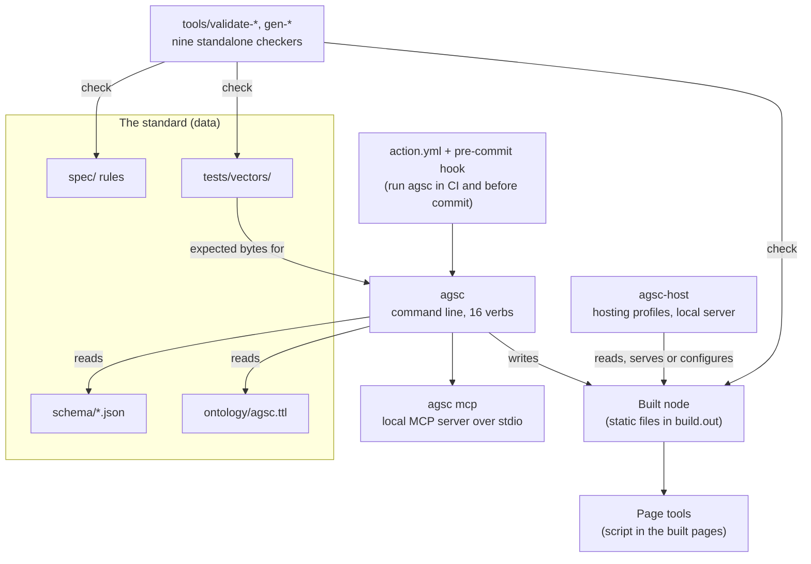

# Architecture — C4 level 2: the containers

**What this shows.** The runnable parts of this distribution and what each reads and
writes. The four folders that define the standard are data every container reads; the
checkers read them without importing any engine code.

Trace: AGSC-09-07 (the sixteen verbs), AGSC-09-13 (the local server), AGSC-09-16
(page tools), AGSC-09-90 (independent checkers), AGSC-00-24 (the deployment-profile
plugin kind).
