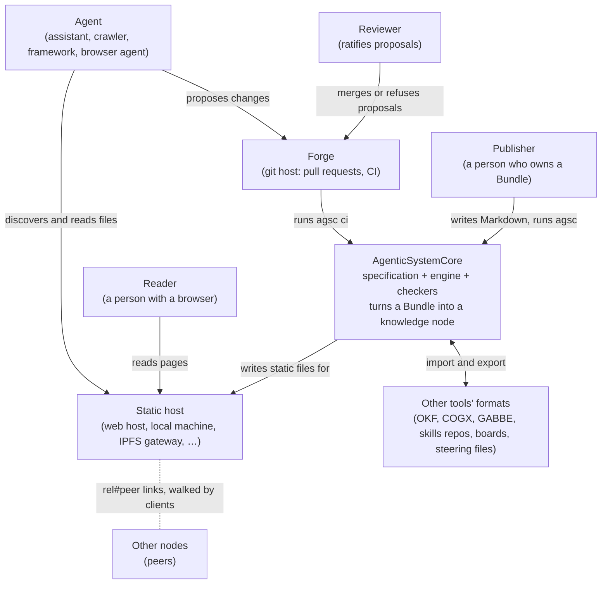

# Architecture — C4 level 1: the system and its neighbours

**What this shows.** The system context in C4 terms: who uses a knowledge node and
which outside systems it touches. Everything outside the box is someone else's; the
node depends on none of them at build time (no network during a build).

Trace: AGSC-00-02, AGSC-01-22, AGSC-01-26, AGSC-04-03 (no network in a build),
AGSC-08-04 (proposals), AGSC-09-08 (`ci`), AGSC-11-06.
