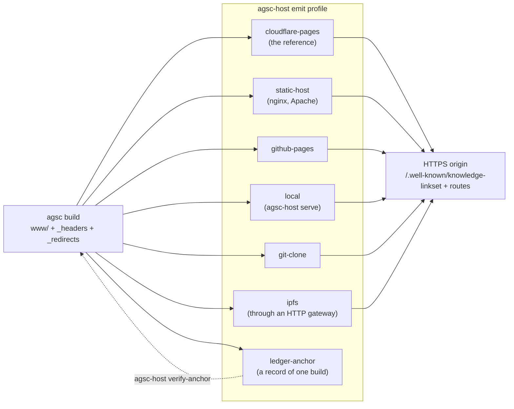

# Architecture — where a node can live

**What this shows.** A node is a set of files. Any place that can put those files
behind an HTTPS origin — serving the discovery document and the routes, with the
response headers the build wrote — can host it. The seven built-in hosting profiles
translate the build's header rules for each kind of place; a ledger can anchor the
bundle hash and the content version of one build. No rule of 1.x pins a transport
other than HTTP.

Trace: AGSC-00-24 (the deployment-profile kind), AGSC-06-01 and AGSC-06-17 (routes and
headers), AGSC-04-25 (the content version), AGSC-11-05 (response headers).
