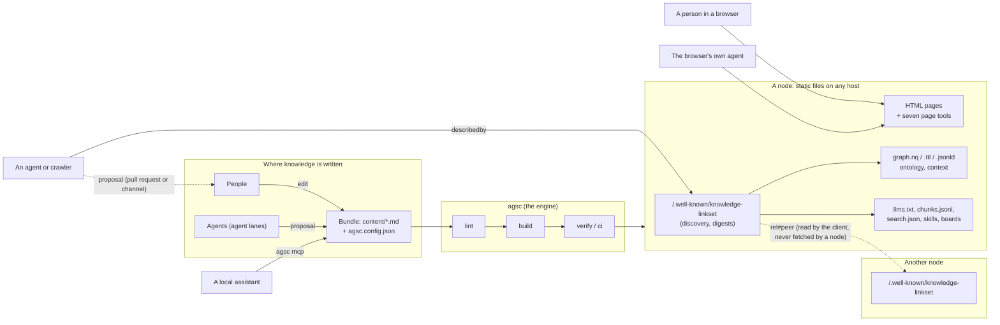

# Architecture — the system in one picture

**What this shows.** How the pieces meet: a person or an agent writes a Bundle (a
folder of Markdown files); the engine builds it into a node (static files on any
host); readers — people, agents, a browser's own agent, other nodes — find the node
through its discovery document and read its surfaces; changes come back only as
proposals a person ratifies. Nodes never call nodes: a client walks from one to the
next. The rules win over the picture.

Trace: AGSC-00-02 (no server), AGSC-06-01 (the route set), AGSC-06-07 and AGSC-06-08
(discovery and digests), AGSC-06-25 (`describedby`), AGSC-09-13 and AGSC-09-16 (the
seven tools on two transports), AGSC-08-08 (a person ratifies), AGSC-11-06 and
AGSC-11-13 (federation walked by the client).
