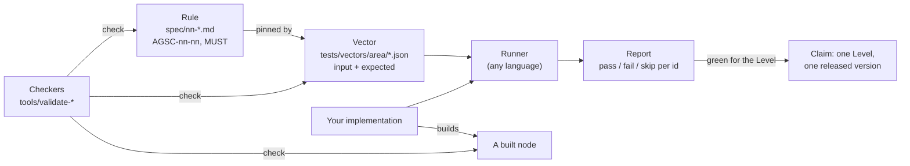

# Flow — the conformance chain

**What this shows.** How a rule becomes something anyone can check. A rule in `spec/`
is pinned by one or more vectors (expected bytes or codes); a runner in any language
runs the vectors of a Level; the standalone checkers check the specification, the
vectors and a built node without importing the engine; a green run of a Level's set at
a released version is what a conformance claim rests on.

Trace: AGSC-09-01 to AGSC-09-06 (vectors and reports), AGSC-09-90 (checkers),
AGSC-10-01 and AGSC-10-15 (Levels and their areas), AGSC-10-05 (no claim before
1.0.0).
