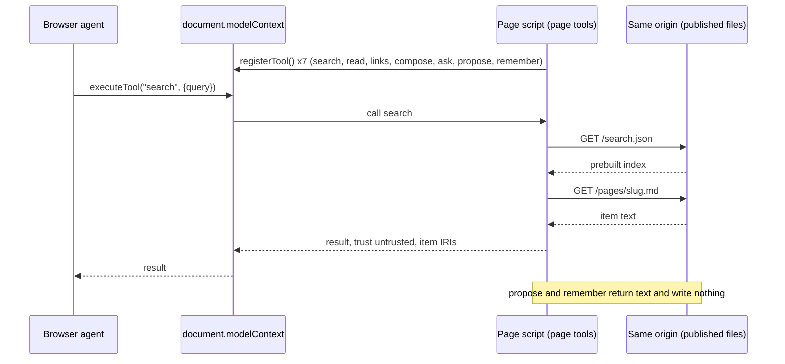

# Flow — one page tool call

**What this shows.** What happens when a browser's own agent calls a tool on a built
page. The page registers the seven tools only when the browser offers
`document.modelContext`; the tool reads the node's own published files from the same
origin — no server, no key, no other host — and answers exactly what the local MCP
server would answer for the same input over the published items.

Trace: AGSC-09-13 (the seven tools), AGSC-09-16 (page tools equal the local server),
AGSC-06-16 (the search index), AGSC-06-05 (no other origin), AGSC-11-18 (the hints).
