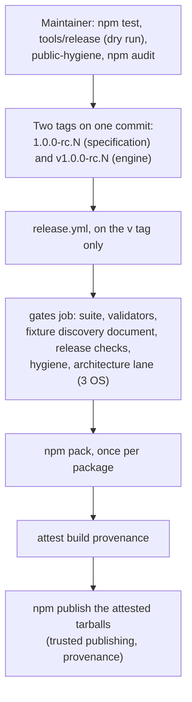

# Flow — a release

**What this shows.** How a version reaches npm. The maintainer runs the release checks
locally, then pushes two tags on one commit: the specification's own tag and the
engine's `v` tag. Only the `v` tag starts the release workflow, which re-runs every
gate on three operating systems, packs both packages once, attests the tarballs and
publishes exactly those tarballs through npm trusted publishing. No token is stored.

Trace: PRD-048, PRD-049, PRD-050 (the release lane), NFR-09, AGSC-10-05. The file
headers of `.github/workflows/release.yml` and `tools/release` are the detail.
