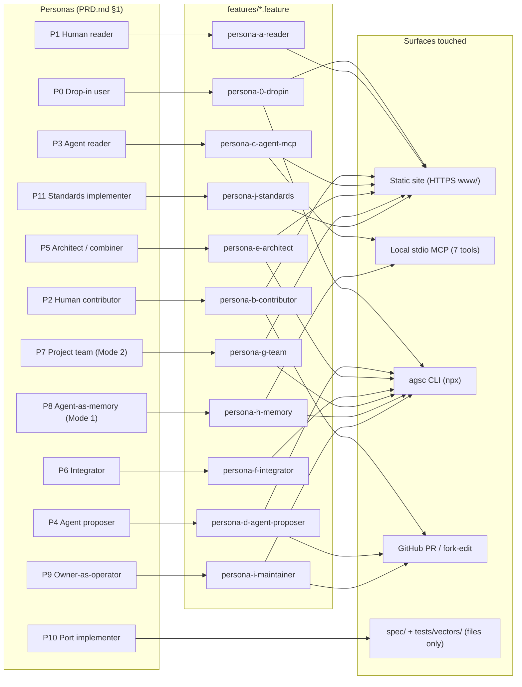

# Scenario map — personas → features → surfaces

12 personas from `docs/PRD.md` §1 map to the eleven `features/*.feature` files (audit/D §3 walkthroughs
(a)–(j)) and on to the four live surfaces plus the files-only surface used by P10 (no (k) walkthrough
exists; P10's acceptance is `spec/` + `tests/vectors/`, not a runtime scenario). Fan-out on Fb/Fc/Fe/Fg/Fh/Fi
shows personas that cross more than one surface in their walkthrough.

Trace: PRD-001–052 (persona table §1), audit/D §3 (a)–(j), PLAN.md §1.2 stakeholder table.
