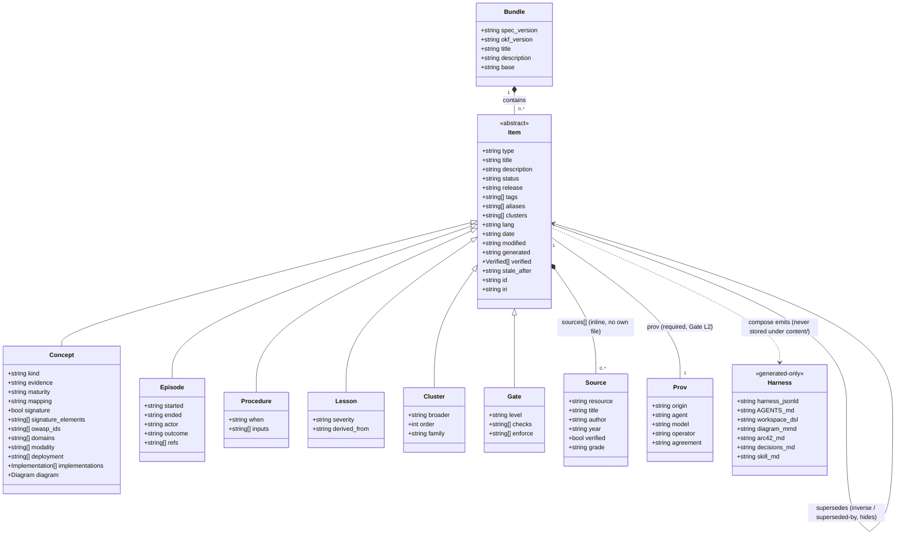

# Domain schema — item model (audit/D §1.2)

`Item` is the common frontmatter shape (audit/D §1.2 "Common to all items"); the six concrete types
add only the fields in their own table row — no type inherits another type's specific fields. `Source`
has no own file at v1 (inline `sources[]` only). `prov` is required (Gate L2); `prov.commit`/`reviewer`
are deliberately absent here — they are derived at build from git log + `verified[]`, never stored
(G35). All nine Link keys are authored as slug arrays on the item; every inverse shown is computed at
build, never authored. `Harness` is generated-only and is never a Bundle member (audit/D §1.1).

Trace: PRD-002, PRD-037, PRD-042 · audit/D §1.1, §1.2, §1.3 · PLAN.md §5.1 (`src/knowledge/`).
