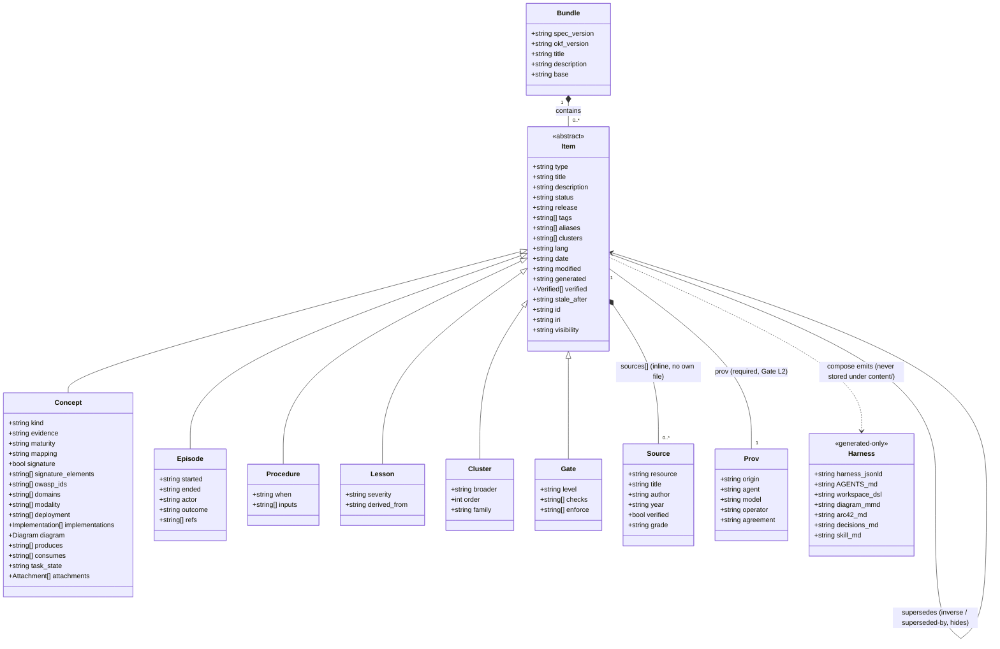

# Domain schema — item model

**What this shows.** The item model as a class diagram: the Bundle, the six item types, the frontmatter keys they share and the ones each type adds, and which members are authored by a person and which are generated by the build.

`Item` is the common frontmatter shape (the members common to all items) and a documentation device only:
the ontology deliberately has **no** `asc:Item` class (AGSC-05-13, SPEC §6(2)). The six concrete types
add only the fields in their own table row — no type inherits another type's specific fields. `Source`
has no own file at v1 (inline `sources[]` only). `prov` is required (Gate L2); `prov.commit`/`reviewer`
are deliberately absent here — they are derived at build from git log + `verified[]`, never stored.
All fourteen Link keys (nine core + the five Mode-2 keys) are authored as slug arrays on the item; every inverse shown is computed at
build, never authored. `Harness` is generated-only and is never a Bundle member.

The item also carries ports (`produces`/`consumes`, AGSC-02-96), `attachments[]` (AGSC-02-98), `task_state`
(AGSC-02-99), `visibility` and the fourth `status` value `retired` (AGSC-11-22).

Trace: PRD-002, PRD-037, PRD-042 · PLAN.md §5.1 (`src/knowledge/`).
