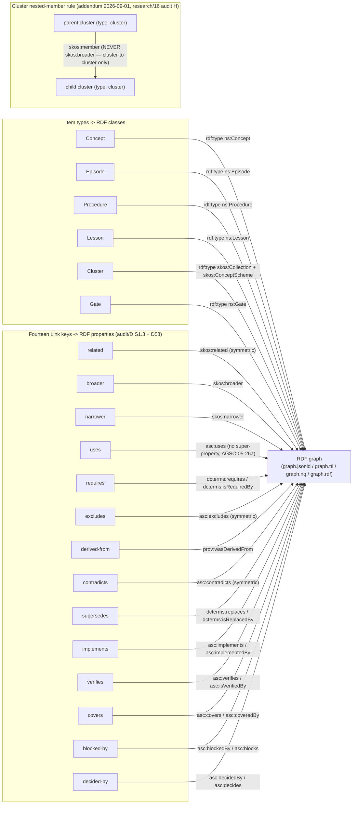

# Ontology mapping — item types and Links to RDF (audit/D §1.3, addendum)

Item `type` maps 1:1 to an OWL 2 RL-safe class in `ns/agsc.ttl` (`https://w3id.org/agentic-system-core/ns#`,
e.g. `ns:Concept` — the exact class named in the walkthrough's `/ns/` example, audit/D §3(j)); `Cluster`
is additionally a `skos:Collection` plus, at the Bundle root, a `skos:ConceptScheme` (PLAN.md §6(a)
step 6). All fourteen authored Link keys map to a fixed property per audit/D §1.3 and D53: three vocabularies in
play — `skos:` (advisory/hierarchy), `dcterms:`/`prov:` (hard semantics: closure, derivation,
supersession), and the project's own `asc:` terms for `uses`/`excludes`/`contradicts` and the five
Mode-2 keys, which have no exact SKOS/DCTERMS/PROV equivalent. Only the nine core keys carry
composition semantics; the Mode-2 five are navigational (combiner semantics `none`, AGSC-03-18). The nested-member rule is the one place `broader` on an item does
**not** become `skos:broader`: when the *subject* item itself has `type: cluster`, its `broader` edge
exports as `<parent> skos:member <child>` instead, so Clusters form a nested `skos:Collection` tree
rather than a flat SKOS hierarchy.

Trace: PRD-002, PRD-022 · audit/D §1.3, §1.4, addendum (2026-09-01) · PLAN.md §5.1 (`skos.js`, `jsonld.js`, `turtle.js`, `nquads.js`, `rdfxml.js`), §6(a) step 6.
