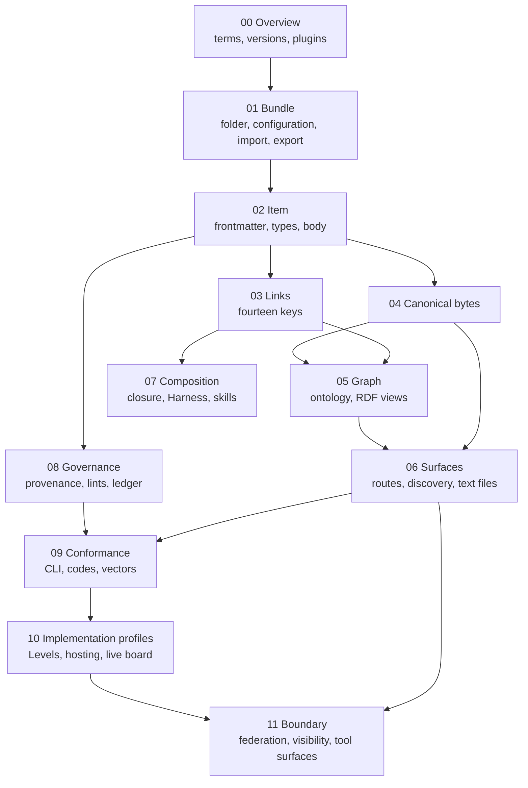

# Specification — how the twelve chapters depend on one another

**What this shows.** Which chapters a chapter builds on. Read a chapter after the ones
that point to it. The overview (00) defines the terms every other chapter uses; 04 fixes the
bytes everything emitted must have; 09 and 10 say how all of it is checked and
claimed.

Trace: AGSC-00-01 (what the specification is), AGSC-09-04 (vector areas per chapter),
AGSC-10-15 (areas per Level).
