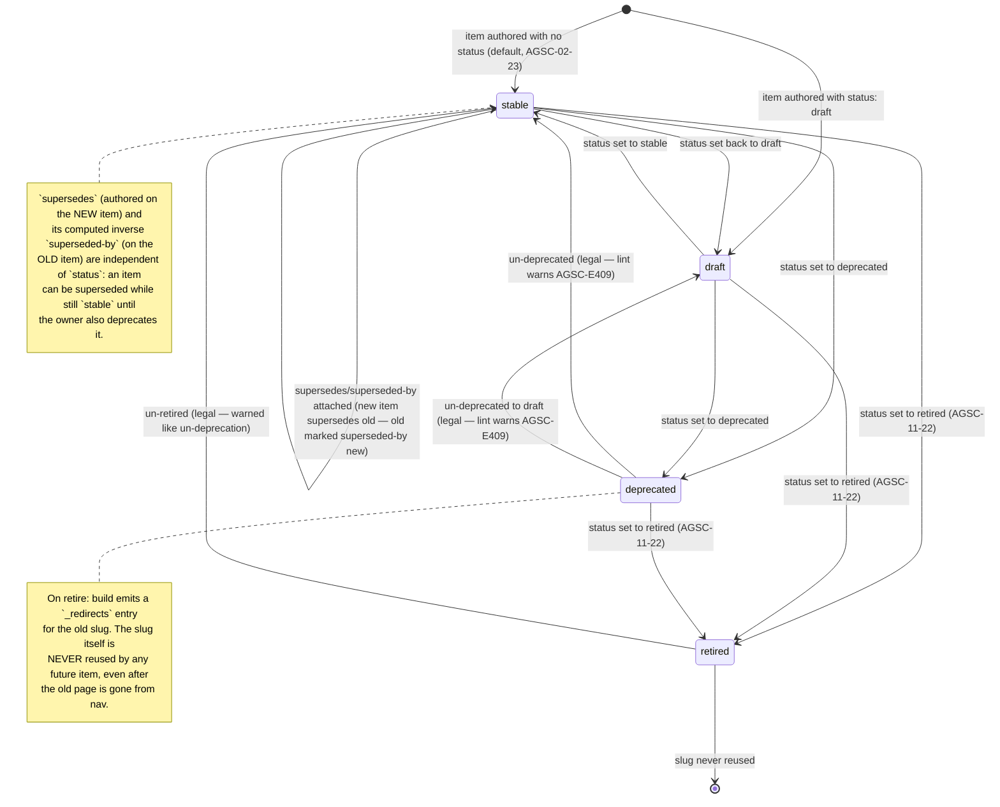

# Item lifecycle — status state machine

**What this shows.** The three values an item's `status` can take — draft, stable and deprecated — and every transition between them. `supersedes` is drawn as a self-loop because it is a Link, not a change of state.

Four `status` values (`draft | stable | deprecated | retired`, default `stable` — an item
authored without a `status` therefore *starts* stable, and every transition including `deprecated` →
`stable` is legal, warned but never rejected, per AGSC-02-23); `retired` was added at rc.3 by
AGSC-11-22 — a retired item keeps its page and its canonical IRI, carries a visible retirement notice,
leaves `search.json`, `/chunks.jsonl`, `/llms.txt`, skill packs and every composition selection, and stays
in the graph exports with `asc:retiredAt`. There is no `archived` or `deleted` state — deletion is out of scope.
`supersedes`/`superseded-by` is a Link-key edge, orthogonal to `status`, shown as a
self-loop annotation because it does not change which of the four states an item is in.

Trace: PRD-018.
