# Proposal lifecycle — state machine

**What this shows.** A proposal's life from an authored edit to a merge or a rejection: what `agsc propose` writes, what the operator runs, what CI checks without a model, and where a human decides. The machine is total over what actually happens, including a lint-green proposal the owner still closes.

```mermaid
stateDiagram-v2
  [*] --> authored: human or operator-run agent edits item with prov{origin, operator}

  authored --> proposed: agsc propose writes dist/proposal/<n>.patch + PR body\n(agsc:proposal v1 marker) — no network write

  proposed --> prOpen: operator runs the printed git/gh commands\nPR carries Signed-off-by (CA-v1)

  prOpen --> lintVerdict: ci.yml runs agsc ci (lint L1+L2, build x2, diff)\ncontents: read, no LLM

  state forkCheck <<choice>>
  prOpen --> forkCheck
  forkCheck --> lintOnlyUntilLabelled: PR is from a fork
  lintOnlyUntilLabelled --> lintVerdict: maintainer labels the PR
  forkCheck --> lintVerdict: PR is from the main repo

  state botCap <<choice>>
  lintOnlyUntilLabelled --> botCap: open bot PR count checked
  botCap --> lintOnlyUntilLabelled: count <= 5, PR accepted
  botCap --> refused: count > 5, sixth PR refused
  refused --> [*]

  lintVerdict --> rejected: findings block (exit 1) or human closes PR
  lintVerdict --> humanReview: findings pass (exit 0)

  humanReview --> humanReview: owner adds verified: [{by, at}]
  humanReview --> rejected: owner closes the PR (no merge)

  state mergeGate <<choice>>
  humanReview --> mergeGate
  mergeGate --> merged: ruleset satisfied\n(PR + 1 approval + Code Owner + green ci)
  mergeGate --> humanReview: ruleset not yet satisfied
  mergeGate --> authored: conflict with base — a new patch is needed

  merged --> rebuiltDeployed: merge triggers agsc ci then Pages publish www/\nledger.jsonl re-derived from git history into www/ (kind:"merge" entry);\nprov.commit/reviewer derived at build, never written by CI

  rejected --> [*]
  rebuiltDeployed --> [*]
```

A rejected Proposal has no `resubmit` edge on purpose: resubmission is a **new** Proposal, entering at
`authored`. `mergeGate` covers a base conflict by returning to `authored` (the patch is rebuilt), and
`humanReview` can end in `rejected` when the owner closes a lint-green PR — the machine is total over
what actually happens.

Trace: PRD-039–043, D07, D27, D40, D48(1)(7) · audit/D §3(b)/(d) · PLAN.md §6(b), §5.3 (Provenance & Governance).
