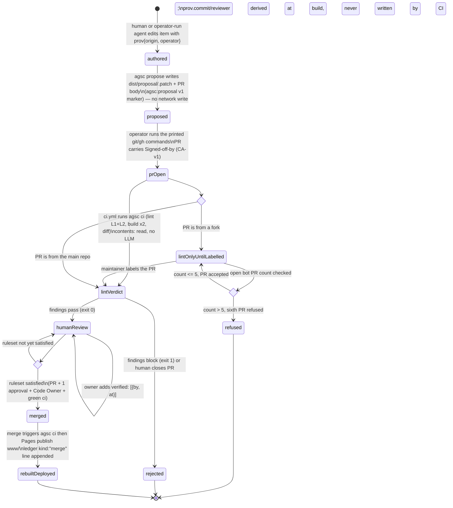

# Proposal lifecycle — state machine

```mermaid
stateDiagram-v2
  [*] --> authored: human or operator-run agent edits item with prov{origin, operator}

  authored --> proposed: agsc propose writes dist/proposal/<n>.patch + PR body\n(agsc:proposal v1 marker) — no network write

  proposed --> prOpen: operator runs the printed git/gh commands\nPR carries Signed-off-by (CA-v1)

  prOpen --> lintVerdict: ci.yml runs agsc ci (lint L1+L2, build x2, diff)\ncontents: read, no LLM

  state forkCheck <<choice>>
  prOpen --> forkCheck
  forkCheck --> lintOnlyUntilLabelled: PR is from a fork
  lintOnlyUntilLabelled --> lintVerdict: maintainer labels the PR
  forkCheck --> lintVerdict: PR is from the main repo

  state botCap <<choice>>
  lintOnlyUntilLabelled --> botCap: open bot PR count checked
  botCap --> lintOnlyUntilLabelled: count <= 5, PR accepted
  botCap --> refused: count > 5, sixth PR refused
  refused --> [*]

  lintVerdict --> rejected: findings block (exit 1) or human closes PR
  lintVerdict --> humanReview: findings pass (exit 0)

  humanReview --> humanReview: owner adds verified: [{by, at}]

  state mergeGate <<choice>>
  humanReview --> mergeGate
  mergeGate --> merged: ruleset satisfied\n(PR + 1 approval + Code Owner + green ci)
  mergeGate --> humanReview: ruleset not yet satisfied

  merged --> rebuiltDeployed: merge triggers agsc ci then Pages publish www/\nledger kind:"merge" line appended;\nprov.commit/reviewer derived at build, never written by CI

  rejected --> [*]
  rebuiltDeployed --> [*]
```

Trace: PRD-039–043, D07, D27, D40 · audit/D §3(b)/(d) · PLAN.md §6(b), §5.3 (Provenance & Governance).
