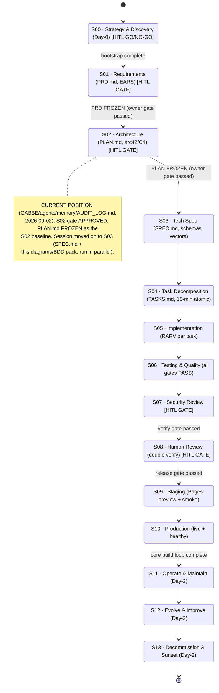

# SDLC state machine — S00…S13 (Loki Mode)

Per `GABBE/agents/AGENTS.md` §"Loki & Brain": a 14-phase lifecycle — Day-0 bootstrap (S00), a 10-phase
core build loop (S01–S10), and Day-2 operations (S11–S13) — with human-in-the-loop gates at
**S00 / S01 / S02 / S07 / S08**. `docs/PRD.md` is itself titled "S01 requirements artifact" and
`docs/PLAN.md` "S02 artifact", grounding those two phase identities directly.

"continue" always re-enters at S00 and re-verifies passed gates against frozen artifacts rather than
redoing approved work (ASC continue protocol). Phase names completed 2026-09-02 (R4 review) from the
canonical Loki table in `GABBE/agents/skills/brain/loki-mode.skill.md` (S00 Strategy & Discovery …
S13 Decommission & Sunset) — the earlier generic labels were a documented fidelity gap, now closed.

Trace: `GABBE/agents/skills/brain/loki-mode.skill.md` (phase table); `GABBE/agents/AGENTS.md` §"Loki & Brain"; `docs/PRD.md` line 1 (S01);
`docs/PLAN.md` line 1 (S02); GABBE audit log 2026-09-02 entries (S02 gate, current position).
