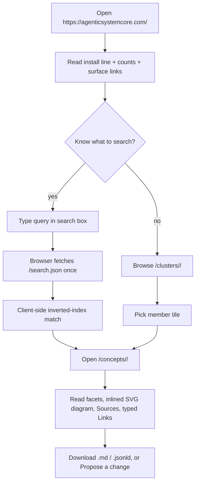
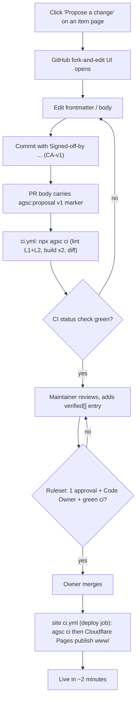
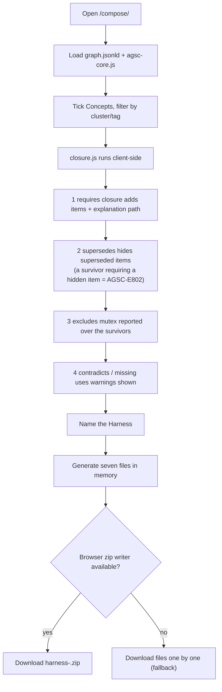
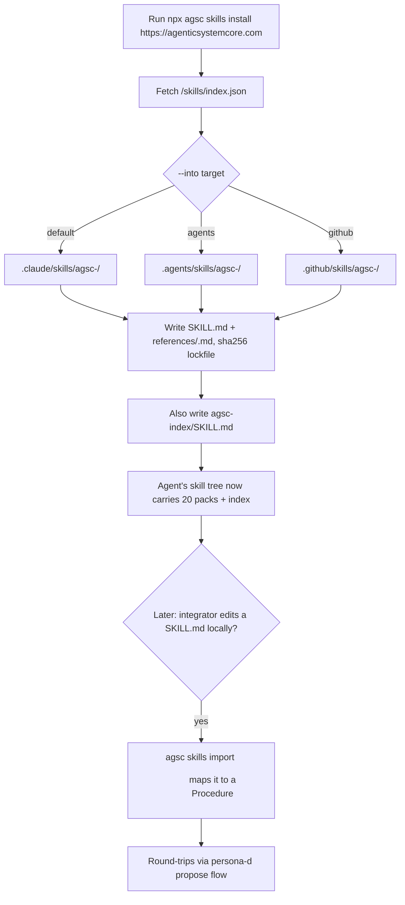
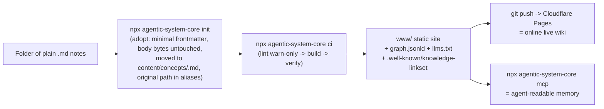

# User flows — the five richest journeys

## 1. Reader find-pattern (P1, Mode 0)

## 2. Contributor propose → merge (P2, Mode 0)

## 3. Architect compose → Harness (P5, Mode 4)

## 4. Integrator skills install (P6, Mode 3)

Trace: PRD-011/013/014 (flow 1), PRD-039–042/050 (flow 2), PRD-036–038 (flow 3), PRD-032–035 (flow 4);
PLAN.md §6(b), §6(c).

## Flow 0 — Drop-in user (PRD-053; the front-door scenario)

Trace: PRD-053, AGSC-02-90..93.
