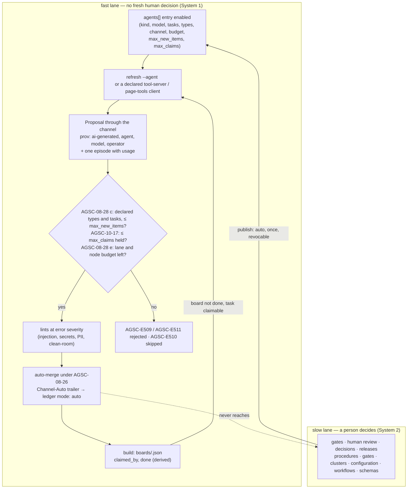

# Workflow — the agent lane and the live board's two lanes (rc.4, AGSC-08-28…30, AGSC-10-16…18)

**What this shows.** The two lanes of the live board: a fast lane where a declared agent may act without a fresh human decision, and a slow lane where people decide. The caps, lints and budget checks that gate the fast lane are drawn on it, and the fast lane can never reach the slow one.

The fast lane runs until the board is done or a task needs a person (`TASK_STATE_INPUT_REQUIRED`, `TASK_STATE_AUTH_REQUIRED`); the slow lane is unreachable from it by construction (AGSC-08-26(b), AGSC-08-28(c), AGSC-10-18). The dashed edge is the only link between the two: the human's one configured, revocable `publish: auto` choice (AGSC-08-29).

Trace: PRD-063, PRD-064, PRD-065 · D87, D88 · spec/08 §8.6, spec/10 §10.6, spec/01 AGSC-01-36…38.
