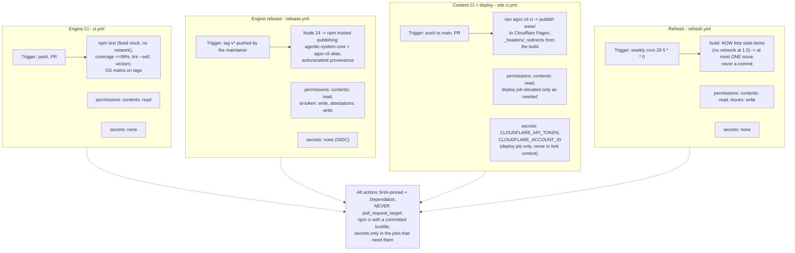
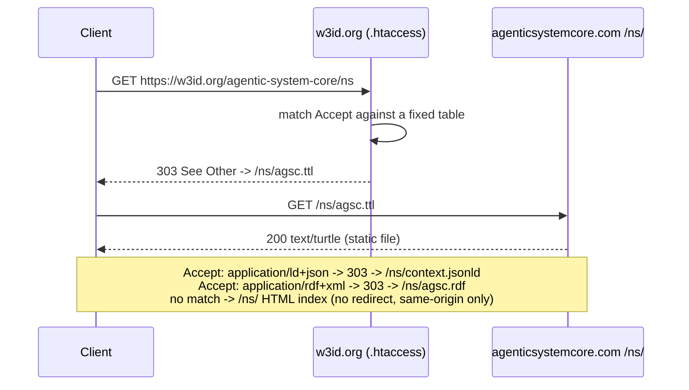

# Workflow — CI/CD lanes (PLAN §7) + w3id conneg

## The four lanes

## `/ns/` content negotiation via w3id `.htaccess`

Four lanes, no fifth: there is no server lane because there is no server (C2). Content CI is the only
lane that spends a credentialed secret, and only in the deploy job — never reachable from a fork PR.
The w3id `.htaccess` is the one piece of "conneg logic" in the whole system and it lives outside this
repo entirely (ADR-005); every redirect target is a same-origin static file, so there is no open
redirect to exploit (T5 in PLAN.md §12).

Trace: PRD-048–051, NFR-04, NFR-09 · PLAN.md §7 (lane table), §12 T4/T5/T6 · ADR-005.
