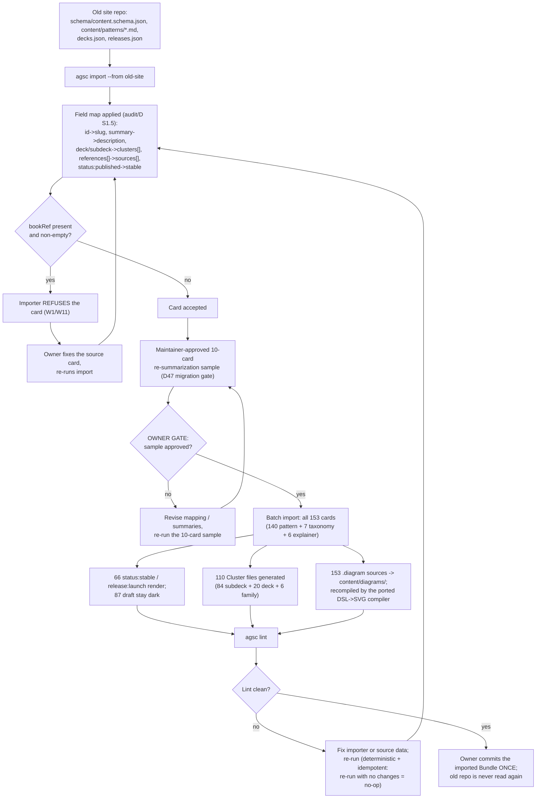

# Workflow — migration from the old site (audit/D §1.5, D47 migration gate)

**What this shows.** The one-time migration of the previous site into a Bundle: the import, the field map it applies, the clean-room decisions it forces, and the clean `agsc lint` the result must reach before it is committed.

The `bookRef` refusal is structural, not a lint warning — it is the clean-room boundary (W1/W11): no
card carrying a book reference can enter the public Bundle at all. The owner gate sits after field
mapping but before the 153-card batch, per D47 ("migration gate = maintainer-approved 10-card
re-summarization sample"); everything downstream of the gate (batch import, 110 Clusters, diagram
recompilation) runs unattended and must land on a clean `agsc lint` before the one-time commit.

Trace: PRD-021 · audit/D §1.5, §1.1 (Cluster row) · D47 (migration gate), D08/Art. XIII (W1/W11 clean room).
