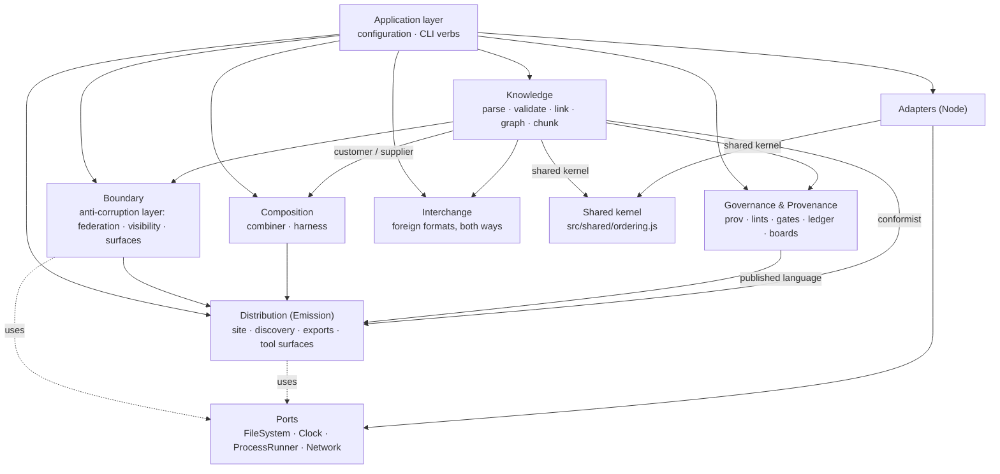

# `src/` — the reference engine

**Summary.** This directory is one implementation of the AgenticSystemCore
specification, not the specification itself. The truth is `spec/00`–`spec/11`,
`schema/*.json`, `ontology/agsc.ttl` and `tests/vectors/**`; a port in any language
must be able to reach conformance from those alone. What follows is how this
particular engine is arranged, what each module promises, and how to check it.

Everything here is CommonJS (`require`), Node ≥ 22.12, and deterministic: no wall
clock, no network, no locale, no filesystem enumeration order (AGSC-04-01,
AGSC-04-03). Standard formats are read and written by maintained libraries at exact
pinned versions; what this engine writes by hand is only what the specification pins
byte for byte and no library produces.

---

## 1. The context map

The directory layout **is** the domain model. Each context owns a language and a set
of rules; the arrows below are the only permitted directions, and
`tests/arch/context-boundaries.test.js` fails the build if a `require` points the
wrong way.



**The shared kernel** (added 2026-09-18, F27-13). `src/shared/ordering.js` holds the
two string orderings — the UTF-16 comparison of AGSC-04-05 and the code-point
comparison of AGSC-04-12 — and depends on nothing. It exists because the FileSystem
adapter owes AGSC-01-15 the same code-point order that the Knowledge context owes
AGSC-04-12, and an adapter may not reach into a bounded context. A second copy of the
comparator would be worse than the arrow it removes: two orderings can drift, one
cannot. `knowledge/unicode.js` re-exports both, so every existing caller is unchanged.

**Ubiquitous language.** Bundle, Item, Link, Cluster, Chunk, Attachment, Proposal,
Review, Gate, Ledger, Channel, Agent lane, Selection, Verdict, Harness, Page, Route,
Surface, Peer, Visibility, Tombstone. These are the only names for these things, in
code, in tests and in prose. `docs/ARCHITECTURE-DDD.md` defines each one; the
specification section that governs it is cited in every module header.

**Purity.** `knowledge/`, `governance/` and `composition/` never touch a file, a
process, a clock, a network or a random number. They take strings and records and
return records. Everything that reaches the outside world does so through a port,
and only the application layer and `bin/` may construct an adapter.
`tests/arch/core-purity.test.js` enforces this.

**Errors.** A domain fault is a **Finding** with a registered `AGSC-E<nnn>` code
(AGSC-09-11), returned, never thrown. A thrown error means a *programming* fault —
a schema that does not compile, a value that is not JSON — and the process may
legitimately stop. `SOURCE_DATE_EPOCH` being malformed is the one environment fault:
`AGSC-E603`, exit 2, never a Finding (AGSC-09-08).

One exception, corrected 2026-09-18 (F27-07): a few faults are *raised* by throwing
because they are discovered inside an adapter that has no Finding list to return —
`AGSC-E902` (a path escaping the Bundle root), `AGSC-E903` (an archive) and
`AGSC-E904` (the size cap). All three are **registered in spec/09 §9.4**, so the CLI
shell turns a thrown error whose `code` has that shape into a Finding in the
AGSC-09-11 envelope with the AGSC-09-08 exit code. Before the correction those three
codes were unreachable through the CLI: an oversized file exited 1 with
`agsc: internal error:` and an **empty stdout under `--json`**.

---

## 2. Module map

| Path | Context | Implements |
|---|---|---|
| `knowledge/unicode.js` | Knowledge | AGSC-04-05, 04-12, 04-21, 04-23, 02-24 — NFC, code-point length, the two orderings, the combining bound |
| `knowledge/yaml.js` | Knowledge | AGSC-02-01…04 — the YAML failsafe subset and its rejections |
| `knowledge/frontmatter.js` | Knowledge | AGSC-02-01, 01-14, 01-16 — the block, the body, the Item record |
| `knowledge/schema.js` | Knowledge | AGSC-00-09, 02-24, 01-10 — the JSON Schema 2020-12 validator and `oneOf` discrimination |
| `knowledge/validate.js` | Knowledge | AGSC-00-15, 01-03, 01-11, 01-18, 02-05, 02-05a, 02-07, 02-21, 02-24 and the §9.4 code precedence |
| `knowledge/slug.js` | Knowledge | AGSC-01-10, 01-11, 01-23, 02-91 — grammar, uniqueness, slugifier, collisions |
| `knowledge/jcs.js` | Knowledge | AGSC-04-04…06, 04-21 — RFC 8785 with NFC first, plus the I-JSON check |
| `knowledge/adopt.js` | Knowledge | AGSC-02-90…93 — total, idempotent, byte-preserving adoption |
| `ports/*.js` | — | JSDoc interfaces only; they export nothing |
| `adapters/node-fs.js` | — | FileSystem over `node:fs`; AGSC-01-15/16; also `readSchemas` and `readOntology`, the one door the schemas and the vocabulary enter by |
| `adapters/node-clock.js` | — | Clock over `SOURCE_DATE_EPOCH`; AGSC-04-09/10 |
| `adapters/node-proc.js` | — | ProcessRunner: `execFileSync`, no shell, scrubbed environment, timeout |
| `adapters/node-network-refusing.js` | — | Network that refuses every call (AGSC-04-03) |

Other modules in `knowledge/`, `governance/`, `composition/`, `distribution/`,
`boundary/`, `interchange/` and `application/` are delivered by the other packages of
this milestone and documented in their own headers. **§11 carries the module map
of the whole engine as it stands after integration**, together with the verb →
module table, and is the section to read first if you want the current shape
rather than the history of how it was built.

### Shared records

```js
// Finding (AGSC-09-11) — the severity literal is `warn`, never `warning`
{ code: 'AGSC-E301', col: 1, file: 'content/concepts/a.md', line: 12,
  message: '…', severity: 'error' | 'warn', slug?: 'a' }
// sorted by (file, line, col, code), compared code-point-wise (AGSC-09-10)

// Item (parsed)
{ path, slug, type, frontmatter, body, lineOffset, findings }

// Bundle (loaded)
{ root, config, index: { frontmatter, body }, items, byslug, findings }

// Envelope (AGSC-09-11), emitted JCS-canonical with one trailing LF
{ counts: { error, warn }, findings: [], schema: 'agsc.diagnostics.v1',
  spec_version, status: 'pass' | 'fail', verb, version }
```

### Public API of this package

```js
// knowledge/unicode.js
nfc(s); codePointLength(s); compareCodePoint(a, b); compareUtf16(a, b);
checkCombining(s, max = 256); isWellFormed(s)

// knowledge/yaml.js — throws YamlError { code: 'AGSC-E10x' | 'AGSC-E904', line, col, message }
parse(text, { lineOffset = 0, maxBytes = 1 MiB }) -> value   // every scalar a string

// knowledge/frontmatter.js
split(markdown, { file }) -> { hasFrontmatter, yamlText, body, bodyLine, errors }
parseItem(markdown, { path, schemas, config }) -> Item
hasClosedFrontmatter(markdown); keyLines(yamlText, lineOffset); firstHeading(body)

// knowledge/schema.js
compile(schemaObject) -> (value) => { valid, errors: [{ path, keyword, message, params, schemaPath }] }
keywordsUsed(schemaObject) -> { keywords, formats }

// knowledge/validate.js
schemas({ item, config, bundle }) -> { item, config, bundle }   // compiled
applyTypes(value, schema) -> value                              // AGSC-02-03, second half
item(frontmatter, { schemas, file, keyLines, slug, config }) -> Finding[]
index(frontmatter, { schemas, file, keyLines }) -> Finding[]
config(configObject, { schemas, file, checkAgents }) -> Finding[]
placement(path, frontmatter) -> Finding[]
unknownKeys(frontmatter, { schemas | schema }) -> { known, vendor, unknown, malformed }
majorCompatible(declared, own); sortFindings(findings); finding(code, message, extra)

// knowledge/slug.js
SLUG_PATTERN; isValid(slug); check(slugs, { files }) -> Finding[]
slugify(title); dedupe(slug, taken); stemOf(path); pathSlug(path)

// knowledge/jcs.js
canonicalize(value) -> string; isIJSON(value) -> boolean; compareUtf16; compareCodePoint

// knowledge/adopt.js
adopt(files, { config, gitUserEmail }) -> { files, findings }
adoptFile({ path, markdown }, { config, gitUserEmail, taken }) -> { path, output, changed, skipped, frontmatter, body, findings }
operatorFor(config, gitUserEmail); titleFor(body, stem, slug); serialize(frontmatter)
relativeReferences(body)

// adapters
createFileSystem(root, { maxBytes }); readSchemas(engineRoot); readOntology(engineRoot)
createClock({ env, lastCommitSeconds }) -> { now, iso, findings }
createProcessRunner({ cwd, env, timeoutMs }) -> { run }
createNetwork() -> { fetch }   // always rejects, AGSC-E905
```

---

## 3. Libraries

Standard formats are not reimplemented here. Every dependency is pinned to an exact
version, is permissively licensed, reaches neither the network nor the clock at
runtime, and is loadable from CommonJS.

| Need | Library | Version | Licence |
|---|---|---|---|
| YAML failsafe subset | `yaml` | 2.9.1 | ISC |
| JSON Schema 2020-12 | `ajv` (`ajv/dist/2020`) | 8.20.0 | MIT |
| `format` keyword | `ajv-formats` | 3.0.1 | MIT |
| RFC 8785 (JCS) | `json-canonicalize` | 3.0.1 | MIT |
| property tests (dev) | `fast-check` | 4.10.1 | MIT |

What this package still writes by hand, and why: the AGSC-02-02 **allow-list** on top
of the YAML parser (no library knows which constructs this specification forbids or
which code each one carries); the `oneOf` **discrimination** on top of Ajv (§9.4's
precedence rule is unsatisfiable without it); NFC-**before**-canonicalisation
(AGSC-04-21 — RFC 8785 deliberately leaves normalization to the caller); the slug
grammar and slugifier (AGSC-01-10, AGSC-02-91); and the emitted-YAML profile
selection of AGSC-04-19. `tools/validate-vectors` is independent by construction —
Node built-ins only, no import from `src/` — because a validator that imported the
engine it validates would prove nothing (AGSC-09-90).

### The JSON Schema keywords the three schemas use

Derived from `schema/*.json`, never typed by hand
(`knowledge/schema.js#keywordsUsed`; `tests/knowledge/schema.test.js` re-derives it):

```
$defs  $id  $ref  $schema  additionalProperties  allOf  const  default  description
enum  format  if  items  maxItems  maxLength  maximum  minItems  minLength  minimum
oneOf  pattern  patternProperties  properties  required  then  title  type  uniqueItems
```

`format` values used: `uri` (once, on `peers[]`, alongside a stricter `pattern`).
Ajv 2020 covers every keyword above natively, `ajv-formats` covers `uri`, and Ajv
already counts `minLength`/`maxLength` in Unicode code points, which is exactly what
AGSC-02-24 requires. Ajv runs in `strict` mode so that a keyword outside this list
throws when the schema is compiled rather than being ignored at validation time; the
single relaxation is `strictRequired`, because `config.schema.json` has an `if/then`
that requires a property declared in a sibling subschema.

---

## 4. Running the conformance vectors

```bash
npm install                      # exact pins; the lockfile is committed
node --test 'tests/**/*.test.js' # unit, architecture and conformance suites
node tools/validate-vectors --json
node tools/count-artifacts --json
```

The runner is `tests/conformance/vector-runner.test.js`. The RUN itself is
`src/application/conformance.js` — the same module `agsc conform` calls, so the
suite and the verb cannot disagree about what a vector set is or how a result is
classified. It loads every file under `tests/vectors/**`, dispatches on `area` to
`tests/conformance/areas/<area>.js` and prints one line:

```
vectors: <pass> pass, <fail> fail, <skip> skip (<withdrawn> withdrawn, <pending> pending) of <total>
```

* a `withdrawn` vector is skipped and counted for nothing (AGSC-00-16, AGSC-09-05);
* an id listed in `tests/conformance/pending.json` is skipped with its reason, a
  temporary state while the milestone lands — the integration package empties it;
* a vector naming `requires_surface` values this node does not declare is
  skipped-as-passed (AGSC-09-04); this node declares `mcp` and `webmcp`;
* a required vector with no handler **fails**. Silence is never a pass.

Run one suite with `node --test tests/knowledge/slug.test.js`. Every test sets its
own clock or passes a fixed one; none reaches the network.

`agsc conform --level <0|1|2|3> [--to <path>]` runs the same vectors outside
`node:test` and writes the AGSC-09-03 report; `npm audit` is the release gate and
is run explicitly (`AGSC_AUDIT=1 node --test tests/arch/pinned-dependencies.test.js`)
because it is the one check that needs the network.

---

## 5. Using the fixture from a foreign port

`tests/fixtures/minimal/` is the smallest Bundle that conforms: one
`agsc.config.json`, one `content/index.md`, two `concept` items and one `cluster`,
every file UTF-8/LF/NFC with one trailing LF, every frontmatter key already in the
schema order of AGSC-04-19 so that `lint --fix` is a no-op.

A port in another language can use it without reading a line of this engine:

1. copy the directory;
2. set `SOURCE_DATE_EPOCH=1767225600` (2026-01-01T00:00:00Z) so the build instant is
   fixed (AGSC-04-09);
3. lint it — the result must be zero findings;
4. build it twice into two directories and compare bytes — they must be identical
   (AGSC-04-01, AGSC-04-02);
5. compare your emitted machine artefacts with the expected bytes the vectors carry
   (AGSC-04-24 lists which artefacts are pinned across implementations; generated
   HTML is not one of them).

`tests/knowledge/fixture-minimal.test.js` is this engine's own version of steps 1–3,
so a change that quietly breaks the fixture fails here first.

---

## 6. Application layer — configuration and the CLI shell (WP-10-B)

Added by the WP-10-B package (`src/application/config/`, `src/application/cli/`,
`src/governance/agents.js`, `bin/agsc.js`, `bin/agentic-system-core`). The
application layer orchestrates use cases across contexts and owns no domain rule
of its own (§1's context map); it is the only layer, besides `bin/`, allowed to
construct an adapter.

| Path | Implements |
|---|---|
| `application/config/env.js` | AGSC-01-37 — the `.env` file, the `AGSC_*` name table (mechanically derived from `schema/config.schema.json`), credential exclusion |
| `application/config/load.js` | AGSC-09-09 — the five-layer precedence (flag > env > `.env` > project > user > default) |
| `application/cli/main.js` | AGSC-09-07…12 — verb dispatch, global flags, the AGSC-09-11 envelope |
| `application/cli/verbs/*.js` | one module per verb of AGSC-09-07; wired at integration — see the verb → module table of §11.2. The interim `AGSC-PENDING` marker is gone: a verb either answers, or says with one finding which rule it will implement |
| `governance/agents.js` | AGSC-01-36/37/38, 08-25, 08-28(c), 10-17(partial) — `checkAgents`, `checkProposal`, `capMeter` |
| `bin/agsc.js`, `bin/agentic-system-core` | the real CLI entry points; wire A's adapters when present, fall back to inline Node-stdlib ports otherwise |

### Libraries added by this package (D94/ADR-019)

| Need | Library | Version | Licence |
|---|---|---|---|
| `.env` raw tokenising | `dotenv` (`.parse()` only, never `.config()`) | 18.0.0 | BSD-2-Clause |
| argv parsing | `commander` | 15.0.0 | MIT |

**`.env`** — `application/config/env.js#parseDotenv` calls `dotenv.parse(text)` for
the raw `NAME=value` tokenising; the `^AGSC_[A-Z0-9_]+$` name filter, the
credential exclusion (`AGSC_MODEL_API_KEY`/`AGSC_MODEL_BASE_URL` never become
configuration keys) and the AGSC-09-09 precedence merge stay hand-written, since
no library does the AGSC-01-37-specific part.

**argv** — a genuine attempt with `commander@15.0.0` succeeded (kept; the
hand-rolled tokenizer was deleted). `application/cli/main.js#buildVerbParser`
builds one `Command` per verb, scoped to that verb's known flags, with
`exitOverride()` (throws a `CommanderError` instead of calling `process.exit`)
and `configureOutput()` (silences commander's own text; every byte on
stdout/stderr is still ours). `helpOption(false)` keeps `-h`/`--help` out of
scope (AGSC-09-09 does not name a help flag; an unrecognised `--foo` correctly
falls through to `commander.unknownOption`). The four commander error codes this
engine maps: `commander.unknownOption` → `AGSC-E002`; `commander.optionMissingArgument`
→ `AGSC-E003`; anything else caught during parse also maps to `AGSC-E002` (a
generic usage fault) — none of commander's own exit codes are used, only its
error *taxonomy*; AGSC-09-08's exit codes (0/1/2) and the E00x codes stay this
module's own. `--version` (bare, no verb) and `SOURCE_DATE_EPOCH` validation are
checked before a verb is even looked up, so they never reach commander at all.
Positional arguments (`trace <file.json>`, `run <slug>`) pass through via
`allowExcessArguments(true)`.

### User configuration (AGSC-09-09, the "user" precedence layer)

Decision (coordinator, 2026-09-18): `bin/agsc.js` reads
`$XDG_CONFIG_HOME/agsc/config.json`, falling back to `~/.config/agsc/config.json`,
through a **second**, separate `createFileSystem` instance rooted at that
directory — distinct from the Bundle's own FileSystem port, since the two roots
are unrelated directories and a Bundle-rooted port cannot reach outside its own
root (`AGSC-E902`, AGSC-01-16/01-35). The loaded object (or `undefined` if the
file is absent or malformed — there is no registered code for "no user
configuration") is passed to `main()` as `ctx.userConfig`, which forwards it to
`application/config/load.js#load` unchanged; `load()` itself never touches a
filesystem for the user layer, keeping its existing `{ userConfig }` object
interface. `bin/agsc.js` exports `resolveUserConfigDir`/`loadUserConfig` for
testing and guards its own side-effecting entry point behind
`require.main === module` so `tests/bin/agsc-user-config.test.js` can exercise
both against a real temp directory (`node:os.tmpdir()`) without ever touching a
real home directory.

### A schema gap this package works around (report only — not this package's file to fix)

`schema/config.schema.json` is frozen at the current tag and carries no literal
JSON-Schema `default` for four keys the specification prose nonetheless defaults:
`build.out` ("www", AGSC-01-19), `build.feed` (`true`, spec/06-surfaces.md — *not*
`false`; an earlier coordinator instruction misstated this value, corrected here
against the specification text per project rule 6), `i18n.default` ("en",
AGSC-01-18) and `run.enabled` (`false`, AGSC-09-94). `application/config/load.js`
applies these four explicitly (`PROSE_DEFAULTS`, cited by rule id) so the engine
behaves per the specification today; `application/config/env.js#allDefaults`
still derives only what `config.schema.json` literally declares, mechanically,
never hand-typed. The schema itself should gain the four `default` keywords at
the next release candidate.

### `tasks[]` enforcement (AGSC-08-28(c))

`governance/agents.js#checkProposal` rejects a Proposal (or one of its changes)
that declares a `task` (via `proposal.task`, overridable per change with
`change.task`) outside the agent's `tasks[]`, with `AGSC-E509`. This is
deliberately **not** derived from a change's `op` (`create`/`edit`): the
already-conformant `prov-0002` vector has the `planner` agent — whose
`tasks[]` is `['plan','claim','work']`, not `create` — legitimately issue
`op:'create'` changes as part of its `plan` task (decomposing work necessarily
creates task items). `op` and `task` are not the same vocabulary; inferring one
from the other would reject that already-passing case, so the check only fires
when a `task` is actually declared (open question in the WP-10-B report: what
carries a Proposal's task in the wire format `refresh --agent` eventually
produces).

---

## 7. Links, the Markdown subset, the lints and the provenance gates (WP-10-C)

Added by the WP-10-C package: the Link graph and the body renderer in Knowledge,
and the five lint modules and the provenance/Gate aggregate in Governance. Every
module is pure; every file fact a lint needs — which paths git tracks, which
attachment files exist and how large they are, an attachment's bytes, an item's
previous `status` — is **injected** through `options`, so the same records always
lint to the same Findings in the same order.

| Path | Context | Implements |
|---|---|---|
| `knowledge/markdown.js` | Knowledge | AGSC-02-20, 02-22, 03-13 — the subset renderer, the preserved info strings, the heading-anchor algorithm |
| `knowledge/links.js` | Knowledge | AGSC-03-01…03-13, AGSC-01-35, AGSC-11-12 — the fourteen keys, inverses, cycles, cluster bounds, orphans, body references |
| `governance/injection.js` | Governance | AGSC-08-13 — `injection-scan` (`AGSC-E401`, `AGSC-E402`) |
| `governance/secrets.js` | Governance | AGSC-08-15, AGSC-01-37 — `no-secrets` and the tracked `.env` (`AGSC-E403`) |
| `governance/pii.js` | Governance | AGSC-08-16 — `no-pii` (`AGSC-E404`) |
| `governance/cleanroom.js` | Governance | AGSC-08-17 — `clean-room` (`AGSC-E405`) |
| `governance/finding.js` | Governance | the one place a Governance Finding adds a member |
| `governance/lint.js` | Governance | AGSC-08-13…17 composed, plus AGSC-01-34, 01-35, 02-21, 02-22, 02-23, 02-96, 02-98, 04-23; sorted per AGSC-09-10 |
| `governance/prov.js` | Governance | AGSC-08-01…08-09, AGSC-10-02, AGSC-10-17 — provenance, trailers, Gates, the claim limit |

### Public API of this package

```js
// knowledge/markdown.js
anchorOf(text); assignAnchors(texts); anchors(body) -> { anchors, headings, errors }
render(body) -> { html, headings, anchors, fences, links }
headings(body); fences(body); links(body); selectionFences(body); scan(body)

// knowledge/links.js
LINK_KEYS (14); CORE_KEYS (9); MODE2_KEYS (5); INVERSE; SYMMETRIC; COMPUTED_KEYS
resolve(items, { assets? }) -> { edges, errors, inverses, cycle, cycles, chain,
  chains, parents, resolved, unresolved, skipped_external }
anchors(body); findCycle(adjacency, nodes); pathGrammarError(relative, fromDir)
resolveInside(fromDir, relative); dirOf(path); view(item)

// governance/{injection,secrets,pii,cleanroom}.js
check(input) -> Finding[]              // input carries { text, file, slug, line, … }
secrets.checkTracked(trackedPaths) -> Finding[]

// governance/lint.js
lint(bundle, { trackedPaths?, attachmentBytes?, filesPresent?, previousStatus?,
  sha256?, paths?, emitters? }) -> Finding[]      // sorted per AGSC-09-10
checkPaths, checkCombiningBound, checkAttachments, checkPorts, checkSections,
checkFences, checkSvg, svgViolations, statusTransition, severityFor, proseStrings

// governance/prov.js
deriveProv(item, config) -> { prov, inherited, findings }
checkTrailers(message, { prov }) -> { signoff, assisted, findings }
parseSignoff(line); parseAssisted(line); trailerBlock(message)
checkGate(item) -> { checks, findings }
readForeignTaskState(value); isTerminal(state); heldBy(board, agent)
checkClaims(config, proposal, board) -> { accepted, findings, held_after }
```

### Libraries added by this package

| Need | Library | Version | Licence |
|---|---|---|---|
| Markdown (CommonMark 0.31.2 + GFM tables) | `markdown-it` | 15.0.2 | MIT |
| XML/SVG allow-list | `fast-xml-parser` | 5.11.1 | MIT |

`markdown-it` runs `{html:false, linkify:false, typographer:false}`: raw HTML never
passes through, a bare URL is never turned into a link behind the author's back, and
no character is substituted for a prettier one. `markdown-it-anchor` is **not** used
— its ids are not AGSC-03-13's — so the anchor algorithm, including the
`section-<n>` numbering and the collision walk, stays hand-written and is the single
source of every anchor in the engine. `fast-xml-parser` gives the element and
attribute tree of AGSC-02-98's allow-list; the DOCTYPE, entity-declaration and
processing-instruction checks are a textual pre-scan, because an XML parser
normalises exactly those away (V7-38).

### Two decisions this package records

**`AGSC-E304` is raised for a closed set of names, not by shape.** AGSC-03-03 warns
on an "unknown link-shaped key", but an arbitrary unknown key is already
`AGSC-E207` in `knowledge/validate.js`, and one fault must not carry two codes.
`links.js` therefore warns for the reserved `peer-ref` (AGSC-11-12), the untyped
`mentions` of AGSC-03-11, and the foreign spellings AGSC-03-19/03-20 map on import
— and for nothing else.

**AGSC-02-21's `taxonomy` and `explainer` headings are not implemented.** The rule
says those two kinds "keep their four headings" but never lists them, so
`checkSections` covers the kinds the rule enumerates (`pattern`, `procedure`,
`episode`, `lesson`) and no heading is invented. Reported as a specification gap.

## 8. The graph exports — JSON-LD, N-Quads, Turtle, RDF/XML, SKOS (WP-10-D)

Added by the WP-10-D package. One dataset, four views: `nquads.js` builds the quads,
and every other module in this group is a serialization of the same list, so
"all views express the same triples" (AGSC-05-06) is true by construction rather than
by discipline.

| Path | Implements |
|---|---|
| `knowledge/nquads.js` | AGSC-05-01…03 (IRIs), 05-12/13 (classes), 05-14/15 (Source and Review fragment IRIs), 05-16 (Links and inverses), 05-26/05-30 (the frontmatter → property table), 05-29 (attachments), 05-31/32 (literal forms and escaping), 04-13/15/16 (the sort that is the canonicalisation), 06-33 (static fragments) |
| `knowledge/skos.js` | AGSC-05-12/13, 05-17…05-20 — the SKOS integrity rules, IRI-free and injected with a resolver so that `nquads.js` may require it without a cycle |
| `knowledge/turtle.js` | AGSC-05-10 (the stable-Turtle profile), 05-31 (a plain literal is bare in Turtle), 05-08 (`AGSC-E605`), and the vocabulary reader that feeds AGSC-06-32 |
| `knowledge/jsonld.js` | AGSC-05-09 (`graph.jsonld`), AGSC-06-32 (`/ns/context.jsonld`), AGSC-05-04b (`memory://`, `AGSC-E309`) |
| `knowledge/rdfxml.js` | AGSC-05-06 — RESERVED at 1.x, not emitted; kept correct by an isomorphism test |

```js
// knowledge/nquads.js
typePlural(type); bundleIri(base); itemIri(item, {base}); instant(value)
iri(v); literal(v, {lang|datatype}); quad(s, p, o, graph)
escapeLiteral(s); escapeIri(s); nquadsTerm(term); nquadsLine(quad); serialize(quads)
dataset(items, options) -> quad[];  toNQuads(items, options) -> string
attachmentQuads(item, options) -> quad[]
shard(nquads, {sha256, generatedAt}) -> { files, index }; fragmentName(iri, sha256)
countBlankNodes(nquads)
// knowledge/skos.js
classOf(type); isConceptType(type); allowsSemanticRelation(type); isSemanticRelation(p)
labels(item, {lang}); membership(items, resolve)
// knowledge/turtle.js
turtleIri(v); turtleTerm(term); turtlePredicate(v); prefixBlock(); serialize(quads)
toTurtle(items, options); parse(text, options); ontologyTerms(turtleText); ontologyVersion(turtleText)
checkExportBlocks(markdown, {file, lineOffset}) -> Finding[]
// knowledge/jsonld.js
context(ontologyTerms, externalProperties) -> object; allExternalProperties(); persistentContextUrl(ontologyVersion)
expandCompact(v); termName(compact, ascNames, locals); termIndex(context)
resolveMemory(value, {bundleId}) -> { slug } | { finding }
toJsonLd(items, options) -> object
// knowledge/rdfxml.js
escapeXml(s); qname(iri); propertyElement(p, o); serialize(quads); toRdfXml(items, options)
```

### Libraries added by this package

| Need | Library | Version | Licence |
|---|---|---|---|
| RDF parsing (Turtle, N-Quads) | `n3` | 2.7.12 | MIT |
| JSON-LD processing (tests only) | `jsonld` (**devDependency**) | 9.0.0 | BSD-3-Clause |

`n3` is the reader everywhere this engine reads RDF: the vocabulary file behind the
context generator, the blank-node check of AGSC-05-08, and the round-trip test that
re-parses what the Turtle writer wrote. Its **writer** is not used, and the reason is
mechanical rather than stylistic: probed at the pinned version on 2026-09-18,
`N3.Writer` emits `\U0001f600` for an astral character and omits `^^xsd:string` on a
plain literal — exactly the two forms AGSC-05-32 forbids and AGSC-05-31(c) requires —
and its Turtle layout (`"config";`) is not the profile AGSC-05-10 pins (`"config" ;`).
Where the specification pins bytes, this engine writes them and proves the result by
handing it back to the library's parser.

`jsonld` is the reference JSON-LD processor and stays a **development** dependency:
emitting JSON-LD is writing JSON, AGSC-05-11 forbids claiming to be a processor on the
strength of these outputs, and requiring an asynchronous processor at runtime would
make every emitter asynchronous for no gain. It is used where it is worth its weight —
`tests/knowledge/jsonld-roundtrip.test.js` expands and re-compacts `graph.jsonld` to
prove the AGSC-06-32 round trip, and converts it to N-Quads to prove it isomorphic to
`graph.nq`. No RDF/XML writer exists on npm at all (survey of 2026-09-18), which is
why `rdfxml.js` is hand-written and why its test re-parses with `fast-xml-parser`.

### Three decisions this package records

**The graph name is the Bundle IRI, and a caller may ask for the default graph.**
`graph.nq` is a quad file whose fourth term is the Bundle IRI (AGSC-05-03) — the form
the rc.3 vectors `graph-0010`, `graph-0013`, `graph-0014` and `build-0010` state.
The earlier vectors `graph-0001`…`graph-0006` state triples with no graph name, so
`dataset` takes `graph: null` for that and the area handler selects on the vector's
input shape, as `tests/vectors/README.md` directs. `graph.ttl` and `graph.jsonld`
carry the triples: Turtle has no graph names, and AGSC-05-10 asks only that the views
be isomorphic.

**`dcterms:created` and `dcterms:modified` are `xsd:dateTime` under the midnight
convention.** AGSC-05-31 says they carry "the datatype the AGSC-05-26 table names for
`date`/`modified`", and that table has no row for either key. `xsd:date` is outside
the OWL 2 datatype map (AGSC-05-22), so the only available datatype is `xsd:dateTime`
rendered by the midnight convention of AGSC-05-14 — the same one `asc:verifiedOn`,
`asc:retiredAt` and `asc:staleAfter` already use. Reported as a specification gap.

**Cross-context needs are injected, never imported.** The Knowledge context hashes
but never reads, so an attachment's bytes and the SHA-256 function are parameters
(AGSC-05-29); the build instant is a parameter (AGSC-04-09); and the inline-link
edges of AGSC-03-11, which only the Links module can resolve, arrive as
`options.mentions` rather than by requiring it.

---

## 9. The build pipeline and the published surfaces (WP-10-E)

Everything a node *serves*: the route set of AGSC-06-01, the four text and JSON
surfaces an agent reads, the derived ledger and boards, and the two use cases that
drive them, `init` and `ci`.

| Path | Context | Implements |
|---|---|---|
| `knowledge/chunks.js` | Knowledge | AGSC-06-26…31 — the two cuts, the identifier, the record, the exclusions, the shards |
| `governance/ledger.js` | Governance | AGSC-08-20…24 — the derivation, the production of the git-log file, the chain, `verify --ledger` |
| `governance/boards.js` | Governance | AGSC-10-13, AGSC-10-16…18 — the board exports, the derived `done` and `claimed_by`, the WIP limit |
| `distribution/search.js` | Distribution | AGSC-06-16, AGSC-06-21, AGSC-06-23 — the normative tokenizer and the index |
| `distribution/llms.js` | Distribution | AGSC-06-13, 06-13a, 06-14, 06-15 — the byte layout of the two text files |
| `distribution/discovery.js` | Distribution | AGSC-06-07…12, 06-35, 10-12, 11-16, 11-20, 11-23 — the link set, its validator, the peer check |
| `distribution/headers.js` | Distribution | AGSC-06-04, 06-17, 11-03, 11-04, 11-05 — `_headers` and `_redirects` |
| `distribution/now.js` | Distribution | AGSC-06-22, AGSC-08-25 — the NOW state and the monthly spend meter |
| `distribution/html.js` | Distribution | AGSC-06-02, 06-05, 06-18…20, 06-24, 06-25 — the page templates |
| `distribution/site.js` | Distribution | AGSC-06-01 and AGSC-04-01/02 — `build`, `write`, `verify` |
| `distribution/init.js` | Distribution | AGSC-02-94, AGSC-02-95, AGSC-01-37 — the adoption use case |
| `distribution/ci.js` | Distribution | AGSC-09-08 — lint → build → verify and the exit codes |

### Public API of this package

```js
// knowledge/chunks.js
records(items, { base, maxBytes, license, attachmentBytes, releases }) -> { records, findings }
serialize(records, canonicalize) -> string        // one JCS line per chunk, one trailing LF
files(records, canonicalize, { itemsPerShard }) -> { files: [{path, text}], manifest }
sections(body); splitBySize(text, maxBytes); cutPoints(body)
chunkId(iri, section, ordinal); digestOf(text); citationAnchor(id)
itemIri(base, item); linksOf(item); isPublished(item, releases); byteLength(s)

// governance/ledger.js
derive(gitLog, contentTree, version, { epoch }) -> { entries, ledger, head }
verify(ledger, wellknown) -> Finding[]            // AGSC-E701 / AGSC-E702
produce(commits) -> gitLog                        // AGSC-08-20b
parseTrailers(message); publishedHead(wellknown); hashEntry(prev, entry); actorOf(signedOffBy)
instantFromEpoch(seconds); epochFromInstant(instant)

// governance/boards.js
boards(items, { base, generatedAt, gitLog }) -> { index, boards: [{slug, path, board}], findings }
wipLimit(items, config) -> Finding[]              // AGSC-E511
claimants(gitLog); isTask(item); stateOf(item, { foreign })

// distribution/search.js
tokenize(text) -> string[]; stripFencedCode(body); tokenizerInput(item)
index(items) -> { docs, terms }; files(items, { itemsPerShard }) -> { files, manifest }

// distribution/llms.js
llmsTxt(bundle, { generatedAt, specVersion, terms }) -> string
llmsFullTxt(bundle, { … }) -> string; sectionBlocks(bundle); primaryCluster(item); iriOf(base, item)

// distribution/discovery.js
linkset(config, { level, ledgerHead, digests, counts, generatedAt, specVersion,
                  bundleHash, surfaces, routes, tombstone, successor }) -> object
check(doc, { level, file }) -> Finding[]          // AGSC-E209
peerCheck([{url, doc, level}, …]) -> { both_resolve, each_names_the_other, mutual, tombstoned, findings }
countsOf(items); digestOf(bytes); wellknownUrl(base); href(base, route); attributesOf(link)
WELLKNOWN_SUFFIX WELLKNOWN_PATH WELLKNOWN_ALIAS MEDIA_TYPE PROFILE REL

// distribution/headers.js
headerSets(config) -> [{route, headers: [[name, value], …]}]
headersFile(config) -> string; redirectsFile(renames) -> string; etag(hex)

// distribution/now.js
state(items, config, { instant, allItems }) -> object
spend(items, config, { month }) -> { month, episodes, spent_usd, cap_usd, ratio, findings }
counts(items); staleItems(items, instant); nowMarkdown(state)

// distribution/html.js
shell(page); itemPage(item, options); indexPage({title, description, entries}, options)
nowPage(markdown, options); notFoundPage(options); aboutPage({verbs, personas}, options)
escapeHtml(value); termsLine(licenseProse); HONEST_LIMIT

// distribution/site.js
build(bundle, ports, options) -> { files: Map<route, string>, findings, skipped, state, ledgerHead }
write(files, ports) -> string[]; verify(bundle, ports, options) -> Finding[]   // AGSC-E602
routeOf(item); sitemap(base, routes, instant); robots(base); tdmrep(base); securityTxt(base, expires)

// distribution/init.js
plan(files, { directory, specVersion, epoch, gitUserEmail, existing }) ->
  { writes, copies, config, indexFrontmatter, items, findings }
run(ports, planned) -> { written, findings }
synthesizeConfig(…); synthesizeIndex(…); credentialFiles(); normalizePath(p); resolveFrom(dir, ref)

// distribution/ci.js
ci(bundle, ports, options) -> { exit, counts, findings, files, skipped, lanes }
```

### What is injected, and why

`site.build` takes two collaborators through `options` so that a port in another
language can substitute its own, and so that a partial build can never be mistaken
for a complete one:

* **`options.render`** — the Markdown renderer. The default is
  `knowledge/markdown.js#render`; `null` omits every HTML route and names it in
  `skipped`.
* **`options.graph`** — the four RDF views. The default is `knowledge/jsonld.js`,
  `nquads.js` and `turtle.js`; `null` omits `/graph.*` and `/ns/context.jsonld`.

`options.lint` does the same for `ci`: the four N9 lints of `governance/lint.js`
are a lane, not an import, so `ci` can be run with a stricter or a narrower lint set
without changing the pipeline. The git log, the content tree hash and the build
instant all arrive as data; nothing in this package reads a clock, a process or a
network, and only `init.run` and `site.write` touch the FileSystem port.

### Level 0 versus Level 2 (AGSC-10-02, AGSC-10-04)

`build` takes `options.level`. At Level 0 it emits exactly the artefacts AGSC-10-02
names — the items, `content/index.md`, `/.well-known/knowledge-linkset`,
`/graph.jsonld` and `/llms.txt` — plus `search.json`, which AGSC-06-16 MUSTs
unconditionally; at Level ≥ 2 it emits the whole route set. The discovery document
carries a relation link for **a route this node actually has** at either Level
(AGSC-11-16), while the digests and the `agsc-*` attributes are Level-≥2 only
(AGSC-06-08a) and `rel#ledger` is Level-≥2 by AGSC-06-11.

### Proof against an independent publisher

The site repository (`AgenticSystemCore.com`) is a Level-0 publisher written
earlier, from the specification, without this engine. Building its content with
`site.build` at Level 0 reproduces its `search.json` **byte for byte**, and its
`/llms.txt` byte for byte apart from the `generated_at` line, which is the build
instant of AGSC-04-09 and differs between two runs at two instants. That is the
cross-implementation agreement AGSC-04-24 asks for, on the two artefacts the two
implementations share.

---

## 10. Composition, the node boundary and the two tool transports (WP-10-F)

Added by the WP-10-F package: the Composition context (`composition/`), the
Boundary context (`boundary/`) and the three tool Surfaces of Distribution
(`distribution/mcp-tools.js`, `mcp-stdio.js`, `webmcp.js`, with the interim
Bundle loader `distribution/bundle.js`, which integration moved to
`application/bundle.js` — §11.3).

| Path | Context | Implements |
|---|---|---|
| `composition/compose.js` | Composition | AGSC-07-03…07-10 — the five steps in the normative order, the AGSC-07-09 verdict and every ordering; AGSC-07-23 wiring; AGSC-11-22's selection half |
| `composition/architecture.js` | Composition | AGSC-02-97, AGSC-07-24 — the saved composition: the `yaml agsc-selection` block, `compose --from`, the stale `verdict_digest` warning |
| `composition/harness.js` | Composition | AGSC-07-17 and the two AGSC-07-23 renderings; the seven files of AGSC-07-12 are NOT here (see its header) |
| `composition/conform.js` | Composition | AGSC-09-01…09-03, AGSC-04-22, AGSC-04-24, AGSC-10-15 — the claim, the Level's area set, the divergence verdicts, the report |
| `boundary/surfaces.js` | Boundary | AGSC-11-16…11-19, AGSC-11-21, AGSC-10-14 — declaration, pinning, the floor in each surface's vocabulary, and the ONE place a foreign protocol version is named |
| `boundary/visibility.js` | Boundary | AGSC-11-01…11-05, AGSC-11-20, AGSC-11-22 — parameters, reserved values, CORS, ETag/`no-cache`, the profile carriers, retirement |
| `boundary/federation.js` | Boundary | AGSC-11-06…11-15, AGSC-11-23, AGSC-10-12, AGSC-06-35 — peers, transport, addresses, redirects, the walk, citation, contribution, boards, tombstones |
| `distribution/mcp-tools.js` | Distribution | AGSC-09-13, 09-13a, 09-14a, 09-14b, AGSC-08-18 — the seven tools and the one envelope |
| `distribution/mcp-stdio.js` | Distribution | AGSC-09-13 over stdio JSON-RPC, AGSC-11-18's MCP half |
| `distribution/webmcp.js` | Distribution | AGSC-09-16 — the browser registration script, feature-detected, write tools local-only |
| `distribution/page-tools.js` | Distribution | AGSC-09-16's browser half — the SAME seven tools over the published routes, emitted as source text per AGSC-07-13; see §11.12 |
| `distribution/bundle.js` | Distribution | the loaded-Bundle record; INTERIM — **moved to `application/bundle.js` at integration**, see §11.3 |

### Public API of this package

```js
// composition/compose.js
compose(items, selection) -> { added, conflicts, hidden, selection, valid, warnings, wiring, order }
verdictOf(result) -> the six AGSC-07-09 members, in JCS order
verdictDigest(result); dedupe(selection); compareCodePoint(a, b); byCodePoint(list)
indexBySlug(items); slugOf(item); frontmatterOf(item)
// composition/architecture.js
selectionBlock(item) -> { blocks, findings, selection }
composeFrom(items, slug) -> { findings, result, selection }
selectionFences(body)
// composition/harness.js
isEmitted(result); dslRelationships(result); mermaidEdges(result); pairs(result)
// composition/conform.js
areasForLevel(level); claimCompleteness(claim); divergenceVerdict(d, options)
divergenceVerdicts(list, options); crossImplementationClaim(claimed); report(input)
// boundary/surfaces.js
declare({base, emitted, mcpServed, surfaces}) -> link objects
validate({declared, emittedUndeclared, resolves, pinningVectors, responderDeclared}) -> Finding[]
accepted(declared, findings); acceptedSurfaces(...); acceptedHrefs(...); mcpCapabilities()
MCP_PROTOCOL_VERSION; MCP_PROTOCOL_MIN_VERSION; MCP_SURFACE_VERSION;
WEBMCP_SURFACE_VERSION; MCP_EXTENSION_ID; TOOL_NAMES; WEBMCP_ANNOTATIONS; REL
// boundary/visibility.js
headersFor(route, {visibility, level, bytes}); headerSets({artefacts, routes, visibility, level})
visibilityLinks({visibility, access}); readReserved(list, value); isArtefact(route); etag(bytes)
profileRecognised(response); profileRecognisedWithoutHeaders(response)
checkBoundaryConfig(config) -> Finding[]; retirement(items, {base}); retiredAt(item)
// boundary/federation.js
effectiveFederation(config); peerBase(url); peerLinks(config)
checkScheme(url, {dev}); checkAddresses(addresses, {dev}); followRedirects(peer, hops, options)
walk({start, fetch, federation}) -> { error, ignoredByFanOut, notDescended, partial, requests, skipped, visited }
normaliseReference(raw) -> { error, url }; peerCitations(items, {base, peers}); serializeQuads(quads)
linkKeyBoundary(items); checkContribute(config); contributeLinks(config, {clientSupports})
checkRelated(config); relatedLinks(config); mutualCheck(nodes); clientUnion(dumps)
mergeBoards(boards); peerResults({localHits, peerHits, peer})
// distribution/mcp-tools.js
tools(bundle, {config}) -> { call(name, args) -> envelope, manifest() }
manifest(); tokenize(text); envelope(source, type, body); errorEnvelope(source, code, message)
// distribution/mcp-stdio.js
createServer(bundle, options) -> { server, toolset };  serve(ctx) -> Promise<void>
// distribution/webmcp.js
script({manifest}) -> the page script;  LOCAL_ONLY_TOOLS
// distribution/page-tools.js — the page half of AGSC-09-16 (§11.12)
bundle({bundleId, specVersion}) -> the page-tool script;  PORTABLE
pageCorpus(sources, {bundleId}) -> { base, bundleId, bySlug, index, items }
pageToolset(corpus, core) -> { call(name, args) -> envelope }   // core = AGSC_CORE
pageSplitFrontmatter(text); pageParseFrontmatter(yamlText); pageApplyTypes(value, key)
pageEdges(items); pageAnchors(body); pageInlineTargets(body); pageTokenize(text)
// distribution/bundle.js — MOVED to application/bundle.js at integration (§11.3);
// `ports` is now the port bag {fs, clock, proc, network}
loadBundle(ports, { schemas }) -> Bundle
```

### Libraries added by this package (D94/ADR-019)

| Need | Library | Version | Licence |
|---|---|---|---|
| MCP stdio server | `@modelcontextprotocol/sdk` | 1.30.0 | MIT |
| TOON tabular encoding (`export --to llm-context`, D98) | `@toon-format/toon` | 4.1.1 | MIT |

`@toon-format/toon` was added by ENG-2 on 2026-09-21 at an exact pin
(`npm install --save-exact`), checked live against the five requirements of the
WP-10 contract: MIT, maintained, zero dependencies, `require()`-able although
the package is `type: module` (exactly as `commander@15` is), and free of any
clock, network or environment read at runtime — which
`tests/arch/pinned-dependencies.test.js` asserts by reading the installed file.
`npm audit` reports 0 vulnerabilities with it in the tree.

The official SDK supplies the JSON-RPC framing, the initialize handshake and
the version negotiation; nothing of the protocol is hand-rolled. The wire
revision it speaks (`2025-11-25`, negotiating down to `2025-03-26`) and the
external revisions the `mcp`/`webmcp` surfaces DECLARE (`2026-07-28`,
`2026-09-15`) are two different things, and both live in `boundary/surfaces.js`
— the anti-corruption layer — never in a tool function.
`tests/arch/surface-arrows.test.js` fails the build if any other module carries
an external version literal.

Address classification (AGSC-11-08) uses **`node:net.BlockList`**, the
platform's own classifier, because the rule forbids hand-parsing an address
literal. `::ffff:0:0/96` is deliberately not added as a subnet: BlockList
already checks an IPv4-mapped address against the IPv4 rules, which is exactly
what the rule asks, while adding it would make every IPv4 address match.

### What this package does not build, and says so

`composition/harness.js` renders the wiring of AGSC-07-23 and answers
AGSC-07-17. *(Superseded on 2026-09-21: ENG-2 wired `harness.js#emit` to
`compose`, so the **seven Harness files** of AGSC-07-12 — with AGSC-07-13,
AGSC-07-15, AGSC-07-16 and the `--emit` targets of AGSC-07-18 — are written
into `dist/harness/<name>/`; see §11.9 ENG2-A. What is still not built is
AGSC-07-19's published skill PACK, which the `skills` verb says it does not
write: no `compose/` vector asserts a byte of it at `1.0.0-rc.5`, and a file
that looked plausible would be an unproved claim.)*

### Two duplications to resolve at integration — BOTH RESOLVED, see §11.3

1. `boundary/visibility.js#headerSets` and `distribution/headers.js` (WP-10-E)
   both implement AGSC-11-03 and AGSC-11-05. `tests/arch/context-boundaries.test.js`
   forbids Boundary from requiring Distribution, so the rule is implemented in
   Boundary, where the chapter lives; Distribution should call it.
   *Resolved 2026-09-18: Distribution now imports the CORS pair, the `no-cache`
   list, the `describedby` header and the `profile` header from Boundary, and
   `tests/arch/headers-unified.test.js` proves byte equality (§11.3).*
2. `distribution/bundle.js` is a Bundle loader in Distribution. It belongs in
   the application layer, which is the only layer that orchestrates across
   contexts; `distribution/site.js` needs the same record.
   *Resolved 2026-09-18: it is `application/bundle.js`, called as
   `loadBundle(ports, {schemas})` with the port bag (§11.3).*

---

## 11. Integration — the sixteen verbs, and what this engine claims (WP-10-G)

**Summary.** This section is the state of the engine after the six packages were
wired together on 2026-09-18: what each module is, which module answers each
verb, what the engine does NOT do and says so, and the one honest sentence about
conformance. Where this section and an earlier one differ, this one is current.

### 11.1 The conformance claim

**No claim is made before 1.0.0.** AGSC-10-05 says the reference implementation
"will claim Level 3 at its 1.0.0 release; no claim exists before a green run of
the Level-3 set", and AGSC-10-01 adds that a claim names one Level and is backed
by a green run of that Level's vector set. At the `1.0.0-rc.4` tag the vector set ran
`126 pass, 0 fail, 3 skip (3 withdrawn, 0 pending) of 129` — and four verbs of
AGSC-09-07 answered "not implemented at this milestone" (below), so nothing was
claimed, published or implied. *(Tense corrected 2026-09-21, FINAL-VERIFY-28: this
paragraph is the rc.4 record; the current figures are the paragraph below it.)* `agsc conform` writes a REPORT of a run; a report
is not a claim, and AGSC-09-03 says a published claim is the claimant's own
assertion and that this specification defines no arbitration.

*(Updated 2026-09-21 for `1.0.0-rc.5`, RC5-B; the counts updated the same day by
RC5-C, which withdrew `bnd-0027` and added `bnd-0036`.)* The vector set now runs
`136 pass, 0 fail, 14 skip (14 withdrawn, 0 pending) of 150` —
**every required and optional vector of every area passes, and
`tests/conformance/pending.json` is empty.** The 14 skipped are the withdrawn
ones, which AGSC-00-16 counts for nothing. **Three** verbs of AGSC-09-07 still answer
"not implemented at this milestone" — `skills`, `run` and `trace`, the set
`tests/application/cli/verbs-sixteen.test.js:34` holds — so nothing is claimed,
published or implied. *(Superseded 2026-09-21 by ENG-5: **no** verb answers that any
more — the set the test holds is EMPTY — and nothing is claimed, published or implied
all the same, because AGSC-10-05 puts the claim at the 1.0.0 release and this is
rc.5. §11.13 says which verb gained what, and which single obligation of AGSC-09-94
this package could not discharge.)* *(Corrected 2026-09-21, FINAL-VERIFY-28: this sentence read
"Two"; `export` left the refusing set when `--jsonld`/`--jsonl`/`--to` landed and
`import` left it with ENG-1, but `skills` never did.)* Counts, derived by `node tools/count-artifacts --json` and never typed:
335 rules (324 active + 11 reserved) · 90 error codes · 150 vectors
(135 required + 1 optional + 14 withdrawn) · 52 ontology terms · 18 populated
vector areas. *(Updated 2026-09-21 by FIX-28: the vector set gained `fm-0010`,
AGSC-02-24's authored-single-line case, and the runner line above moved with it —
`135 pass … of 149` before it. No rule, code, term or area was added.)*

**Divergence recorded and CLOSED on 2026-09-21 (NS-FIX).** Until this date
`/ns/context.jsonld`, as emitted by `agsc build`, carried the seven prefixes and the
24 external term definitions of AGSC-06-32 and **none of the 52 `asc:` term
definitions**, so `graph.jsonld` and every `pages/<slug>.jsonld` wrote vocabulary
IRIs unabbreviated and AGSC-06-32's round-trip clause did not hold for a built node.
A related omission: at **Level 0** `graph.jsonld` was emitted with no `@context`
member at all, contrary to AGSC-05-09 as amended at rc.5, and a conforming JSON-LD
processor then dropped every member whose key was a term or a compact IRI —
measured at 19 of 36 triples surviving on the reference fixture. The cause was a
wiring omission, not a design choice, and it dates from the engine's first build
lane (`4a6a12e`, 2026-09-18): the generator `knowledge/jsonld.js#context` was
complete throughout, and is proved correct by the required vector `graph-0011` and
by `tests/knowledge/jsonld-roundtrip.test.js`, but `buildOptions` never supplied the
vocabulary and `distribution/site.js` never handed the generated context to the
JSON-LD emitter, so nothing in the suite exercised the path from `ontology/agsc.ttl`
to a real build. **Fixed on 2026-09-21**: the vocabulary is read once through the
adapter and reaches the build; one context object per build is both the bytes of
`/ns/context.jsonld` and the compaction table every JSON-LD view uses; and the
context reference is present at every Level — the specification's persistent
versioned URL below Level 2, the node's own byte-identical copy at Level ≥ 2. The
change moved the bytes of `/graph.jsonld`, every `/pages/<slug>.jsonld`,
`/ns/context.jsonld` and three digest members of `/.well-known/knowledge-linkset`,
and no other route; `graph.nq`, `graph.ttl`, `search.json`, `chunks.jsonl`,
`/llms.txt`, `/llms-full.txt`, `ledger.jsonl` and every HTML page are byte-unchanged,
which a test asserts. No released vector asserted the defective bytes and none
broke. No conformance claim is made at this milestone (AGSC-10-05). §11.14 has the
detail; the two rule defects the analysis found are §11.6's.

### 11.2 Verb → module

| Verb | Rule | Module | State |
|---|---|---|---|
| `init` | AGSC-02-90…95, AGSC-01-37 | `application/cli/verbs/init.js` → `distribution/init.js`, `knowledge/adopt.js` | wired |
| `lint` | AGSC-09-12, AGSC-08-13…17 | `verbs/lint.js#lane` → `knowledge/{validate,links,slug}.js`, `governance/lint.js`, `governance/agents.js` | wired |
| `build` | AGSC-06-01, AGSC-04-01/02 | `verbs/build.js` → `distribution/site.js` | wired |
| `verify` | AGSC-04-02, AGSC-08-23 | `verbs/verify.js` → `site.verify`, `governance/ledger.js#verify` | wired |
| `ci` | AGSC-09-08 | `verbs/ci.js` → `distribution/ci.js` with the lint lane injected | wired |
| `export` | AGSC-01-26…29, AGSC-01-26a | `verbs/export.js` → `interchange/{export-bundle,steer}.js`, the build's own bytes, `interchange/adapters/<name>.js` for `--to` | wired, **all six flags** (`--markdown`, `--okf`, `--steer`, `--jsonld`, `--jsonl`, `--to <adapter>`) — see §11.13.1 *(updated 2026-09-21, ENG-5)* |
| `import` | AGSC-01-22/23, AGSC-03-19, AGSC-01-26a | `verbs/import.js` → `interchange/{import,oldsite,mapping,sources,status,clusters,cleanroom-rewrite,selection,okf}.js` | wired for `--from old-site` (with that adapter's `--selection`, `--corrections`, `--attach-diagrams`) and for `--from okf`, the foreign OKF v0.2 reader of AGSC-01-22; `--dry-run` on both *(updated 2026-09-21, ENG-5)* |
| `compose` | AGSC-07-04…09, 07-24, 07-18, 07-12 | `verbs/compose.js` → `composition/{compose,architecture,harness}.js` | wired, and it WRITES the seven Harness files of AGSC-07-12 into `--out`; `--emit <target>` alone is refused (AGSC-07-18 ships no target template and no registry row) |
| `propose` | AGSC-08-04, AGSC-08-05 | `verbs/propose.js` → `knowledge/adopt.js`, `diff@9.0.0` | wired |
| `review` | AGSC-08-27 | `verbs/review.js` → the lint lane | wired, **lint-only**; no model call is reachable |
| `refresh` | AGSC-08-28(f) | `verbs/refresh.js` → `governance/agents.js#checkProposal` | `--dry-run` wired; the live path needs a model and a channel adapter |
| `skills` | AGSC-07-19…22, AGSC-07-15 | `verbs/skills.js` → `composition/skills.js`; `distribution/site.js#skillPacks` emits the same bytes at `/skills/**` | wired — the packs into `dist/skills/`, `skills install [<target>]`, `skills import <file>` — see §11.13.2 *(updated 2026-09-21, ENG-5)* |
| `mcp` | AGSC-09-13 | `verbs/mcp.js` → `distribution/mcp-stdio.js` → `mcp-tools.js` | wired; **streaming** — see 11.4 |
| `run` | AGSC-09-94, AGSC-02-22 | `verbs/run.js` → `knowledge/runblocks.js`, the ProcessRunner port | wired — gate, parse, allow-list, `--dry-run`, comparison; it EXECUTES only against a runner that declares network isolation, which the shipped adapter does not — see §11.13.4 *(updated 2026-09-21, ENG-5)* |
| `trace` | AGSC-09-94, AGSC-02-14 | `verbs/trace.js` → `interchange/trace.js` | wired — a captured agent-run record to an Episode, purely; opt-in *(updated 2026-09-21, ENG-5)* |
| `conform` | AGSC-09-01…03, AGSC-10-15 | `verbs/conform.js` → `application/conformance.js`, `composition/conform.js` | wired |

**Tool → module, and the two transports it is served over** (AGSC-09-13, AGSC-09-16).
The seven tools are not verbs: they are a surface, served over the stdio MCP server
that `agsc mcp` runs and over the page tools a built site registers with the browser.
The two answer identically for the same input and the same published Bundle, and
`cli-0003` compares them call by call against the EMITTED page.

| Tool | Rule | Local server (`agsc mcp`) | Page tool (a built site) | Hints (AGSC-11-18) |
|---|---|---|---|---|
| `search` | AGSC-09-13, AGSC-06-23 | `mcp-tools.js`, over the loaded Bundle | `page-tools.js`, over `/search.json`'s postings | read-only, untrusted output |
| `read` | AGSC-09-13 | `mcp-tools.js` | `page-tools.js`, over `/pages/<slug>.md` | read-only, untrusted output |
| `links` | AGSC-03-02…11 | `mcp-tools.js` → `knowledge/links.js` | `page-tools.js#pageEdges`, over the published source files | read-only |
| `compose` | AGSC-07-04…08 | `mcp-tools.js` → `composition/compose.js` | `page-tools.js` → the same algebra, from `agsc-core.js` | read-only, untrusted output |
| `ask` | AGSC-09-14a | `mcp-tools.js` | `page-tools.js` — search plus the cited items' own descriptions, **no model** | read-only, untrusted output |
| `propose` | AGSC-08-04, AGSC-11-14 | `mcp-tools.js`; the caller MAY write `dist/proposal/<n>.{patch,md}` | `page-tools.js` — the payload is returned and **nothing is written** | consequential, untrusted output |
| `remember` | AGSC-09-14b | `mcp-tools.js` | `page-tools.js` — the payload is returned and **nothing is written** | consequential, untrusted output |


A verb marked **not implemented** returns the AGSC-09-11 envelope with
`status: "fail"`, exit 1, and exactly ONE finding whose message names the rule it
will implement. It is never a silent success. The two OPT-IN verbs are the
exception the specification itself writes: with `run.enabled` false, AGSC-09-94
says `run` and `trace` "MUST exit 2 with `AGSC-E001`, exactly as an unknown verb",
so they take the usage-error path of AGSC-09-08 — a single finding line on
**stderr**, where AGSC-09-10 puts every diagnostic, and nothing at all on stdout —
and not the refusal above (F27-06; the stream was named wrongly here until V9-D).
`tests/application/cli/verbs-sixteen.test.js` holds the set to sixteen and holds
the refusals honest; `tests/application/cli/verbs-wired.test.js` exercises every
wired verb end to end over a copy of the fixture.

A verb that is not one of the sixteen is `AGSC-E001` and exit 2, and outside `--json` the shell
prints the AGSC-09-07 verb set and the AGSC-09-09 global flags on stderr beneath
the finding, so the first command a person types is answered with a way forward
rather than the word `null` (V9-D lens f; `main.js#usageText`). Under `--json`
stderr keeps one finding object per line and the usage block is not printed.
*(Corrected 2026-09-21, FINAL-VERIFY-28: this paragraph used to add "including
`--help`, which AGSC-09-09 does not make a global flag". AGSC-09-09 as amended at
rc.5 (V9D-02) DOES make `--help` a global flag; `agsc --help` and `agsc <verb>
--help` print to stdout and exit 0, `main.js#helpText`/`#helpDocument`.)*

### 11.3 The modules integration added, moved or unified

| Path | What changed, and the rule |
|---|---|
| `application/bundle.js` | **moved** from `distribution/bundle.js`. A Bundle loader orchestrates across contexts and owns no domain rule, which is the application layer's definition; Distribution reads results and assembles nothing (`docs/ARCHITECTURE-DDD.md` §2). The convention is `loadBundle(ports, {schemas})` with the **port bag** `{fs, clock, proc, network}` — the same bag `site.build` and `ci.ci` take. |
| `application/conformance.js` | **new**. AGSC-09-02/04/05 and AGSC-10-15 in one place, called by both `agsc conform` and the vector runner. |
| `application/cli/verbs/*.js` | **wired**. The interim `AGSC-PENDING` marker and the `tryRequire` probes are gone: every module they probed for exists. |
| `distribution/headers.js` | **unified** with `boundary/visibility.js`. AGSC-11-03 and AGSC-11-05 are the boundary chapter's rules and are implemented ONCE, in Boundary; Distribution imports the CORS pair, the `no-cache` list and the `describedby` header from there and turns them into `_headers` bytes (AGSC-06-04/06-17). `tests/arch/headers-unified.test.js` proves byte equality for every route, public and restricted. |
| `boundary/visibility.js` | AGSC-11-04's `Link: …; rel="profile"` header on the discovery document was missing and is now emitted; the unification test is what found it. |
| `distribution/site.js` | AGSC-06-21 pagination (`/<route>/page-<n>/`, page 1 the route itself) above 500 entries; the `/`, `/tags/<tag>/` and `/search/` index routes; `/pages/<slug>.jsonld` beside the Markdown view (AGSC-06-02); `@context` named only at Level ≥ 2, where `/ns/context.jsonld` is actually emitted (AGSC-06-32); and `UNPRODUCED_ROUTES`, which puts every AGSC-06-01 route that has no producer into `skipped` with its reason. |
| `knowledge/links.js` | two AGSC-03 fixes, both found by the fixture: a `clusters[]` entry counts as an INBOUND reference to the cluster (AGSC-03-10 — otherwise every top-level cluster is a permanent orphan warning), and a body reference resolves to an item with or without the `.md` extension (AGSC-03-11 — the published route of AGSC-06-01 is extension-less, so that is the form a reader follows). |
| `governance/agents.js` | AGSC-08-28(c): a Proposal with NO change still has its top-level `task` checked, so a dry run naming an undeclared task is `AGSC-E509` before anything is written. |
| `application/config/{load,env}.js` | AGSC-11-01's ranges are checked over the RESOLVED configuration and reported as `AGSC-E209`, with `boundary/visibility.js#checkBoundaryConfig` INJECTED (Knowledge may not require Boundary). `AGSC_FEATURE_LLM_REVIEW` is recognised as an environment feature flag (AGSC-08-27), not an unknown configuration key. |
| `adapters/node-proc.js` | a child's stderr is CAPTURED, never inherited: under `--json` stderr carries one JSON object per line (AGSC-09-10), and `fatal: not a git repository` would corrupt it. |
| `interchange/` | created, with a README and no code — the context map and the directory tree now agree. |

### 11.3a Interchange: `import --from old-site`, and the diagram compiler (M3, WP-12)

`src/interchange/` is now the supporting context the map always showed: eight pure
modules and one CLI verb.

| module | what it owns |
|---|---|
| `selection.js` | the selection TSV (AGSC-01-22). **Which records are imported, and with which `status`, is content — never a list inside the engine** (project rule 9), so the verb takes `--selection <tsv>` and reads the decision from there. |
| `oldsite.js` | the FOREIGN reader. The old format uses dotted keys (`references.0.label`) and flow sequences, both of which AGSC-02-02 refuses with `AGSC-E105`; `knowledge/yaml.js` is deliberately NOT reused, because refusing a foreign file for being foreign is what AGSC-01-22 forbids. |
| `mapping.js` | the field table old → new. Every foreign key is mapped, renamed, folded, moved into the `x-oldsite-*` namespace of AGSC-02-05a, or dropped with a reason. A `related` value naming no imported item is DROPPED and reported, never rewritten as a URL — AGSC-11-12 makes a URL-valued Link `AGSC-E311`. |
| `sources.js` | `references[]` → `sources[]` (AGSC-02-10), `grade` stating what the array's order means. |
| `status.js` | AGSC-02-23's enum (`published` → `stable`), AGSC-01-20's release switchboard and AGSC-01-21's tag vocabulary, which the old format ran together in two keys. |
| `clusters.js` | decks → Clusters with SKOS integrity: a Collection carries NO semantic relation (AGSC-05-20) and membership is authored on the item (AGSC-02-19), so it is derived here. |
| `cleanroom-rewrite.js` | the mechanical half of AGSC-08-17. Rule-driven from `governance/cleanroom.js#REFUSED_PHRASES`, never card-driven; it removes the smallest span that carries a refused phrase — the CLAUSE where the sentence has clauses — never crosses a line break, and reports every excision verbatim. |
| `import.js` | the PLAN: `{path, text}` pairs in code-point order. Deterministic, idempotent and total (AGSC-01-23). |
| `knowledge/diagrams.js` | the DSL → SVG compiler (AGSC-01-07, AGSC-02-13, AGSC-02-98, AGSC-06-20). Pure, total, byte-deterministic; inside the SVG allow-list by construction; nothing in its output carries a colour, so it reads in both schemes. |

Two rules pull in opposite directions over the compiled picture: AGSC-01-07 says a
compiled `.svg` MUST NOT be committed, and AGSC-02-98/R59 admit the same picture as
an attachment with its DSL source beside it. The import therefore writes the SOURCE
only by default, and `--attach-diagrams` is the operator's choice when a Bundle must
carry the rendered bytes.

### 11.4 `mcp` is a streaming verb

AGSC-09-13 forbids a non-protocol byte on stdout. The CLI shell knows it: for
`mcp` alone, `application/cli/main.js` prints no diagnostic line and no envelope
on stdout, writes any configuration finding to stderr (which the rule allows),
and returns 0 when stdin reaches EOF. No stream is monkey-patched, and
`distribution/mcp-stdio.js` requires the application layer to hand it a loaded
Bundle rather than reading one itself.

### 11.5 What this engine does not do, and where it says so

* the four Interchange verbs (`export`, `import`, `trace`, and the Level-2 half
  of `skills`) — `src/interchange/README.md`;
* the seven Harness files of AGSC-07-12 and every `--emit` target of AGSC-07-18 —
  `composition/harness.js` and the `compose` verb's finding;
* the sandboxed executor of AGSC-09-94 — the `run` verb's finding;
* the AGSC-06-01 routes no module produces — `site.build`'s `skipped`, from
  `site.UNPRODUCED_ROUTES`;
* the tracked-file half of AGSC-01-37, when no ProcessRunner port is wired —
  named in the lint lane's `lanes`;
* `/ledger.jsonl`, when no git-log file is supplied (AGSC-08-20a) — named in
  `skipped`, and `verify --ledger` then reports `AGSC-E703` rather than a green
  chain.

### 11.6 Known specification items for 1.0.0

Reported, never worked around in silence. Collected from all seven packages of
this milestone; each is a question for the owner, not a defect of the code.

**Rules that disagree or under-specify**

1. `AGSC-01-35` and `AGSC-03-11` cannot both hold for a relative body reference
   into `content/assets/`; the engine follows AGSC-01-35 and reports `AGSC-E902`.
2. `AGSC-02-21` says `taxonomy` and `explainer` "keep their four headings" and
   never lists them; the engine checks only the kinds the rule enumerates and
   invents no heading.
3. `AGSC-03-10` does not say whether a `clusters[]` entry is an inbound
   reference to the cluster it names; the engine reads it as one (11.3).
4. `AGSC-03-11` does not say whether an extension-less body reference resolves;
   the engine resolves both forms (11.3).
5. `AGSC-05-10` orders predicates by IRI while `graph-0014` shows them in
   prefixed-name order.
6. `AGSC-05-31` cites rows of the `AGSC-05-26` table for `dcterms:created` and
   `dcterms:modified` that the table does not carry; the engine emits
   `xsd:dateTime` at midnight (AGSC-05-14).
7. `AGSC-06-21` says "any index route carrying more than 500 entries" without
   saying which routes of AGSC-06-01 are index routes; the engine paginates `/`,
   `/<type-plural>/`, `/tags/<tag>/` and `/search/`.
8. `AGSC-06-33` states the fragment index as arrays while `build-0010` states it
   as counts; the rule wins.
9. `AGSC-08-13`'s injection patterns are additive to a 28-entry engine default;
   the blob threshold (128 characters) is the engine's choice, and the 1 MiB cap
   does not say whether it counts code points or bytes.
10. `AGSC-08-20b` does not name the extended git-log entry shape the derived
    `claimed_by` of AGSC-10-13 needs; the engine treats it as an extension.
11. `AGSC-10-15` does not fix an order for a Level's area set; `conform-0003` is
    therefore compared set-wise.
12. `AGSC-11-01`'s maxima are stated in three other rules; the engine reads them
    from there and reports `AGSC-E209` for anything outside, but the rule would
    be easier to implement if it restated the bounds.

**The error-code registry (§9.4)**

13. There is no code for "a verb this specification names, recognised but not
    implemented at this Level". The engine uses `AGSC-E001` — the code
    AGSC-09-94 itself prescribes when a named verb is not offered — at exit 1,
    because nothing about the invocation was wrong.
14. There is no code for an internal engine fault (a thrown error whose `code` is
    not one of §9.4's). The shell writes `agsc: internal error: …` to stderr and
    exits 1, emitting **no envelope and nothing at all on stdout**, because an
    envelope with no finding would be a false green. This is the **one
    acknowledged departure** from AGSC-09-10's "exactly one envelope on stdout
    under `--json`": stdout carries zero envelopes, never two, and the
    alternatives are worse — a fabricated code, or a green envelope over a
    crash. A registered code is no longer lost this way (F27-07, §11.7); only a
    genuinely unregistered fault takes this path. **Open question for the owner:**
    register a code for an internal fault, or state the zero-envelope case in
    AGSC-09-10 itself.

**Routes and artefacts**

15. No rule pins the bytes of `/feed.xml`, so `build.feed` has nothing to switch
    on and the route is named in `skipped`.
16. `/graph.jsonld` at Level 0 carries compact terms (`member`, `prefLabel`,
    `definition`, `source`) with no `@context`, because AGSC-06-32 makes
    `/ns/context.jsonld` a Level-≥2 artefact. A Level-0 document is therefore
    lossy when expanded. Either AGSC-10-02 should ask for an inline `@context`
    at Level 0, or AGSC-05 should pin absolute IRIs there.
17. `AGSC-05-06` reserves `/graph.rdf` and no 1.x route emits it;
    `knowledge/rdfxml.js` exists and is wired into nothing, deliberately.

**Schemas and vectors (report only — frozen artefacts)**

18. `schema/config.schema.json` carries no literal `default` for `build.out`,
    `build.feed`, `i18n.default` or `run.enabled`, which the prose defaults; the
    engine applies them explicitly. It also needs `strictRequired: false` to
    compile, because an `if/then` requires a property declared in a sibling
    subschema.
19. `graph-0010`'s "complete serialization" omits the obligatory `type`,
    `inScheme` and `kind` lines; `graph-0013`/`graph-0014`'s `turtle_lines`
    cannot be matched whole-line and are compared as clauses.
20. `bnd-0012`, `bnd-0014`, `bnd-0020` and `bnd-0025` assume a default base the
    vector does not state.
21. `cli-0002` pins `version: "0.1.0"` in its options while `package.json` is at
    `0.0.2`; the handler passes the vector's value, as the vector intends.

**Further items found by the 2026-09-18 documentation and standards review** (same status:
reported, frozen at the `1.0.0-rc.4` tag, to be taken at 1.0.0)

22. `AGSC-00-20` says a 1.0 tool MUST accept `build.rdfxml`, while `AGSC-01-18` and
    `AGSC-05-06` call `rdfxml` reserved and `schema/config.schema.json` closes `build`
    to `out`/`feed` — so the key is `AGSC-E004`, which the same rule's next clause also
    demands. The engine rejects it with `AGSC-E004`.
23. The board-export member lists of `AGSC-00-20` and `AGSC-10-12`'s §10.6 companion
    omit `done`, which the prose of the same rule then requires.
24. `AGSC-01-26a` requires adapters to be listed in `docs/IMPLEMENTERS-GUIDE.md`; that
    file does not exist, so the obligation cannot be met as written.
25. `AGSC-01-34` reads "an `attachments[]` entry whose file is absent, or is `AGSC-E413`
    at build" — the second limb has no subject. The registry and `AGSC-05-29` show the
    intended fault is a byte/hash mismatch, which is what the engine raises.
26. `AGSC-01-36`'s opening member list omits `max_new_items` and `max_claims`, which the
    same rule then defines and the schema carries, while the rule closes the object.
27. `AGSC-02-24` says the schemas enforce the bounds it names "never with a
    regular-expression quantifier" and names port names ≤64 among them — yet that bound is
    enforced solely by the quantifier `{0,63}` of `AGSC-02-96`.
28. `AGSC-04-24`'s byte-identity claim names "the seven Harness files" as discharged by
    expected-byte vectors, but the `harness/` vector area is declared and empty and the
    compose vectors assert `harness_emitted: false` only. `AGSC-07-12` defines seven file
    *kinds*, two of them one file per selected item, so "seven files" is never literally
    seven.
29. `AGSC-06-01` says a writer MUST emit exactly its route set and that no other route is
    conditional, while `AGSC-09-03` allows `/conformance/` and `AGSC-06-12` contemplates
    `/.well-known/void`. Neither path is in either list.
30. `AGSC-06-16` and `AGSC-06-26` state unconditional MUSTs on the shape of `search.json`
    and `/chunks.jsonl`; above 500 items `AGSC-06-21` and `AGSC-06-31` turn both into
    manifests, and neither shape rule carries the carve-out.
31. `AGSC-06-25` says a writer MAY send the `Link:` response header; `AGSC-11-05` says a
    Level ≥ 2 writer MUST emit it on `/`. `AGSC-11-04` argues for the MAY reading.
32. `AGSC-09-13a` does not say that a tool call omitting a REQUIRED argument is
    `AGSC-E003`; the engine returns that code (§11.7).
33. `AGSC-09-14a` obliges an LLM responder to record spend by emitting
    `remember(kind: episode)` carrying `usage`, but `AGSC-09-14b` fixes the signature with
    no `usage` argument, so `AGSC-08-25`'s cap is unenforceable for responders.
34. `AGSC-09-90` requires the `tools/` validators to import "no engine import beyond
    stdlib", which pre-dates the library decision recorded in §3; the validators import
    nothing from `src/` and that is the durable clause.
35. `AGSC-09-91` makes `validate-spec` fail on any `spec_version` literal in `docs/` that
    differs from the `spec/00` declaration; it will fire on deliberately historical
    release-candidate notes. `tools/count-artifacts` already implements the carve-out —
    a literal preceded on the same line by *at*, *since*, *amended*, *added*, *withdrawn*,
    *before*, *until* or *from* is a historical note — and is the reference behaviour.
36. The §9.4 registry: seven registered codes (`AGSC-E002`, `E003`, `E101`, `E102`,
    `E407`, `E803`, `E901`) are raised by no rule sentence; five rows do not name every
    rule that raises the code; `AGSC-E506` carries three distinct meanings under one
    gloss; and `AGSC-E508` is listed before `AGSC-E507`.
37. `AGSC-10-12` cites "F1–F9" and §11.3 is headed "Federation — nine parts", but no rule
    carries an F3 label anywhere in the repository.
38. `AGSC-10-17` cites `AGSC-02-06` for staleness; `AGSC-02-06` fixes the instant format
    and `AGSC-02-11` defines staleness.
39. `AGSC-07-05`'s trace bracket cites itself; `AGSC-07-17` traces exit code 1 to
    `AGSC-09-06`, which governs vector-file encoding, where `AGSC-09-08` is meant; and
    `AGSC-09-13a`'s "only `code` is asserted (`AGSC-09-06`)" means `AGSC-09-05`.
40. Four rules carry no trailing trace bracket — `AGSC-05-26`, `AGSC-07-12`,
    `AGSC-08-06`, `AGSC-09-11` — which the site build warns about on every run.
41. Schema-local: `diagram.alt` has no `minLength` although `AGSC-02-24` names "`alt` ≥1"
    among the bounds the schemas enforce; `config.schema.json` requires `model` for an
    `llm` lane but never forbids it on a `process` lane, which `AGSC-01-36` does;
    `surfaces[].surface` admits a trailing and a doubled hyphen where every other `x-`
    site uses the `AGSC-02-05a` grammar; and the JSON-Schema keyword subset is declared
    only in a `description` and is nowhere normative.
42. `spec/02` §2.2 describes `lang` as "lowercase BCP 47"; `AGSC-01-13` in fact compares
    case-insensitively and lower-cases only on emission, so the permissive schema pattern
    is right and the table is what misleads.
43. Three version labels read as current although each names a Unicode version or a date
    rather than the specification version: `spec/06-surfaces.md` "(16.0.0 at rc.3)" and
    `spec/11-boundary.md` "(`2026-09-15` at rc.3)" and "— at rc.3: …".
44. `tests/vectors/boundary/bnd-0005` calls `followRedirects` with no resolution map and
    expects the redirect to be followed, so the address guard cannot be made
    unconditional while that vector stands (§11.7, `AGSC-11-08`). It is the one item on
    this list that keeps a fail-open path open.

Every item above is a question for the owner about a frozen artefact, not a defect of this
code: a rule, a schema or a vector is changed by a release, and a vector is withdrawn and
superseded rather than edited in place (`AGSC-00-16`).

---

### 11.7 Behaviour corrected on 2026-09-18 (FIX-F27)

Eleven defects the final adversarial read of session 27 recorded were closed here.
Nothing in `spec/`, `schema/`, `ontology/` or `tests/vectors/` changed; every one of
them was the engine failing a rule it already had. Each carries a test that fails
before the change and passes after, and each cites its rule in a code comment.

| finding | what changed | rule |
|---|---|---|
| F27-01 | the symlink realpath check moved from `readFile` into the shared `abs()` helper of `adapters/node-fs.js`, so `writeFile`, `mkdirp`, `remove`, `stat`, `readdir`, `walk` and `exists` are all contained. A path that does not exist yet is judged by its nearest existing ancestor. | AGSC-01-16, AGSC-01-35 (`AGSC-E902`) |
| F27-03 | `distribution/mcp-tools.js` lost its hand-written YAML writer and calls `knowledge/adopt.js#serialize`, the one canonical writer. | AGSC-04-19, AGSC-09-16 (D94) |
| F27-04 | `boundary/federation.js#walk` applies the scheme and address rules to every peer value it would fetch. The guard runs **only** on a value that parses as an absolute URL with a scheme, because AGSC-11-10 models a walk over opaque peer keys; a refused peer is recorded in `skipped` with `AGSC-E905` and never fetched. | AGSC-11-07, AGSC-11-08, AGSC-11-10 |
| F27-05 | `checkAddresses` fails **closed**: an empty or absent address list is `AGSC-E905`, because AGSC-11-08 refuses addresses *before connecting* and an empty list cannot establish that. `followRedirects` consults it whenever a resolution map is supplied. | AGSC-11-08 |
| F27-07 | a thrown error carrying a code registered in spec/09 §9.4 becomes a Finding in the AGSC-09-11 envelope with the AGSC-09-08 exit code; only an unregistered fault keeps the internal-error path, which still prints nothing on stdout (§11.6 item 14). | AGSC-09-10, AGSC-09-11 |
| F27-08 | `distribution/site.js` emits AGSC-06-19's Schema.org JSON-LD on item and index pages: a `concept` item is a `DefinedTerm`, every other item a `TechArticle`, an index route a `Dataset` — the three types the rule names and no fourth. Serialised with JCS; `<` is escaped as `<` so no title can close the script element. | AGSC-06-19, AGSC-06-05 |
| F27-09 | `knowledge/frontmatter.js` checks all four byte obligations, not two: BOM, CRLF, **non-NFC content** and the single trailing LF. NFC and the trailing LF are reported and **not** repaired in memory, because rewriting the body would change the bytes every emitter must reproduce. | AGSC-01-14 (`AGSC-E108`) |
| F27-10 | `mcp-tools.js#call` enforces `REQUIRED_ARGUMENTS` before dispatch and returns the AGSC-09-13a error envelope with `AGSC-E003`. Both transports go through `call`, so both are covered. An empty string is *supplied*, not missing. | AGSC-09-13a (`AGSC-E003`) |
| F27-11 | every Finding raised in `boundary/`, `governance/agents.js`, `composition/architecture.js` and `application/bundle.js` now carries a message a reader can act on. `tests/arch/finding-messages.test.js` reads the source, so a reintroduced empty default is caught. | AGSC-09-11, R64 |
| F27-12 | the text arguments of the seven tools are capped at AGSC-01-16's 1 MiB, **counted in UTF-8 bytes**, and refused with `AGSC-E904` before dispatch. | AGSC-01-16 |
| F27-13 | the `adapters -> knowledge` edge is gone: the two orderings moved to the shared kernel `src/shared/ordering.js` and `knowledge/unicode.js` re-exports them. `tests/arch/context-boundaries.test.js` now states the rule on its own so it cannot be widened by accident. | the context map of §1 |

Two behaviours a caller may notice: a tool call that omits a required argument is now
an error envelope rather than a total-function answer (`ask`, `search`, `compose`,
`read`, `propose`, `remember`), and item and index pages carry one more `<script
type="application/ld+json">` block, so their bytes differ from a pre-fix build.

### 11.8 Behaviour corrected on 2026-09-19 (V9-D, the deep engine audit)

| id | what changed, and why | rule |
|---|---|---|
| V9D-C1 | `knowledge/yaml.js` finds duplicate keys itself, with one key set per mapping, instead of asking the `yaml` package for `uniqueKeys`. That option compares each new key against every key already in the mapping, and AGSC-01-16 admits a 1 MiB frontmatter block: 60 000 distinct keys (817 KB, inside the cap) took about a minute and now takes 1.7 s. The code, line, column and message are unchanged, including inside a nested mapping and inside a mapping that is a sequence entry. | AGSC-02-02 (`AGSC-E106`), AGSC-01-16 |
| V9D-C2 | `knowledge/markdown.js#assignAnchors` remembers the highest suffix consumed per base. 10 000 identical headings took 8.3 s and now take 0.16 s; the anchors are byte-identical to the unmemoised search, proven against it over 4 000 generated heading lists, including lists holding a literal `base-2`. | AGSC-03-13 |
| V9D-C3 | `boundary/federation.js#walk` treats an injected fetch that THROWS as that peer's `AGSC-E907` — unreachable, skipped, never retried — instead of letting a stranger's transport failure escape the anti-corruption layer as an exception the shell would report as an internal fault. | AGSC-11-10(e) |
| V9D-C4 | the same function ignores a `peers` member that is not an array. A string used to be iterated character by character, so a one-line document walked ten "peers". | AGSC-11-10(b) |
| V9D-C5 | the links beyond `fan_out` are appended with a loop, not `push(...rest)`: the spread passes one argument per element and overflowed the call stack at about 200 000 peers, a list a 1 MiB discovery document can hold. | AGSC-11-10(b) |
| V9D-F1 | a missing or unknown verb is still `AGSC-E001` and exit 2 — `--help` is not a global flag of AGSC-09-09 and not a verb of AGSC-09-07 — but the message says `no verb given` rather than `unknown verb null`, and outside `--json` the verb set and the global flags follow it on stderr (`main.js#usageText`). Under `--json` stderr still carries exactly one finding object per line. | AGSC-09-07, AGSC-09-08, AGSC-09-10, R64 |
| V9D-F2 | `compose` gives each conflict kind its own sentence and its own rule id. All four used to print "composition conflict on `<key>`: `<a>` / `<b>` (AGSC-07-06)": an absent or retired slug is AGSC-07-03, a superseded hard dependency is AGSC-07-05a — which fixes the message form "required item superseded — select `<superseding>`" — and only a surviving `excludes` pair is AGSC-07-06. | AGSC-07-03, AGSC-07-05a, AGSC-07-06, AGSC-07-09 |

| V9D-G4 | two test sources carried literal U+0000 bytes in their `git ls-files -z` and hostile-IRI fixtures, so `file(1)` called them data and GNU `grep` treated them as binary and every source sweep skipped them silently — the third occurrence of the defect that hid `boundary/federation.js` in session 27. Written as the six-character escape instead, and `tests/arch/text-sources.test.js` is the guard: no NUL, no BOM and no CR in any source under `src/`, `tests/`, `bin/`, `tools/`, `schema/`, `ontology/` or `spec/`, and the sweep asserts how many files it read. | AGSC-01-14 (the same two byte obligations the engine checks in content) |

**Items this audit adds to §11.6.** Each is a rule obligation the engine does not
meet, named here rather than left silent; none is worked around.

22. **`AGSC-06-21`'s budgets are not enforced.** The rule states four numeric
    budgets and says a build MUST fail when one is exceeded that no sharding rule
    relieves: ≤100 KB per HTML page, ≤1 KB of `search.json` per published item,
    ≤500 KB of `search.json` absolute at or below 500 items, and ≤60 s of build
    per 500 items. `distribution/site.js` implements the sharding and pagination
    half of the rule and measures no size and no duration; the route is not in
    `skipped`, because the routes themselves are produced. Measured for scale:
    100 items build in 1.5 s, 1 000 in 7.1 s, 5 000 in 30.4 s and 10 000 in
    57.9 s, so the time budget is met with room — it is simply not checked.
23. **`lint --fix` does not exist.** Four rules place obligations on it —
    AGSC-03-12 (wikilink normalisation), AGSC-04-14 (authored array order),
    AGSC-04-19 (idempotence and the fixed YAML profile) and AGSC-04-20 (never
    change prose) — and `agsc lint --fix` is `AGSC-E002`, an unknown flag. An
    adopted note keeps its `[[wikilinks]]`, which then render as literal text.
24. **`AGSC-08-12`'s `enforce[]` compilation does not exist.** No module turns
    `status-check`, `hook`, `codeowner` or `ruleset` into a required check, a
    pre-commit hook file, `CODEOWNERS` entries or a forge ruleset, and nothing
    reports drift. A `gate` item validates and its `enforce[]` has no effect.
25. **`AGSC-01-21`'s tag-count warning does not exist.** The rule says the "2–5
    count warning of the §2.2 table still applies"; no code is registered for it
    and none is raised. `schema/item.schema.json` carries no `minItems`/`maxItems`
    on `tags` either.
26. **`AGSC-09-14a`'s `ask` envelope is not the shape the rule describes.** The
    rule asks for the AGSC-08-18 envelope with `body` = the answer and "an added
    `citations[]`"; the tool returns `body` as an object `{answer, citations,
    terms}`, so `body` is not "exactly `no answer in this memory`" when nothing
    matches and `citations[]` is not a member of the envelope. No vector pins the
    shape, so the code chose one the rule does not describe.
27. **Every page links to `/legal/`, which the build does not emit.** AGSC-06-18
    publishes the Content Use Terms text at `/legal/` and calls a distribution
    without it incomplete; `distribution/html.js` puts that link in every page
    footer, `robots.txt` and `security.txt` point at it, and AGSC-06-01's
    `/legal/` route is honestly in `skipped` because no rule pins its bytes. The
    output is therefore internally inconsistent by construction.
28. **The build holds the whole site in memory.** `site.build` returns
    `files: Map<path, bytes>`, which `verify` compares between two builds — so the
    contract is deliberate — but peak resident memory is 773 MiB at 5 000 items
    and 1.2 GiB at 10 000 items (30 118 files, 250 MB), and a 10 000-item build
    fails with a V8 out-of-memory error under a 512 MiB heap cap. AGSC-06-21 says
    "a 5,000-item Bundle conforms", and it does; ten thousand needs a streaming
    emit, which changes `site.build`'s published contract.

### 11.9 Behaviour added on 2026-09-21 (ENG-2 — the Harness, the three surfaces, the three silent gaps and the `llm-context` adapter)

| id | what changed, and why | rule |
|---|---|---|
| ENG2-A | `compose` WRITES the seven Harness files. `composition/harness.js#emit` had them and no verb called it; `verbs/compose.js#emitHarness` now writes them into `dist/harness/<name>/` — `<name>` being `harness.harnessName(selectionDigest)`, the first sixteen hex characters of the SHA-256 of the canonical member set, so a Harness is addressed by what is IN it. `--out <dir>` overrides the directory and changes no byte. `harness_emitted` is `true` only when every file kind the rule names for that member set is present and nothing AGSC-07-15 forbids is. | AGSC-07-12, AGSC-07-13, AGSC-07-15, AGSC-07-17 |
| ENG2-B | `verbs/compose.js#flatten` now carries the item BODY. Without it AGSC-02-97's `yaml agsc-selection` fence was invisible, so `compose --from <slug>` always returned an empty selection, and `skills/<slug>/SKILL.md` was emitted with no prose in it — while the `/compose/` page, which fetches `/pages/<slug>.md`, emitted the real one. That is an AGSC-07-13 byte-identity break in the least visible place there is. | AGSC-02-97, AGSC-07-12, AGSC-07-13, AGSC-07-24 |
| ENG2-C | `composition/browser.js#itemsFromGraph` reads the graph a Level-2 build actually publishes. It matched the COMPACT terms (`asc:Concept`, `skos:prefLabel`) while `graph.jsonld` carries full IRIs for `asc:` terms and bare terms for the SKOS ones, so the page recovered **zero items** from every real node; and it read `compose.compareCodePoint`, a member of a required module, which in the emitted bundle is a function and not an object — `itemsFromGraph` threw `compose.compareCodePoint is not a function` on every page. Both are closed: `localOf`/`nodeValues` reduce the three spellings of a term to one local name, and `tests/arch/composition-portable.test.js` now refuses a member read on a required module and runs every page-support function inside the bundle. | AGSC-05-16, AGSC-07-01, AGSC-07-13 |
| ENG2-D | the `/compose/` controller takes the build instant from the discovery document's `agsc-generated-at` (AGSC-06-08) instead of a `dcterms:modified` member `graph.jsonld` does not carry. A page that cannot read the document gets the empty string and never a wall clock. | AGSC-04-11, AGSC-06-08, AGSC-07-13 |
| ENG2-E | `lint --fix` exists (`governance/fix.js`). It applies exactly AGSC-04-19's five normalisations and is idempotent; the frontmatter is re-emitted through the one YAML writer (`knowledge/adopt.js#serialize`) only when its key order is not already the schema order, so a block that already round-trips is never requoted; a wikilink inside a code fence or a code span is an example and is left alone; a target no item answers to is left as authored with a warning rather than rewritten into a link to nothing. Under `--json` it is a DRY RUN. | AGSC-03-12, AGSC-04-14, AGSC-04-19, AGSC-04-20, AGSC-09-09 |
| ENG2-F | `ci` compiles a `gate` item's `enforce[]` into `dist/forge/` (`distribution/forge.js`), once per run, and reports drift as `AGSC-E707` without overwriting; `governance/lint.js#checkEnforce` reports a value it cannot compile with the same code. | AGSC-08-09, AGSC-08-12 |
| ENG2-G | `export` implements `--jsonld`, `--jsonl` and `--to <adapter>`, writing under `dist/export/` and printing each file's SHA-256. The first two take their bytes out of the build that produced them, so AGSC-01-27's byte-identity holds by construction rather than by a second serialiser. `--markdown`, `--okf` and `--steer` each say, per flag, that they are not implemented. | AGSC-01-26a, AGSC-01-27, AGSC-09-09 |
| ENG2-H | `compose` gives each verdict WARNING a sentence. `agsc compose supervisor` printed `warn: AGSC-E803 ` — a blank diagnostic line for the commonest outcome there is — because a verdict warning is a domain record with no `message` and the application layer never supplied one. | AGSC-07-07, AGSC-07-23, R64 |
| ENG2-I | `site.build` moves its entries into the ordered map instead of copying them, and `site.verify` retains only the first build's DIGESTS. Peak resident memory at 10 000 items: 1 082 MiB, from 1 225 MiB; at 5 000 items 664 MiB, from 773 MiB. The supported scale is unchanged — a 10 000-item build still exhausts a 512 MiB heap — and `site.build`'s published contract is untouched. | AGSC-04-02, AGSC-06-21 |

**§11.6 items this package closes.** 22 (`AGSC-06-21`'s four budgets are measured — three byte budgets in `site.build`, the duration in `site.timeBudget`, which the CALLER supplies so no finding depends on how busy the machine is), 23 (`lint --fix`), 24 (`AGSC-08-12`'s `enforce[]`) and 27 (`/legal/` is emitted from the Bundle's own `LICENSE-CONTENT`, and no build emits a link to a route it does not produce — `site.internalLinks` + `site.resolvesTo` raise `AGSC-E901` when one does). Item 28 is reduced, not closed: see ENG2-I.

**The two additive surfaces of D98, and how a node declares them.** `agsc export --to llm-context` writes `dist/export/llm-context/chunks-index.toon` (TOON tabular form, `@toon-format/toon@4.1.1`, the uniform metadata of every chunk and no body text) and `llms-ctx.txt` (a skim view that states in its own header that it is not provenance-complete). Both are OUTSIDE `build.out`, because AGSC-06-01 closes the route set and an adapter's output is a product of `export`, never of `build` (AGSC-01-26a). A node that wants them discoverable declares each one in `agsc.config.json` under `related[]` (AGSC-06-35, AGSC-01-18) — `{"rel": "alternate", "href": "<base>/chunks-index.toon", "type": "text/toon", "title": "Chunk index (TOON)"}` and `{"rel": "alternate", "href": "<base>/llms-ctx.txt", "type": "text/plain", "title": "Skim context"}` — and the deploy step copies them beside the built site. AGSC-06-35 states that no related-system link affects conformance, any digest, the peer check or the walk, so the declaration is risk-free to every existing vector. The adapter's claimed key set (AGSC-01-26a) is `llm-context.CLAIMED_KEYS`.

### 11.10 `1.0.0-rc.5` — the engine follows the specification (RC5-B, 2026-09-21)

**Summary.** `RC5-A` and `RC5-A2` amended 72 rules in the frozen artefacts,
withdrew 10 vectors and added 19. This section is what the engine changed to
follow them, and the readings it had to make. Where a vector and the engine
disagreed, AGSC-00-03 made the rule normative and the engine the defect; every
one of the nineteen is now a passing handler and `tests/conformance/pending.json`
is empty.

**One source of truth for the spec version.** `application/cli/main.js#SPEC_VERSION`
(`'1.0.0-rc.5'`) is the ONE place the engine states which version of the
specification it implements; every envelope, report, `llms.txt` header and
`/compose/` page takes it from there through `ctx.specVersion`, so a release bump
is one edit. A test harness still pins a per-vector value, which is what keeps a
released vector reproducible across an rc bump (AGSC-00-16).

| id | what changed, and why | rule |
|---|---|---|
| RC5B-A | **`knowledge/nquads.js` emits the two configuration licence rows on the Bundle AND on every item, as `xsd:string` literals.** `schema:usageInfo` was an IRI taken from a caller-supplied `usage_info`; the Content Use Terms identifier is a CONSTANT of AGSC-06-18, independent of `bundle.license_prose`, and AGSC-05-31 form (c) makes both literals. They are emitted only when the caller supplies `options.bundle` — the record of the build's configuration — which is what keeps `graph-0001/0002/0004/0006` byte-identical across rc.5. `knowledge/jsonld.js` moved `schema:usageInfo` from `@id` to a plain literal in the context, so all four RDF views changed together. | AGSC-05-26, AGSC-05-31, AGSC-06-18 |
| RC5B-B | **`boundary/federation.js#followRedirects` consults the address guard on EVERY hop, unconditionally.** The guard used to run only when a resolution map was supplied, which left a fail-open branch in the transport rules — the reason `bnd-0005` was withdrawn and the last blocker for 1.0.0. A hop whose host the caller has not resolved has no classified address to connect to and is refused with `AGSC-E905` before it is followed. | AGSC-11-08, AGSC-11-09 |
| RC5B-C | **The `ask` envelope is flat.** `{body, citations, license, source, trust, type}` with `body` the answer TEXT and the Content Use Terms line embedded in it, and exactly `no answer in this memory` when nothing matches. It used to return `{answer, citations, terms}` inside `body` — the reading AGSC-09-14a rejected at rc.5, and the one that makes the fixed no-answer string unreachable. The WebMCP mirror dispatches to the same implementation, so AGSC-09-16's byte-identity holds by construction. | AGSC-09-14a, AGSC-09-16 |
| RC5B-D | **The `search` and `ask` tools tokenize what AGSC-06-23 says they tokenize.** `mcp-tools.js#documentText` passed a loaded Item — whose `title`, `description` and `tags` live under `frontmatter` — to a function that reads a FLAT item, so the tools matched the body alone and silently matched neither a title nor a tag. Found by `cli-0007`. | AGSC-06-23 |
| RC5B-E | **The MCP `extensions` capability is MCP's own MAP of identifier to settings object**, and this node's object carries exactly `linkset`, the absolute URL of its `/.well-known/knowledge-linkset`. `surfaces.checkMcpExtensions` reports `AGSC-E210` for a missing, wrong or additional member. `server/discover` and the per-request capabilities are the same object, there being no initialization handshake in revision `2026-07-28`. *(RC5-C, same day: the conformance handler no longer projects that map to its key set for any vector. `bnd-0027`, the one vector that stated the capability as the identifier array, is withdrawn under AGSC-00-16 and its case is `bnd-0036`, which states the map; `bnd-0031`'s `mcp_extensions` is by its own name the list of identifiers advertised and is unaffected.)* | AGSC-11-18, AGSC-06-07 |
| RC5B-F | **The `webmcp` report date is an input, not a constant.** `surfaces.declare({webmcpVersion})` echoes the `YYYY-MM-DD` date the node targets; any such date conforms, and the constant `WEBMCP_SURFACE_VERSION` is now a default rather than a pin. | AGSC-11-16 |
| RC5B-G | **`--help` exists** (AGSC-09-09 as amended): it prints the verb set and the flag list to stdout and exits 0, with a verb it prints that verb's flags, and it is the one flag that is not a diagnostic. Under `--json` it takes the shape `--version` already takes — one canonical JSON object — rather than a usage block in a machine-readable pipeline. | AGSC-09-09, AGSC-09-10 |
| RC5B-H | **`lint --fix` reports per NORMALISATION**: the encoding third (line endings, BOM, NFC, trailing newline) under `AGSC-E108`, every other normalisation under `AGSC-E506`, both warnings. A file that needed both used to be reported under `AGSC-E506` alone. | AGSC-04-19, AGSC-01-14 |
| RC5B-I | **One index budget, measured per DOCUMENT.** `BUDGET_SEARCH_PER_ITEM_BYTES` and `BUDGET_SEARCH_TOTAL_BYTES` are gone; `BUDGET_INDEX_DOC_BYTES = 1000000` replaces them, and `/search.json` and each `/search-<nn>.json` shard are measured on their own, in code-point route order, one `AGSC-E904` per document that exceeds the bound. Summing a manifest and ten shards into one number was the third error the old code made. This is what unblocks `agsc build` and `agsc ci` on a Bundle of ordinary prose. | AGSC-06-21 |
| RC5B-J | **The compiled diagram is INLINE in the item's page**, in a `<figure>`, at no route of its own. `site.js#readDiagramSource` reads `content/diagrams/<slug>.diagram` through the FileSystem port; `html.js#diagramFigure` compiles it, passes `diagram.alt` through as the accessible name so a `label` statement in the source cannot replace the authored text, renders `diagram.caption` as the `<figcaption>`, and runs the AGSC-02-98 allow-list over the compiled bytes before inlining them — a violation is `AGSC-E412` and NO element. The bytes count towards the 100 KB page budget automatically, because `budgets()` measures the emitted HTML. | AGSC-01-07, AGSC-02-13, AGSC-02-98, AGSC-06-20 |
| RC5B-K | **`/attachments/<slug>/<file>` is produced.** It was in `site.UNPRODUCED_ROUTES` with the reason "reaches `build` through no port", which was never true — `build` holds the port, and `verbs/_helpers.js` already reads the same files through it. AGSC-06-01 lists the route and AR2-23 makes the served bytes the hashed bytes of AGSC-05-29, so the writer emits them; the consequence of not emitting them was an `AGSC-E901` on every page carrying an attachment, because `html.js` links each one as an ``. The file is read as a Buffer, so no re-encoding can move a byte the AGSC-01-34 digest covers. | AGSC-06-01, AGSC-01-34, AGSC-02-98 |
| RC5B-L | **An adapter's flags are adapter-SCOPED.** `--selection`, `--corrections` and `--attach-diagrams` left `VERB_FLAGS.import` for `ADAPTER_FLAGS.import.adapters['old-site']`, so they are legal only while that adapter is the one named and `AGSC-E002` under any other adapter or none — which is what AGSC-09-09's closing sentence obliges, and what a second import adapter would otherwise have inherited for free. | AGSC-09-09, AGSC-01-26a |
| RC5B-M | **`AGSC-08-06`'s ABNF is enforced whole.** A line that announces itself as `Assisted-by:` and does not match the `assisted` production makes the trailer BLOCK malformed (`AGSC-E504`) — an actor that is not `human:<id>`, an upper-case `idchar`. Such a line used to be silently dropped, so a trailer naming an agent as its operator passed. | AGSC-08-06, AGSC-08-08 |
| RC5B-N | **`AGSC-06-14` is satisfied**: `llms.js#sectionBlocks` puts every published item no LISTED cluster section carries under `Other`. An item whose primary cluster was not listed used to appear in no section at all, so the discovery surface lost it silently. | AGSC-06-14 |
| RC5B-O | **`knowledge/validate.js#index` maps the `not: {required: ["type"]}` failure of `bundle.schema.json` to `AGSC-E205`**, one finding, because AGSC-01-04 as amended names that code — a `type` key on the root is a file-placement violation, the root not being an item — and §9.4 reserves `AGSC-E201` for a schema failure no more specific registered code names. | AGSC-01-04, AGSC-09-04 |
| RC5B-P | **`composition/conform.js`'s cross-implementation list is written in the AGSC-06-01 route form**, with the leading slash on every route; the bare spelling is still ACCEPTED in a claim, because a claim is a document a stranger wrote. The seven Harness FILE KINDS carry no slash — they are not routes. | AGSC-04-24, AGSC-06-01 |

**`schema.js` `strictRequired` stays OFF, and the reason changed.** R-18's
restructure removed the old cause — `config.schema.json` and `item.schema.json`
both compile with `strictRequired: true`, verified. It stays off for a second,
permanent reason: `bundle.schema.json` carries `"not": {"required": ["type"]}`
and `type` is deliberately absent from that schema's `properties`, because the
Bundle root is not an item. Ajv's heuristic reads that as "required property not
defined" and refuses to compile. The construct is legal JSON Schema 2020-12 and
is exactly what AGSC-01-04 states, so the heuristic is the thing that is wrong.

**AGSC-08-12's three unpinned forge artefacts (ENG2-04), documented here as the
rule now obliges.** Only `status-checks.json` has pinned bytes at 1.0 — the
check names the Bundle's `gate` items imply (AGSC-08-09), as a JCS-canonical
array in code-point order, derived from nothing else. For the other three
AGSC-08-12 names the target path and the determinism obligation and says nothing
about the content, so no conformance claim may assert cross-implementation
byte-identity for them (AGSC-04-24) and **this implementation MUST document its
derivation of each**, which it does here rather than only in a source comment:

* `dist/forge/pre-commit` — runs `agsc lint` and nothing else. It is the one
  executable AGSC-07-15 admits, and it carries no second command, because a hook
  that did more than the engine's own lint would enforce a rule no rule states.
* `dist/forge/CODEOWNERS` — assigns every path to the forge logins of
  `channels[].owner` (AGSC-01-18), falling back to the identifier of
  `bundle.operator` when no channel names one. Every login is written in the
  grammar AGSC-01-16 fixes, and no path is left unowned.
* `dist/forge/ruleset.json` — JCS-canonical; it carries the same check names as
  `status-checks.json` under one active branch rule, so the two cannot drift.

Drift on any of the four is `AGSC-E707` and the file is never overwritten
(AGSC-08-12), so a hand-edit is reported and kept.

**The eleven lines of `src/` this suite does not reach**, all in
`application/cli/main.js`, are fail-closed branches that only a broken
installation can enter: a `require` of `knowledge/jcs.js` or of a verb module
that throws, and a verb module present but without a `run`. Each one writes a
registered code and exits non-zero rather than continuing; none can be reached
from a conforming tree, and none is excluded from the measurement.

### 11.11 The nine independent validators (ENG-4, 2026-09-21)

**Summary.** `AGSC-09-90` obliges the reference 1.0.0 distribution to ship the
`tools/` validators of `PRD-054` — nine command contracts, each **runnable
standalone with no import from `src/`**, each answering `--json` with the
`AGSC-09-11` envelope (`verb` = the tool's own name, `version` = the tool
distribution's own version), each emitting only codes the §9.4 registry holds and
exiting 0 pass / 1 fail / 2 usage. Two shipped earlier; the ENG-4 package added the
other seven. A validator re-derives its expectation from the rule, never from the
engine — which is why `gen-ns` can and does disagree with what the engine emits.

| Tool | What it checks | Rules | Status |
|---|---|---|---|
| `validate-spec` | rule-id uniqueness and resolution; the MUST/SHOULD grammar; a trace bracket on every rule and its PRD/NFR ids; error-code closure against §9.4; version literals in `spec/`, `docs/` and `tests/vectors/**`, with the two carve-outs the rule states | AGSC-09-90, AGSC-09-91 | ships; **20 errors + 2 warnings against the frozen rc.5 text**, each a 1.0.0 item (§11.6, `SPEC-ITEMS-FOR-1.0.0.md`) |
| `validate-schemas` | 2020-12 meta-validation and strict compilation (pinned Ajv); the closed keyword subset and the length bounds of AGSC-02-24; the slug grammar of AGSC-01-10; the six item types of AGSC-00-04; encoding | AGSC-09-90, AGSC-02-24, AGSC-01-10 | ships; **pass**, 0 findings |
| `validate-ontology` | Turtle well-formedness (pinned `n3`); the OWL 2 RL-safe axiom set; blank-node freedom; the persistent hash namespace; `owl:versionIRI` and deprecation; SKOS S19/S20, S32 and S37; AGSC-05-26a | AGSC-09-90, AGSC-05-02/05-08/05-13/05-22/05-25/05-26a | ships; **pass**, 52 terms |
| `validate-vectors` | the vector format of AGSC-09-04/05, every `rule` resolving, JCS member order, encoding, the informational count of declared areas with no file | AGSC-09-90, AGSC-09-04…06 | ships (2026-09-18); **pass** |
| `validate-wellknown` | RFC 9264 link-set shape, profile transport, relation names, every `digest`, the REQUIRED `agsc-*` attributes per Level, and `--peer` for AGSC-10-12 | AGSC-09-93, AGSC-10-12 | ships (2026-09-17); **pass** at `--level 2` on both reference builds |
| `validate-features` | the Gherkin the pack declares it uses; `@PRD`/`@NFR` closure against `docs/PRD.md`; agreement with the coverage table of `features/README.md` (warning) | AGSC-09-90, PRD-054 | ships; **pass**, 12 files, 53 scenarios |
| `validate-diagrams` | the Mermaid lexical contract of `docs/diagrams/README.md`; a trace id on every file; staleness — every rule id against `spec/`, every requirement id against `docs/PRD.md`; the index table against the directory | AGSC-09-90, PRD-054 | ships; **pass**, 18 blocks |
| `gen-spec-html` | renders `spec/` into the `/specs/` pages, deterministically, with a self-linking anchor on every rule id; `--check <dir>` compares a published tree byte for byte | AGSC-09-90, PRD-054, AGSC-04-01 | ships; **pass**, 335 anchors |
| `gen-ns` | derives `/ns/context.jsonld`, `/ns/agsc.rdf` and the `/ns/` index from `ontology/agsc.ttl`, round-trips the RDF/XML back to the Turtle, and `--check <dir>` audits a built `/ns/` against AGSC-06-32 | AGSC-09-90, AGSC-06-32, AGSC-06-06, PRD-054 | ships; derivation **passes**; `--check` **passes on both reference builds** *(updated 2026-09-21, NS-FIX: it failed on both, and on a correct build, for two reasons — the engine emitted no `asc:` term definition, and the check itself resolved terms by key name; both are fixed, §11.14)* |

**The disagreement `gen-ns` found.** `AGSC-06-32` says `/ns/context.jsonld` is
generated from `ontology/agsc.ttl` so that "every `asc:` term becomes a term
definition whose `@id` is its IRI, object properties carry `@type` `@id`, datatype
properties carry the `@type` of their declared range". The context this engine emits
carries the `asc` **prefix** and the 24 external term definitions — which agree with
this tool's independent derivation term for term — and **not one of the 52 `asc:`
term definitions**. Because the context defines no `asc:` terms, `graph.jsonld`
writes vocabulary IRIs in full (`"https://w3id.org/agentic-system-core/ns#Bundle"`),
so the same rule's round-trip clause ("expanding `graph.jsonld` with it and
re-compacting MUST reproduce `graph.jsonld` byte for byte") does not hold either:
re-compacting the reference build's graph with its own context yields `asc:Bundle`
and `asc:specVersion`. Both are engine defects against a frozen rule, reported and
not fixed here (`src/knowledge/jsonld.js#context`, `src/distribution/site.js`).

*(Superseded 2026-09-21 by NS-FIX. The paragraph above is kept as the record of what
this tool found; the two engine defects it names are FIXED and `gen-ns --check` now
passes on both reference builds and on the specification's own site. The tool was
half right and half wrong: the missing 52 term definitions were real — the cause is
in §11.1 — while the place it looked for them was not. `AGSC-06-32` pins a term's
MAPPING and never its NAME, so resolving the 52 terms **by key name** made the check
report the conformant hand-written site, and a correctly fixed engine, as carrying
"52 … no term definition". Under `AGSC-09-92` — "CI MUST run all validators on every
PR; a validator failure blocks merge" — that would have blocked merges on correct
output. The check now resolves by `@id`, which is what the rule pins, and also
reports two further faults it used to miss: a plain-literal property wrongly
declared `"@type": "@id"`, and two term names mapping to one IRI, which leaves
compaction a choice and so leaves the round trip undetermined. The naming
disagreement itself is a **specification** defect, recorded as NS-04 rather than
enforced by a tool: three in-house derivations disagree today, and until the rule
names the convention, `AGSC-04-24`'s cross-implementation byte-identity claim for
`graph.jsonld` cannot be true.)*

**Where the tests live.** `tests/tools/` — one file per tool plus
`standalone.test.js`, the arrow check that reads every file in `tools/` and fails on
any `require` reaching into `src/` or outside the engine's pins. Each new tool is at
**100 % line coverage** by its own tests
(`node --test --experimental-test-coverage 'tests/tools/*.test.js'`), whose failing
cases are written into throw-away directories so that a deliberately broken spec,
ontology or feature file never enters the repository.

### 11.12 The seven tools in a page (ENG-3, 2026-09-21)

`AGSC-09-16` has always said that "where a browser exposes `document.modelContext`,
the `/compose/` page **and the item pages** register the same seven tools of
AGSC-09-13, with identical names, identical argument names and results identical to
the local MCP server's for the same input and Bundle". Until rc.5 the built site
registered seven tools and answered ONE: `compose-page.js` implemented `compose` and
returned a registered error code with the message "has no page implementation yet"
for the other six, and no test noticed, because the conformance handler ran the
emitted registration script against the FULL local implementation rather than against
the page the site ships.

**What the page now does.** `src/distribution/page-tools.js` implements all seven
against the routes AGSC-06-01 already publishes, and nothing else:

| Source | Route | What the page takes from it |
|---|---|---|
| the prebuilt index | `/search.json` | the postings `search` and `ask` score against — the page never re-tokenizes a body, so no second tokenizer exists |
| each item | `/pages/<slug>.md` | the lint-normalized SOURCE FILE (AGSC-05-07) — frontmatter block and body, which is what makes `read` and `propose` answerable at all |
| the node itself | `/.well-known/knowledge-linkset` | the anchor, which is the Bundle base every returned IRI is built from |

**One implementation, two hosts.** `page-tools.js` follows AGSC-07-13's portability
contract, the pattern `composition/browser.js` established: every function in
`PORTABLE` is a self-contained top-level declaration, and `bundle()` emits its
`Function.prototype.toString()` source text as `/compose/agsc-page-tools.js`. Node and
the browser therefore run the SAME bytes. `tests/arch/page-tools-portable.test.js`
enforces it three ways — every portable name is emitted, no portable function reads a
module-scope binding, and the emitted script evaluates in a context that holds only
the language.

**The fake-harness proof.** `tests/conformance/areas/cli.js` now builds the reference
Bundle's site with a fixed clock, loads `agsc-core.js`, `agsc-page-tools.js` and
`webmcp.js` into a `node:vm` context whose only DOM is
`{ modelContext: { registerTool } }`, assembles the page corpus from the build's own
published bytes, and compares every registered tool's answer with the local server's.
`fetch`, `XMLHttpRequest` and `sendBeacon` are traps: a page that reached one would
fail the vector. `tests/distribution/compose-page-run.test.js` runs the same three
scripts over a fake DOM and a fake `fetch` served from the build's file map, so the
ASYNCHRONOUS path a real browser takes is proved too, and
`tests/distribution/page-tools.test.js` compares the page tools with the local server
over 26 calls covering all seven tools, both hosts, every item of the fixture.

**The numbers.** Over the reference Bundle, 26 calls × 2 hosts agree with the local
server byte for byte. Over the published pattern node — 73 published items — 225
calls (`read`, `links` and `propose` on every item, plus `search`, `ask`, `compose`
and `remember`) agree with a local server handed the same published set. Coverage of
`page-tools.js` is 100 % of lines.

**The one honest boundary.** A page sees the PUBLISHED set (AGSC-06-30 excludes
`draft`, `retired` and anything held back by `releases`), while the local server is
handed the whole Bundle. For a published item the two answer identically; for an
unpublished one the page answers `AGSC-E301`, because a page cannot see what the node
did not publish. That is a property of publication, not of this implementation, and it
is recorded as a specification item for 1.0.0 in this distribution's private records.

**Two readers the page had to carry, and why neither is a second algorithm.** A page
cannot load the `yaml` package or the CommonMark parser, so `page-tools.js` carries a
failsafe-subset frontmatter reader and a heading/inline-link scanner. Neither is a
general implementation: the reader reads exactly the dialect
`knowledge/adopt.js#serialize` emits, and the scanner reads the bodies this engine
publishes. Both are pinned by tests against the Knowledge context's own
implementations — `pageParseFrontmatter` against `knowledge/yaml.js` over every item
of the reference Bundle, `pageAnchors` against `knowledge/markdown.js#anchors`, and
`pageEdges` against `knowledge/links.js#resolve` edge for edge — so a divergence is a
red test, not a wrong answer in a browser. The typed-scalar table is derived from
`schema/item.schema.json` by the test, so the schema stays the source of truth.

**On item pages.** Three `<script src>` elements referencing the shared files the
`/compose/` route already serves; nothing inlined, nothing from another origin,
`defer` so the parse is not interrupted. `webmcp.js` feature-detects, so a browser
without WebMCP registers nothing and logs nothing.

**The contribution affordance.** When `contribute[]` declares a `pr` entry
(AGSC-11-14), every item page carries a plain anchor — `rel="noopener"`, an
`aria-label` naming the item — to the forge's edit view of that item's own source
file. It is not a form: AGSC-06-17's policy sets `form-action 'none'`, so a form could
not submit anywhere. The declaration reaches the discovery document as the
`rel#contribute` link the rule defines, and a malformed entry is `AGSC-E209` from
`boundary/federation.js#checkContribute`, which the lint lane already calls through
`boundary/visibility.js#checkBoundaryConfig`.

**The surface is declared.** `site.js#declaredSurfaces` routes the discovery
document's `rel#surface` links through `boundary/surfaces.js#declare()`, so the
`webmcp` surface a build emits at `/compose/` is declared with its access class
(`consent`) and its version. The version is the WebMCP Draft Community Group Report
date the node targets; `config.schema.json` closes `surfaces[]` against the built-in
surfaces, so it is a `declare()` option with the constant
`surfaces.WEBMCP_SURFACE_VERSION` as its default, and AGSC-11-16 as amended at rc.5
conforms any such date.

### 11.13 The last three export forms, the three refusing commands, and the release lane (ENG-5, 2026-09-21)

**Summary.** Every verb of AGSC-09-07 now does something. The "not implemented at
this milestone" list that §11.2's table carried for `skills`, `run` and `trace` is
**empty**, and `tests/application/cli/verbs-sixteen.test.js` holds it empty by
reading the modules' own source. One obligation of one rule is still not
dischargeable by this package and says so loudly, in §11.13.4 below.

#### 11.13.1 The three export forms (AGSC-01-26, AGSC-01-28)

| module | what it owns |
|---|---|
| `interchange/export-bundle.js` | `export --markdown`, `export --okf` |
| `interchange/steer.js` | `export --steer [--target <name>[,<name>…]]` |
| `interchange/okf.js` | `import --from okf` — the other half of the round trip |

Four readings this package had to make, each recorded as a specification item so the
owner can overrule it:

1. **"The lint-normalized Bundle" has one definition, and it is `governance/fix.js`'s.**
   The export calls `lint --fix`'s own planner rather than re-deriving the
   normalisation, so `export --markdown` on an already-normalised Bundle is a
   byte-identical copy of its `content/` tree and on an un-normalised one emits what
   `lint --fix` would have written. This is what settles the interaction ENG-2 flagged
   between AGSC-01-26's "body bytes unchanged" and AGSC-04-19's wikilink rewriting:
   both clauses can only be true when "unchanged" is read against the lint-normalized
   Bundle, which is the rule's own first clause.
2. **Draft, retired and release-gated items are in no export** (AGSC-06-30). AGSC-01-26
   says "the Bundle itself" and names no exclusion; every other surface of this engine
   emits the published projection, and an export is a copy that leaves the node.
   Item ENG5-S1.
3. **Every export form has an export root**, which AGSC-01-26 itself names ("the export
   root carries a `LICENSE-CONTENT` file"). The roots are `dist/export/markdown/`,
   `dist/export/okf/`, `dist/export/steer/` and `dist/export/<adapter>/`, all outside
   `build.out` (AGSC-01-08). A steer bundle is therefore never written over the
   `AGENTS.md` of the repository the command was run in.
4. **`content/index.md` is not re-serialised.** A byte-preserving export keeps the
   authored root document and APPENDS the keys AGSC-01-26 obliges (`license` always,
   `okf_version` under `--okf`) as one line each. Re-emitting it would move bytes the
   export was asked to preserve and would lose the authored quoting of
   `okf_version: "0.2"`, which the failsafe subset reads as a string and a YAML 1.1
   reader reads as a float.

**The round trip is proven, not asserted.** `export --okf` into a directory, then
`import --from okf` that directory into an empty Bundle, and every item file is
byte-identical to the source Bundle's — `tests/interchange/okf-roundtrip.test.js`, over
the real fixture, through the real verbs, over the real filesystem. That is what
AGSC-10-09 claims when it says an export following AGSC-01-26…29 is one "the reference
engine (or any Level-1 reader) imports losslessly". The OKF v0.2 format was read from
its primary source on 2026-09-21 and the module header quotes the four sentences the
reader depends on.

#### 11.13.2 The published skill packs (spec/07 §7.4)

`composition/skills.js` owns the PUBLISHED packs; `composition/harness.js` still owns
the per-Procedure `SKILL.md` files inside a Harness, and §7.4 says in its own words
that the two are different artefacts. One pack per Cluster, plus `/skills/index.json`,
which is also the SHA-256 lockfile AGSC-07-20 requires — AGSC-06-01's closed route set
gives a pack three routes and none of them is a lockfile, so the digests ride in the
index (item ENG5-S6). `agsc skills` writes them into `dist/skills/`, `agsc build` emits
them at `/skills/**`, and both call the same function, so the two can never differ;
`/skills/…` therefore left `site.js#UNPRODUCED_ROUTES`. `skills install` verifies the
lockfile before it writes anything and is idempotent; `skills import` maps a `SKILL.md`
back to a `procedure` item through the same writer every other import uses.

#### 11.13.3 `trace` (AGSC-09-94)

Pure, as the rule says: `interchange/trace.js` maps a captured agent-run record to an
Episode through the AGSC-01-22 tolerance and the AGSC-02-14 `usage` object, copying
`usage` member by member, preserving every key it could not place under the `x-trace-`
vendor namespace (AGSC-02-05a), and reading no clock — a record with no `started`
cannot become a conforming Episode and is reported rather than dated (AGSC-04-11). No
rule pins the record's shape; the aliases this reader accepts are in its header and the
gap is item ENG5-S9.

#### 11.13.4 `run`, and the one obligation this package cannot discharge

Implemented and tested: the `run.enabled` gate (which `main.js` already applied), the
restriction to `procedure` items (AGSC-02-22), the extraction and pairing of the
`{run}` and `{expect}` blocks, the `run.allow[]` program allow-list, the refusal of any
line only a shell could honour, `--dry-run`'s resolved command list, execution through
the ProcessRunner port with a scrubbed environment, a timeout, no shell and a working
directory outside the Bundle, and the comparison of each captured result with its
`{expect}` block.

**Not implemented: "it MUST run with no network."** A Node process cannot deny a child
process the network from inside itself — that needs an OS sandbox on the host, and the
engine could not verify it after spawning in any case. The ProcessRunner port therefore
carries one declaration, `isolated`; `adapters/node-proc.js` sets it to `false`,
because it is the git-log reader of AGSC-08-20a and offers no isolation; and `agsc run`
**refuses to execute** against a runner that does not declare it, naming exactly what is
missing. A host that wires an isolated runner gets the whole verb, and the suite
exercises that path with an injected runner, deterministically and offline. No
conformance Level requires the verb (AGSC-09-94).

Two codes are borrowed because §9.4 registers none for `run`'s two outcomes:
`AGSC-E203` for a program outside `run.allow[]` (a closed operator list of exactly the
shape AGSC-01-21 names) and `AGSC-E602` for a captured result that does not reproduce
its `expect` block (the same fault in the same area digit as a build that does not
reproduce). AGSC-09-15 forbids minting a code; item ENG5-S8 proposes widening the two
rows.

#### 11.13.5 The release lane, and the three small items

`tools/release` is the release procedure of `docs/PLAN.md` §7 as a script. It is
deliberately NOT one of the nine command contracts of AGSC-09-90 — it validates no
normative artefact — so it is named `release` and the `for t in tools/validate-*` gate
does not pick it up; it speaks the same AGSC-09-11 envelope so that one reader reads
every tool. It cannot publish: it requires no `child_process` and no network module,
its default mode is a dry run, and `--apply` writes two version strings and one
changelog heading. `.github/workflows/release.yml` is the lane it checks: a tag the
owner pushes, a three-OS gate matrix, `actions/attest-build-provenance`, and
`npm publish --provenance` over trusted publishing with no secret in the repository.

The three items the last fix package recorded:

* **`content/assets/**` has no emitted route.** `knowledge/links.js` now WARNS under the
  already-registered `AGSC-E310` when a body reference resolves to an asset, naming the
  reason: the link works in the repository and 404s on the built site. The route is a
  rule change and stays the owner's decision (items 56 / FIX28-01 and ENG5-S10).
* **`lint --self` is removed from the CLI.** AGSC-09-09 as amended at rc.5 closes the
  verb-flag set and names `lint --fix` alone, so a registered flag no code read was the
  non-conforming state; `agsc lint --self` is now `AGSC-E002` with exit 2 and a hint
  naming the nine validators. `docs/PLAN.md` and `docs/PRD.md` carry dated notes
  (items 57 / FIX28-02 and ENG5-S11).
* **A `-->` in the licence prose no longer closes the provenance comment early.**
  `knowledge/unicode.js#commentSafe` inserts one U+0020 between the hyphens and the `>`
  and is the identity on every other value, so no byte `disc-0006` pins moves. Every
  writer of the AGSC-06-15 header calls it, the portable copy in `harness.js` is
  compared against it code point by code point, and an arch test asserts that a module
  writing that header without the defence fails the suite (item 58 / FIX28-03).

### 11.14 The vocabulary reaches the build (NS-FIX, 2026-09-21)

**Summary.** Three wiring defects, one tool defect and one site lag, all closed; no
frozen artefact touched, no released vector broken, and the tag `1.0.0-rc.5` not
moved. §11.1 states the divergence and its closure in the words a reader of the
conformance claim needs; this section is the engineering detail.

#### 11.14.1 What was wrong

The context generator `knowledge/jsonld.js#context` was complete and correct
throughout, and the required vector `graph-0011` plus
`tests/knowledge/jsonld-roundtrip.test.js` proved it. Nothing proved the WIRING
from `ontology/agsc.ttl` to a real `agsc build`, and all three defects lived there.

1. **The vocabulary was never supplied.** `distribution/site.js` read
   `options.ontologyTerms` and the only production caller, `buildOptions` in
   `application/cli/verbs/_helpers.js`, returned `{level, specVersion, version}`.
   Every built `/ns/context.jsonld` therefore carried `context([], …)` — the seven
   prefixes and the 24 external definitions, and **0 of 52** `asc:` terms.
2. **The generated context was never handed to the emitter.** Even with (1) fixed,
   `toJsonLd` fell back to `context([], allExternalProperties())` for its compaction
   table, so `graph.jsonld` would still have written every vocabulary IRI in full and
   AGSC-06-32's round trip would still have failed. The two had to be closed together.
3. **A Level-0 emission named no context at all.** `site.js` set `contextUrl` only at
   Level ≥ 2, on the reading that a document must not name a URL its node does not
   serve. AGSC-05-09 as amended at rc.5 overturned that reading — "The URL is a
   constant of this specification, resolvable by every reader at every Level" — and
   the old behaviour was **data loss**: expanded with no context, the reference
   fixture's Level-0 `graph.jsonld` yielded 19 triples where `graph.nq` carries 36.

#### 11.14.2 What the fix is

| file | change |
|---|---|
| `adapters/node-fs.js` | `readOntology(engineRoot)` beside `readSchemas` — the one place vocabulary bytes may enter, since `knowledge/` never reads files |
| `knowledge/turtle.js` | `ontologyVersion(text)` — the `owl:versionIRI` version of AGSC-05-25, read from the document so no module writes `1.0.0-draft.1` down |
| `knowledge/jsonld.js` | `persistentContextUrl(version)` — AGSC-05-09's constant, derived from `nquads.js#NS` and that version |
| `application/cli/verbs/_helpers.js` | `ontology()` reads and memoises the vocabulary exactly as `schemas()` does; `buildOptions` gains `ontologyTerms` and `ontologyVersion` |
| `distribution/site.js` | ONE context object per build: it is both the bytes of `/ns/context.jsonld` and the compaction table every JSON-LD view uses, so the file a node serves and the documents it serves cannot disagree. `contextUrl` is set at every Level — the node's own copy at Level ≥ 2, the persistent versioned URL below it — and a build given no vocabulary names the missing `@context` in `skipped` rather than emitting a lossy document in silence |
| `tools/gen-ns` | `--check` resolves a term by `@id`, not by the key the writer chose (§11.11) |

#### 11.14.3 What it is proved with

`tests/distribution/ns-context.test.js` builds the reference fixture through the
same `buildOptions` the CLI passes and asserts, offline, with the pinned `jsonld`
devDependency and a document loader that refuses every URL but the context:

* the built context carries 85 members — 2 flags, 7 prefixes, 52 `asc:` and 24
  external definitions — none mapped to null, `@version` 1.1, `@protected` true, and
  equals the generator's own output;
* no `.jsonld` route contains the substring `w3id.org/agentic-system-core/ns#`;
* expand → re-compact of the built `/graph.jsonld` against the built
  `/ns/context.jsonld` is **byte-identical**, and so is every `/pages/<slug>.jsonld`;
* a Level-0 and a Level-1 `graph.jsonld` name the persistent versioned URL, a
  Level-2 one names the node's own copy, and all three expand to exactly the triple
  count of `graph.nq`;
* `/graph.nq` and `/graph.ttl` are byte-identical to the pre-fix build, and
  `/graph.jsonld` is not — the fix moves the JSON-LD spelling and no fact.

#### 11.14.4 What moved, and what did not

Six routes of the reference fixture (of 41) and 76 of the pattern node (of 312):
`/graph.jsonld`, `/ns/context.jsonld`, every `/pages/<slug>.jsonld`, and exactly
three digest members of `/.well-known/knowledge-linkset` — the `describedby` digest,
the AGSC-04 bundle hash and the `rel#context` digest. Nothing else moves.

The engine's `/ns/context.jsonld` and the one the specification's own site publishes
are now **byte-identical** (`cmp`), on two independent implementations of
AGSC-06-32 that share no code — which is the strongest evidence available for
AGSC-04-24's cross-implementation claim, and the reason NS-04 (the unpinned term
names) is worth settling at 1.0.0 rather than left to luck.

### 11.15 The two legal-facing surfaces (PUBLIC-STATEMENTS-FIX, 2026-09-21)

`/.well-known/security.txt` and `/legal/` are the two routes whose content is a fact
about the **publisher** rather than about the Bundle, and both were emitted from
nothing. The writer published a `security.txt` with no `Contact:` field and
`Expires:` set to the build instant — invalid under RFC 9116 §2.5.3 and §2.5.5 — and
a `/legal/` page carrying the Content Use Terms alone, where PRD-019 asks for the
terms, a privacy notice, the operator and a retention statement.

Neither input exists in `agsc.config.json`: the configuration is closed
(AGSC-01-18, `additionalProperties: false`) and carries no security contact and no
privacy text, and the `x-<vendor>-<key>` namespace is explicitly one no conforming
tool may interpret. The inputs are therefore **authored files in the Bundle root**,
read through the FileSystem port exactly as `LICENSE-CONTENT` is since rc.5:

| input | route | absent |
|---|---|---|
| `.well-known/security.txt` | `/.well-known/security.txt` | `AGSC-E901`, and the route is not emitted |
| `PRIVACY.md` | the Privacy section of `/legal/` | warning `AGSC-E406`, and the section is omitted |
| `site.author` + `bundle.operator` | the Operator section of `/legal/` | warning `AGSC-E406`, and the section is omitted |

`site.securityTxt` publishes the authored fields verbatim and derives only what the
authored file leaves unstated: `Expires` (364 days after the build instant, so it is
inside RFC 9116's recommended year and cannot go stale between two builds),
`Canonical` and `Policy` (the last only when `/legal/` is emitted). A missing
`Contact` is `AGSC-E202`, an expiry already past at build time is `AGSC-E204`, an
expiry more than a year ahead is the same code as a warning, and any error means the
route is left out rather than published invalid.

`site.publicationFindings` is the one place these checks live; the CLI `lint` lane
calls it so a publisher learns before anything is written, and `distribution/ci.js`
passes `publication: false` to the build so that the fault the lint lane already
reported is counted once (AGSC-09-11).

`site.internalLinks` now takes the node's own base: a `Contact:` is by definition at
another origin (RFC 9116 §2.5.3 — "a web page with contact information"), and the
dangling-link guard read every absolute URL in the two text dialects as a route of
this build. A contact under the node's OWN base that the build does not emit is
still `AGSC-E901`, which is right.

Not fixed here, and recorded for 1.0.0: `spec/` says nothing about either surface
beyond "only `security.txt` is published, at its RFC 9116 location" (AGSC-06-01) —
no rule names the fields, the input or the expiry, and `docs/SPEC.md` §4 nevertheless
claims conformance to RFC 9116 with a "presence + expiry check". §9.4 registers no
code for an artefact that is invalid against a standard it claims.
