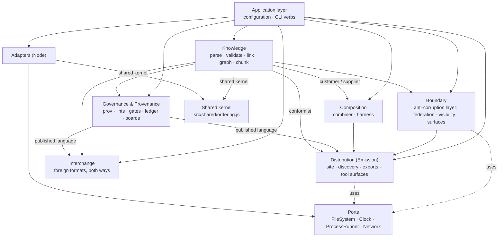

# `src/` — the reference engine, a module guide

**Summary.** This folder is one implementation of the AgenticSystemCore
specification, not the specification itself. The truth is `spec/00`–`spec/11`,
`schema/*.json`, `ontology/agsc.ttl` and `tests/vectors/**`; a port in any language
must be able to reach conformance from those alone. This page is the map of the code:
what each folder owns, which module answers each command, which libraries it uses and
how to check it. It is for a developer who wants to read, change or extend the engine.

**Read after:** the root `README.md`. **Read next:** `docs/CODE-ORIENTATION.md` (a
guided walk with a reading path per task) and `docs/ARCHITECTURE-GUIDE.md` (the
pictures). The per-module reference as each part was built is `REFERENCE.md` in this
folder; the history of changes is `CHANGELOG.md` at the root.

Everything here is CommonJS (`require`), Node ≥ 22.13, and deterministic: no wall
clock, no network, no locale, no filesystem enumeration order (AGSC-04-01,
AGSC-04-03). Standard formats are read and written by maintained libraries at exact
pinned versions; what this engine writes by hand is only what the specification pins
byte for byte and no library produces.

---

## 1. The folders

| Folder | Role | What it owns | Its README |
|---|---|---|---|
| `knowledge/` | bounded context | parsing, validation, links, the graph and its four RDF views, chunks, adoption, the content version, the diagram compiler | [knowledge/README.md](knowledge/README.md) |
| `governance/` | bounded context | provenance, the lints, gates, the derived ledger, boards and agent lanes | [governance/README.md](governance/README.md) |
| `composition/` | bounded context | selection and closure, the Harness, skill packs, the archive, the browser build of the algebra | [composition/README.md](composition/README.md) |
| `distribution/` | bounded context | the build: every route, page, header, discovery document, text file, search index, tool surface and hosting profile | [distribution/README.md](distribution/README.md) |
| `boundary/` | bounded context | where a node meets anything outside it: peers and federation, visibility, the agent surfaces | [boundary/README.md](boundary/README.md) |
| `interchange/` | supporting context | foreign formats in and out: OKF, COGX, GABBE, skills repositories, project boards, steering files, the old site | [interchange/README.md](interchange/README.md) |
| `application/` | application layer | configuration, the command line and its sixteen verbs, the Bundle loader, the conformance run, plugins, `agsc-host` | [application/README.md](application/README.md) |
| `ports/` | hexagonal ports | four interfaces, no code: FileSystem, Clock, ProcessRunner, Network | none: `tests/ports/` holds the folder to exactly its four interface files, and each file's header is its documentation |
| `adapters/` | hexagonal adapters | the Node implementations of the four ports | [adapters/README.md](adapters/README.md) |
| `shared/` | shared kernel | the two string orderings, and nothing else | [shared/README.md](shared/README.md) |

Entry points: `bin/agsc.js` builds the four ports from `adapters/` and calls
`application/cli/main.js#main`, which dispatches to one module per verb in
`application/cli/verbs/`. `bin/agsc-host.js` calls `application/hosting.js#main`.
`index.js` at the root is the programmatic entry of the npm package.

## 2. The context map

The directory layout **is** the domain model. Each context owns a language and a set
of rules; the arrows below are the only permitted directions, and
`tests/arch/context-boundaries.test.js` fails the build if a `require` points the
wrong way.



*Amended 2026-09-24:* the arrow from Governance to Interchange was added. Interchange
reads Governance's published language (provenance, the ledger, agent records) when
it imports and exports, and the architecture test has always allowed it.

**The shared kernel.** `shared/ordering.js` holds the two string orderings — the
UTF-16 comparison of AGSC-04-05 and the code-point comparison of AGSC-04-12 — and
depends on nothing. The FileSystem adapter owes AGSC-01-15 the same code-point order
that the Knowledge context owes AGSC-04-12, and an adapter may not reach into a
bounded context; one comparator in one place cannot drift.

**Ubiquitous language.** Bundle, Item, Link, Cluster, Chunk, Attachment, Proposal,
Review, Gate, Ledger, Channel, Agent lane, Selection, Verdict, Harness, Page, Route,
Surface, Peer, Visibility, Tombstone. These are the only names for these things, in
code, in tests and in prose. `docs/ARCHITECTURE-DDD.md` defines each one; the
specification section that governs it is cited in every module header.

**Purity.** `knowledge/`, `governance/` and `composition/` never touch a file, a
process, a clock, a network or a random number. They take strings and records and
return records. Everything that reaches the outside world does so through a port,
and only the application layer and `bin/` may construct an adapter.
`tests/arch/core-purity.test.js` enforces this.

**Errors.** A domain fault is a **Finding** with a registered `AGSC-E<nnn>` code
(AGSC-09-11), returned, never thrown. A thrown error means a programming fault — a
schema that does not compile, a value that is not JSON. Three faults are raised by
throwing because an adapter finds them and has no Finding list to return:
`AGSC-E902` (a path escaping the Bundle root), `AGSC-E903` (an archive) and
`AGSC-E904` (the size cap). The command line turns such a thrown error into a Finding
in the AGSC-09-11 envelope with the AGSC-09-08 exit code. A malformed
`SOURCE_DATE_EPOCH` is the one environment fault: `AGSC-E603`, exit 2.

### Shared records

```js
// Finding (AGSC-09-11) — the severity literal is `warn`, never `warning`
{ code: 'AGSC-E301', col: 1, file: 'content/concepts/a.md', line: 12,
  message: '…', severity: 'error' | 'warn', slug?: 'a' }
// sorted by (file, line, col, code), compared code-point-wise (AGSC-09-10)

// Item (parsed)
{ path, slug, type, frontmatter, body, lineOffset, findings }

// Bundle (loaded)
{ root, config, index: { frontmatter, body }, items, byslug, findings }

// Envelope (AGSC-09-11), emitted JCS-canonical with one trailing LF
{ counts: { error, warn }, findings: [], schema: 'agsc.diagnostics.v1',
  spec_version, status: 'pass' | 'fail', verb, version }
```

## 3. Which module answers each verb

The sixteen verbs of AGSC-09-07. Each has one module in `application/cli/verbs/`,
which calls into the contexts.

| Verb | Rule | Where the work is done |
|---|---|---|
| `init` | AGSC-02-90…95, AGSC-01-37 | `distribution/init.js`, `knowledge/adopt.js` |
| `lint` | AGSC-09-12, AGSC-08-13…17 | `knowledge/{validate,links,slug}.js`, `governance/lint.js`, `governance/agents.js`; `--fix` in `governance/fix.js` |
| `build` | AGSC-06-01, AGSC-04-01/02 | `distribution/site.js` |
| `verify` | AGSC-04-02, AGSC-08-23 | `distribution/site.js#verify`, `governance/ledger.js#verify` |
| `ci` | AGSC-09-08 | `distribution/ci.js`, with the lint lane injected |
| `export` | AGSC-01-26…29, AGSC-01-26a | `interchange/{export-bundle,steer}.js`, the build's own bytes, `interchange/adapters/<name>.js` for `--to` |
| `import` | AGSC-01-22/23, AGSC-03-19, AGSC-01-26a | `interchange/okf.js`, `interchange/adapters/{cogx,gabbe,skills,board}.js`, `interchange/import.js` for the old site |
| `compose` | AGSC-07-04…09, 07-12, 07-18, 07-24 | `composition/{compose,architecture,harness}.js`; `--zip` through `composition/archive.js` |
| `propose` | AGSC-08-04, AGSC-08-05 | `knowledge/adopt.js`, the `diff` library |
| `review` | AGSC-08-27 | the lint lane; no model call is reachable |
| `refresh` | AGSC-08-28(f) | `governance/agents.js#checkProposal`; the live path needs a model and a channel adapter |
| `skills` | AGSC-07-19…22, AGSC-07-15 | `composition/skills.js`; the build writes the same bytes at `/skills/**` |
| `mcp` | AGSC-09-13 | `distribution/mcp-stdio.js` → `distribution/mcp-tools.js`; a streaming verb, nothing but protocol bytes on stdout |
| `run` | AGSC-09-94, AGSC-02-22 | `knowledge/runblocks.js` and the ProcessRunner port; off by default, and it executes only on a runner that declares network isolation, which the shipped adapter does not |
| `trace` | AGSC-09-94, AGSC-02-14 | `interchange/trace.js`; off by default |
| `conform` | AGSC-09-01…03, AGSC-10-15 | `application/conformance.js`, `composition/conform.js` |

With `run.enabled` false, `run` and `trace` answer exactly as an unknown verb does:
exit 2 with `AGSC-E001` (AGSC-09-94). `tests/application/cli/verbs-sixteen.test.js`
holds the set to sixteen; `tests/application/cli/verbs-wired.test.js` runs every verb
end to end over a copy of the fixture.

**The seven tools** are a surface, not verbs (AGSC-09-13, AGSC-09-16). They are served
over the local MCP server (`distribution/mcp-tools.js`) and as page tools in a built
site (`distribution/page-tools.js`), and the two answer identically for the same
input; vector `cli-0003` compares them call by call.

| Tool | Local server | Page tool |
|---|---|---|
| `search`, `read`, `links`, `ask` | over the loaded Bundle | over the published files (`/search.json`, `/pages/<slug>.md`) |
| `compose` | `composition/compose.js` | the same algebra, shipped to the page by `composition/browser.js` |
| `propose`, `remember` | the caller may write `dist/proposal/<n>.{patch,md}` | the payload is returned and nothing is written |

## 4. Libraries

Standard formats are not reimplemented here. Every dependency is pinned to an exact
version in `package.json`, is permissively licensed, reaches neither the network nor
the clock at run time, and is loadable from CommonJS. *(Table brought up to date on
2026-09-24 from `package.json` and the `require` calls in `src/`, `bin/` and `tools/`;
the first six rows were the whole table until then.)*

| Need | Library | Version | Licence | Used in |
|---|---|---|---|---|
| YAML failsafe subset | `yaml` | 2.9.1 | ISC | `knowledge/yaml.js`, `knowledge/adopt.js`, `governance/fix.js` |
| JSON Schema 2020-12 | `ajv` (`ajv/dist/2020`) | 8.20.0 | MIT | `knowledge/schema.js`, `tools/validate-schemas` |
| `format` keyword | `ajv-formats` | 3.0.1 | MIT | the same two |
| RFC 8785 (JCS) | `json-canonicalize` | 3.0.1 | MIT | `knowledge/jcs.js` |
| CommonMark + GFM tables | `markdown-it` | 15.0.2 | MIT | `knowledge/markdown.js`, `tools/gen-spec-html` |
| Turtle and N-Quads | `n3` | 2.7.12 | MIT | `knowledge/turtle.js`, `tools/validate-ontology`, `tools/gen-ns` |
| XML (SVG allow-list, RDF/XML re-read) | `fast-xml-parser` | 5.11.1 | MIT | `governance/lint.js`, `tools/gen-ns` |
| JSON-LD round-trip proof | `jsonld` | 9.0.0 | BSD-3-Clause | the shipped conformance areas under `tests/conformance/areas/` |
| argv parsing | `commander` | 15.0.0 | MIT | `application/cli/main.js` |
| `.env` tokenising (`parse` only) | `dotenv` | 18.0.3 | BSD-2-Clause | `application/config/env.js` |
| unified diffs | `diff` | 9.0.0 | BSD-3-Clause | `application/cli/verbs/propose.js` |
| MCP over stdio | `@modelcontextprotocol/sdk` | 1.30.1 | MIT | `distribution/mcp-stdio.js` |
| TOON encoding | `@toon-format/toon` | 4.1.1 | MIT | `interchange/adapters/llm-context.js` |
| property tests (dev) | `fast-check` | 4.10.1 | MIT | tests only |
| ZIP reader, to prove the archive (dev) | `fflate` | 0.8.3 | MIT | tests only |
| Gherkin parser (dev) | `@cucumber/gherkin`, `@cucumber/messages` | 42.0.1, 34.2.1 | MIT | the acceptance runner |

What this engine still writes by hand, and why: the AGSC-02-02 **allow-list** on top
of the YAML parser (no library knows which constructs this specification forbids or
which code each one carries); the `oneOf` **discrimination** on top of Ajv (§9.4's
precedence rule is unsatisfiable without it); NFC-**before**-canonicalisation
(AGSC-04-21 — RFC 8785 deliberately leaves normalization to the caller); the slug
grammar and slugifier (AGSC-01-10, AGSC-02-91); the emitted-YAML profile of
AGSC-04-19; and the **ZIP container** of `composition/archive.js`, because the page
and the command line must write the same bytes from one implementation, and the
libraries measured fill the ZIP time fields from local time. `fflate` is pinned as the
independent reader that unpacks every archive the tests build. `REFERENCE.md` §3 has
the full reasoning.

### The JSON Schema keywords the three schemas use

Derived from `schema/*.json`, never typed by hand
(`knowledge/schema.js#keywordsUsed`; `tests/knowledge/schema.test.js` re-derives it):

```
$defs  $id  $ref  $schema  additionalProperties  allOf  const  default  description
enum  format  if  items  maxItems  maxLength  maximum  minItems  minLength  minimum
oneOf  pattern  patternProperties  properties  required  then  title  type  uniqueItems
```

`format` values used: `uri` (once, on `peers[]`, alongside a stricter `pattern`).
Ajv 2020 covers every keyword above natively, `ajv-formats` covers `uri`, and Ajv
already counts `minLength`/`maxLength` in Unicode code points, which is exactly what
AGSC-02-24 requires. Ajv runs in `strict` mode so that a keyword outside this list
throws when the schema is compiled rather than being ignored at validation time; the
single relaxation is `strictRequired`, because `config.schema.json` has an `if/then`
that requires a property declared in a sibling subschema.

## 5. Running the conformance vectors

```bash
npm install                      # exact pins; the lockfile is committed
node --test 'tests/**/*.test.js' # unit, architecture, conformance and acceptance suites
node tools/validate-vectors --json
node tools/count-artifacts --json
```

The runner is `tests/conformance/vector-runner.test.js`. The run itself is
`application/conformance.js` — the same module `agsc conform` calls, so the suite and
the verb cannot disagree about what a vector set is or how a result is classified. It
loads every file under `tests/vectors/**`, dispatches on `area` to
`tests/conformance/areas/<area>.js` and prints one line:

```
vectors: <pass> pass, <fail> fail, <skip> skip (<withdrawn> withdrawn, <pending> pending) of <total>
```

* a `withdrawn` vector is skipped and counted for nothing (AGSC-00-16, AGSC-09-05);
* an id listed in `tests/conformance/pending.json` is skipped with its reason (the
  file is empty today);
* a vector naming `requires_surface` values this node does not declare is
  skipped-as-passed (AGSC-09-04); this node declares `mcp` and `webmcp`;
* a required vector with no handler **fails**. Silence is never a pass.

`agsc conform --level <0|1|2|3> [--to <path>]` runs the same vectors outside
`node:test` and writes the AGSC-09-03 report. `npm audit` needs the network and is run
explicitly (`AGSC_AUDIT=1 node --test tests/arch/pinned-dependencies.test.js`).

**No conformance claim is made before 1.0.0** (AGSC-10-05): a claim names one Level
and is backed by a green run of that Level's vector set at a released version. A
report written by `agsc conform` is not a claim (AGSC-09-03).

## 6. Using the fixture from a foreign port

`tests/fixtures/minimal/` is the smallest Bundle that conforms: one
`agsc.config.json`, one `content/index.md`, two `concept` items and one `cluster`,
every file UTF-8/LF/NFC with one trailing LF, every frontmatter key already in the
schema order of AGSC-04-19 so that `lint --fix` is a no-op.

A port in another language can use it without reading a line of this engine:

1. copy the directory;
2. set `SOURCE_DATE_EPOCH=1767225600` (2026-01-01T00:00:00Z) so the build instant is
   fixed (AGSC-04-09);
3. lint it — the result must be zero findings;
4. build it twice into two directories and compare bytes — they must be identical
   (AGSC-04-01, AGSC-04-02);
5. compare your emitted machine artefacts with the expected bytes the vectors carry
   (AGSC-04-24 lists which artefacts are pinned across implementations; generated
   HTML is not one of them).

`tests/knowledge/fixture-minimal.test.js` is this engine's own version of steps 1–3.

## 7. What this engine does not do, and where it says so

* the sandboxed executor of AGSC-09-94 — the `run` verb's finding;
* an `--emit` target of AGSC-07-18 that no emitter is installed for — the `compose`
  verb's finding;
* the AGSC-06-01 routes no module produces — `site.build`'s `skipped` list, from
  `site.UNPRODUCED_ROUTES`;
* the tracked-file half of AGSC-01-37, when no ProcessRunner port is wired — named in
  the lint lane's `lanes`;
* `/ledger.jsonl`, when the Bundle has no history (AGSC-08-20a) — named in `skipped`,
  and `verify --ledger` then reports `AGSC-E703` rather than a green chain;
* the live half of `refresh` and of the model-backed `review` — they need a model and
  a channel adapter, which the engine does not ship.

## 8. Where the rest went

*Note, 2026-09-24:* this file used to carry the engine's build log as well as its map
(about 2,000 lines). It was cut to this guide, and nothing was deleted:

* the per-module reference as each part was built — the first module table and its
  API, the application layer, links and lints, the graph exports, the build pipeline,
  composition and the tool transports, and §11.1–§11.5 of the integration record —
  is `REFERENCE.md` in this folder, with its section numbers kept;
* §11.6–§11.17 (the specification items the engine found, the behaviour corrections of
  2026-09-18 to 2026-09-21, the release candidates, the validators, the page tools,
  the export forms, the legal surfaces) and the dated sections that followed them are
  in `CHANGELOG.md`, under "Engine notes moved from `src/README.md`", with their
  numbers kept, so a citation such as "§11.6(5)" still finds its text there.

## 9. Changes to the module map (2026-09-24)

*Note, 2026-09-24, appended:* `interchange/licences.js` is new — the licences an import
recognises, shared by the skills adapter and the OKF reader (AGSC-01-22).
`governance/boards.js#claimants(gitLog, items)` now takes the items it derives
`claimed_by` for, and exports `holderOf` and `sameParticipant`; the page tools carry
`pageClaimants` and read the board exports. The six-mode walk is `tests/e2e/modes/`.
