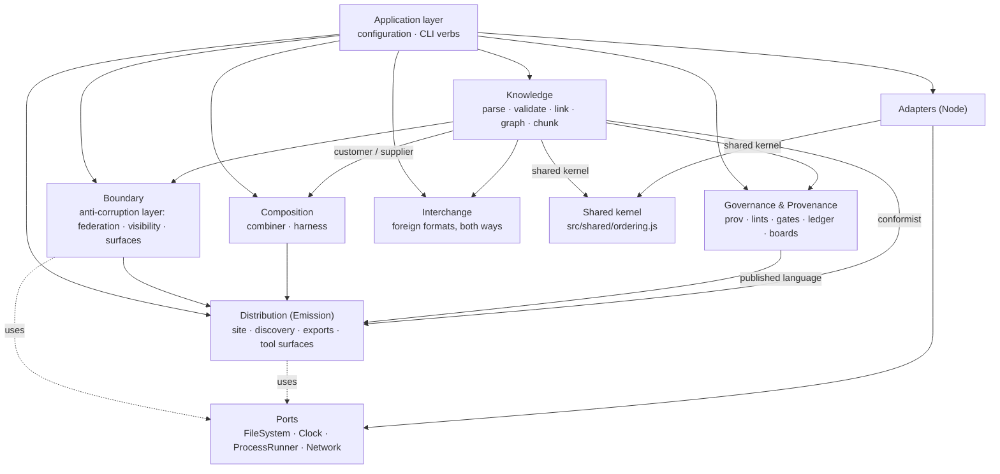

# `src/` — the per-module reference, as each part was built

**Summary.** This is the engine's module reference as it was written while each part
was built, between 2026-09-16 and 2026-09-24: the module tables, the public function
signatures of each context, the libraries each part added and why, and the
integration record (§11.1–§11.5). Section numbers are the ones this text had inside
`src/README.md`, kept so that older citations still resolve. It is for a developer who
needs a function's signature or the reason behind a design choice.

**Read first:** [README.md](README.md), the current module guide. Where this reference
and the guide differ, the guide is current and the specification wins over both. The
change history that followed §11.5 is in `CHANGELOG.md`, under "Engine notes moved
from `src/README.md`".

*Note, 2026-09-24:* moved here unchanged from `src/README.md` when that file was cut to
a module guide. The words "this package" in a section mean the work package that built
that part of the engine.

---

## 1. The context map

The directory layout **is** the domain model. Each context owns a language and a set
of rules; the arrows below are the only permitted directions, and
`tests/arch/context-boundaries.test.js` fails the build if a `require` points the
wrong way.



**The shared kernel** (added 2026-09-18). `src/shared/ordering.js` holds the
two string orderings — the UTF-16 comparison of AGSC-04-05 and the code-point
comparison of AGSC-04-12 — and depends on nothing. It exists because the FileSystem
adapter owes AGSC-01-15 the same code-point order that the Knowledge context owes
AGSC-04-12, and an adapter may not reach into a bounded context. A second copy of the
comparator would be worse than the arrow it removes: two orderings can drift, one
cannot. `knowledge/unicode.js` re-exports both, so every existing caller is unchanged.

**Ubiquitous language.** Bundle, Item, Link, Cluster, Chunk, Attachment, Proposal,
Review, Gate, Ledger, Channel, Agent lane, Selection, Verdict, Harness, Page, Route,
Surface, Peer, Visibility, Tombstone. These are the only names for these things, in
code, in tests and in prose. `docs/ARCHITECTURE-DDD.md` defines each one; the
specification section that governs it is cited in every module header.

**Purity.** `knowledge/`, `governance/` and `composition/` never touch a file, a
process, a clock, a network or a random number. They take strings and records and
return records. Everything that reaches the outside world does so through a port,
and only the application layer and `bin/` may construct an adapter.
`tests/arch/core-purity.test.js` enforces this.

**Errors.** A domain fault is a **Finding** with a registered `AGSC-E<nnn>` code
(AGSC-09-11), returned, never thrown. A thrown error means a *programming* fault —
a schema that does not compile, a value that is not JSON — and the process may
legitimately stop. `SOURCE_DATE_EPOCH` being malformed is the one environment fault:
`AGSC-E603`, exit 2, never a Finding (AGSC-09-08).

One exception, corrected 2026-09-18: a few faults are *raised* by throwing
because they are discovered inside an adapter that has no Finding list to return —
`AGSC-E902` (a path escaping the Bundle root), `AGSC-E903` (an archive) and
`AGSC-E904` (the size cap). All three are **registered in spec/09 §9.4**, so the CLI
shell turns a thrown error whose `code` has that shape into a Finding in the
AGSC-09-11 envelope with the AGSC-09-08 exit code. Before the correction those three
codes were unreachable through the CLI: an oversized file exited 1 with
`agsc: internal error:` and an **empty stdout under `--json`**.

---

## 2. Module map

| Path | Context | Implements |
|---|---|---|
| `knowledge/unicode.js` | Knowledge | AGSC-04-05, 04-12, 04-21, 04-23, 02-24 — NFC, code-point length, the two orderings, the combining bound |
| `knowledge/yaml.js` | Knowledge | AGSC-02-01…04 — the YAML failsafe subset and its rejections |
| `knowledge/frontmatter.js` | Knowledge | AGSC-02-01, 01-14, 01-16 — the block, the body, the Item record |
| `knowledge/schema.js` | Knowledge | AGSC-00-09, 02-24, 01-10 — the JSON Schema 2020-12 validator and `oneOf` discrimination |
| `knowledge/validate.js` | Knowledge | AGSC-00-15, 01-03, 01-11, 01-18, 02-05, 02-05a, 02-07, 02-21, 02-24 and the §9.4 code precedence |
| `knowledge/slug.js` | Knowledge | AGSC-01-10, 01-11, 01-23, 02-91 — grammar, uniqueness, slugifier, collisions |
| `knowledge/jcs.js` | Knowledge | AGSC-04-04…06, 04-21 — RFC 8785 with NFC first, plus the I-JSON check |
| `knowledge/adopt.js` | Knowledge | AGSC-02-90…93 — total, idempotent, byte-preserving adoption |
| `ports/*.js` | — | JSDoc interfaces only; they export nothing |
| `adapters/node-fs.js` | — | FileSystem over `node:fs`; AGSC-01-15/16; also `readSchemas` and `readOntology`, the one door the schemas and the vocabulary enter by |
| `adapters/node-clock.js` | — | Clock over `SOURCE_DATE_EPOCH`; AGSC-04-09/10 |
| `adapters/node-proc.js` | — | ProcessRunner: `execFileSync`, no shell, scrubbed environment, timeout |
| `adapters/node-network-refusing.js` | — | Network that refuses every call (AGSC-04-03) |

Other modules in `knowledge/`, `governance/`, `composition/`, `distribution/`,
`boundary/`, `interchange/` and `application/` are delivered by the other packages of
this milestone and documented in their own headers. **§11 carries the module map
of the whole engine as it stands after integration**, together with the verb →
module table, and is the section to read first if you want the current shape
rather than the history of how it was built.

### Shared records

```js
// Finding (AGSC-09-11) — the severity literal is `warn`, never `warning`
{ code: 'AGSC-E301', col: 1, file: 'content/concepts/a.md', line: 12,
  message: '…', severity: 'error' | 'warn', slug?: 'a' }
// sorted by (file, line, col, code), compared code-point-wise (AGSC-09-10)

// Item (parsed)
{ path, slug, type, frontmatter, body, lineOffset, findings }

// Bundle (loaded)
{ root, config, index: { frontmatter, body }, items, byslug, findings }

// Envelope (AGSC-09-11), emitted JCS-canonical with one trailing LF
{ counts: { error, warn }, findings: [], schema: 'agsc.diagnostics.v1',
  spec_version, status: 'pass' | 'fail', verb, version }
```

### Public API of this package

```js
// knowledge/unicode.js
nfc(s); codePointLength(s); compareCodePoint(a, b); compareUtf16(a, b);
checkCombining(s, max = 256); isWellFormed(s)

// knowledge/yaml.js — throws YamlError { code: 'AGSC-E10x' | 'AGSC-E904', line, col, message }
parse(text, { lineOffset = 0, maxBytes = 1 MiB }) -> value   // every scalar a string

// knowledge/frontmatter.js
split(markdown, { file }) -> { hasFrontmatter, yamlText, body, bodyLine, errors }
parseItem(markdown, { path, schemas, config }) -> Item
hasClosedFrontmatter(markdown); keyLines(yamlText, lineOffset); firstHeading(body)

// knowledge/schema.js
compile(schemaObject) -> (value) => { valid, errors: [{ path, keyword, message, params, schemaPath }] }
keywordsUsed(schemaObject) -> { keywords, formats }

// knowledge/validate.js
schemas({ item, config, bundle }) -> { item, config, bundle }   // compiled
applyTypes(value, schema) -> value                              // AGSC-02-03, second half
item(frontmatter, { schemas, file, keyLines, slug, config }) -> Finding[]
index(frontmatter, { schemas, file, keyLines }) -> Finding[]
config(configObject, { schemas, file, checkAgents }) -> Finding[]
placement(path, frontmatter) -> Finding[]
unknownKeys(frontmatter, { schemas | schema }) -> { known, vendor, unknown, malformed }
majorCompatible(declared, own); sortFindings(findings); finding(code, message, extra)

// knowledge/slug.js
SLUG_PATTERN; isValid(slug); check(slugs, { files }) -> Finding[]
slugify(title); dedupe(slug, taken); stemOf(path); pathSlug(path)

// knowledge/jcs.js
canonicalize(value) -> string; isIJSON(value) -> boolean; compareUtf16; compareCodePoint

// knowledge/adopt.js
adopt(files, { config, gitUserEmail }) -> { files, findings }
adoptFile({ path, markdown }, { config, gitUserEmail, taken }) -> { path, output, changed, skipped, frontmatter, body, findings }
operatorFor(config, gitUserEmail); titleFor(body, stem, slug); serialize(frontmatter)
relativeReferences(body)

// adapters
createFileSystem(root, { maxBytes }); readSchemas(engineRoot); readOntology(engineRoot)
createClock({ env, lastCommitSeconds }) -> { now, iso, findings }
createProcessRunner({ cwd, env, timeoutMs }) -> { run }
createNetwork() -> { fetch }   // always rejects, AGSC-E905
```

---

## 3. Libraries

Standard formats are not reimplemented here. Every dependency is pinned to an exact
version, is permissively licensed, reaches neither the network nor the clock at
runtime, and is loadable from CommonJS.

| Need | Library | Version | Licence |
|---|---|---|---|
| YAML failsafe subset | `yaml` | 2.9.1 | ISC |
| JSON Schema 2020-12 | `ajv` (`ajv/dist/2020`) | 8.20.0 | MIT |
| `format` keyword | `ajv-formats` | 3.0.1 | MIT |
| RFC 8785 (JCS) | `json-canonicalize` | 3.0.1 | MIT |
| property tests (dev) | `fast-check` | 4.10.1 | MIT |
| ZIP reader, to prove the archive (dev) | `fflate` | 0.8.3 | MIT |

What this package still writes by hand, and why: the AGSC-02-02 **allow-list** on top
of the YAML parser (no library knows which constructs this specification forbids or
which code each one carries); the `oneOf` **discrimination** on top of Ajv (§9.4's
precedence rule is unsatisfiable without it); NFC-**before**-canonicalisation
(AGSC-04-21 — RFC 8785 deliberately leaves normalization to the caller); the slug
grammar and slugifier (AGSC-01-10, AGSC-02-91); the emitted-YAML profile
selection of AGSC-04-19; and the **ZIP container** of `composition/archive.js`
(see below).

**Why the archive is written here and `fflate` only reads it.** The `--zip` output
of has to satisfy three things at once, and no published library satisfies
all three. (a) AGSC-07-13 requires the browser and the CLI to produce the same
bytes, and this package holds that by running ONE implementation in both hosts —
`composition/browser.js` emits the source text of the functions the CLI runs, and
`tests/arch/composition-portable.test.js` fails any portable function that calls
`require`, so a library cannot be inside that mechanism. (b) A ZIP entry's
timestamp lives in the MS-DOS fields of APPNOTE.TXT §4.4.6, which are LOCAL time
and carry no zone: `fflate@0.8.3` (`lib/node.cjs:1925`) and `client-zip@2.5.1`
(`index.js`, function `w`) fill them with `Date#getFullYear`/`getHours`/…, so the
same input gives different bytes under `TZ=UTC` and `TZ=Pacific/Kiritimati` —
measured here, not assumed — and AGSC-04-02 forbids that. (`jszip@3.10.2` is the one
that uses the UTC accessors, and fails elsewhere: four runtime dependencies, the
dual `MIT OR GPL-3.0-or-later` licence, a 96 KB browser build, and a Unicode-path
EXTRA FIELD written into every entry whose name is UTF-8, which's
byte-reproducible archive does not want.) (c) The page host is the language alone:
`TextEncoder` is absent from the context that proves (a), and `fflate`'s browser
build (`umd/index.js`, 33,044 bytes, minified, no licence banner) reaches for
`Worker`, `Blob` and `URL.createObjectURL`, which a `script-src 'self'` page
(AGSC-06-17) should not be shipped. So the container — STORE only, no compression, no optional field — is
written here in about 120 lines, and `fflate` is pinned as the independent
THIRD-PARTY READER that unpacks every archive the tests build and compares it,
entry for entry, with the input. A library that verifies the writer is worth more
than a library that is the writer and cannot be proved portable. `tools/validate-vectors` is independent by construction —
Node built-ins only, no import from `src/` — because a validator that imported the
engine it validates would prove nothing (AGSC-09-90).

### The JSON Schema keywords the three schemas use

Derived from `schema/*.json`, never typed by hand
(`knowledge/schema.js#keywordsUsed`; `tests/knowledge/schema.test.js` re-derives it):

```
$defs  $id  $ref  $schema  additionalProperties  allOf  const  default  description
enum  format  if  items  maxItems  maxLength  maximum  minItems  minLength  minimum
oneOf  pattern  patternProperties  properties  required  then  title  type  uniqueItems
```

`format` values used: `uri` (once, on `peers[]`, alongside a stricter `pattern`).
Ajv 2020 covers every keyword above natively, `ajv-formats` covers `uri`, and Ajv
already counts `minLength`/`maxLength` in Unicode code points, which is exactly what
AGSC-02-24 requires. Ajv runs in `strict` mode so that a keyword outside this list
throws when the schema is compiled rather than being ignored at validation time; the
single relaxation is `strictRequired`, because `config.schema.json` has an `if/then`
that requires a property declared in a sibling subschema.

---

## 4. Running the conformance vectors

```bash
npm install                      # exact pins; the lockfile is committed
node --test 'tests/**/*.test.js' # unit, architecture and conformance suites
node tools/validate-vectors --json
node tools/count-artifacts --json
```

The runner is `tests/conformance/vector-runner.test.js`. The RUN itself is
`src/application/conformance.js` — the same module `agsc conform` calls, so the
suite and the verb cannot disagree about what a vector set is or how a result is
classified. It loads every file under `tests/vectors/**`, dispatches on `area` to
`tests/conformance/areas/<area>.js` and prints one line:

```
vectors: <pass> pass, <fail> fail, <skip> skip (<withdrawn> withdrawn, <pending> pending) of <total>
```

* a `withdrawn` vector is skipped and counted for nothing (AGSC-00-16, AGSC-09-05);
* an id listed in `tests/conformance/pending.json` is skipped with its reason, a
  temporary state while the milestone lands — the integration package empties it;
* a vector naming `requires_surface` values this node does not declare is
  skipped-as-passed (AGSC-09-04); this node declares `mcp` and `webmcp`;
* a required vector with no handler **fails**. Silence is never a pass.

Run one suite with `node --test tests/knowledge/slug.test.js`. Every test sets its
own clock or passes a fixed one; none reaches the network.

`agsc conform --level <0|1|2|3> [--to <path>]` runs the same vectors outside
`node:test` and writes the AGSC-09-03 report; `npm audit` is the release gate and
is run explicitly (`AGSC_AUDIT=1 node --test tests/arch/pinned-dependencies.test.js`)
because it is the one check that needs the network.

---

## 5. Using the fixture from a foreign port

`tests/fixtures/minimal/` is the smallest Bundle that conforms: one
`agsc.config.json`, one `content/index.md`, two `concept` items and one `cluster`,
every file UTF-8/LF/NFC with one trailing LF, every frontmatter key already in the
schema order of AGSC-04-19 so that `lint --fix` is a no-op.

A port in another language can use it without reading a line of this engine:

1. copy the directory;
2. set `SOURCE_DATE_EPOCH=1767225600` (2026-01-01T00:00:00Z) so the build instant is
   fixed (AGSC-04-09);
3. lint it — the result must be zero findings;
4. build it twice into two directories and compare bytes — they must be identical
   (AGSC-04-01, AGSC-04-02);
5. compare your emitted machine artefacts with the expected bytes the vectors carry
   (AGSC-04-24 lists which artefacts are pinned across implementations; generated
   HTML is not one of them).

`tests/knowledge/fixture-minimal.test.js` is this engine's own version of steps 1–3,
so a change that quietly breaks the fixture fails here first.

---

## 6. Application layer — configuration and the CLI shell

Added by the package (`src/application/config/`, `src/application/cli/`,
`src/governance/agents.js`, `bin/agsc.js`, `bin/agentic-system-core`). The
application layer orchestrates use cases across contexts and owns no domain rule
of its own (§1's context map); it is the only layer, besides `bin/`, allowed to
construct an adapter.

| Path | Implements |
|---|---|
| `application/config/env.js` | AGSC-01-37 — the `.env` file, the `AGSC_*` name table (mechanically derived from `schema/config.schema.json`), credential exclusion |
| `application/config/load.js` | AGSC-09-09 — the five-layer precedence (flag > env > `.env` > project > user > default) |
| `application/cli/main.js` | AGSC-09-07…12 — verb dispatch, global flags, the AGSC-09-11 envelope |
| `application/cli/verbs/*.js` | one module per verb of AGSC-09-07; wired at integration — see the verb → module table of §11.2. The interim `AGSC-PENDING` marker is gone: a verb either answers, or says with one finding which rule it will implement |
| `governance/agents.js` | AGSC-01-36/37/38, 08-25, 08-28(c), 10-17(partial) — `checkAgents`, `checkProposal`, `capMeter` |
| `bin/agsc.js`, `bin/agentic-system-core` | the real CLI entry points; wire A's adapters when present, fall back to inline Node-stdlib ports otherwise |

### Libraries added by this package (ADR-019)

| Need | Library | Version | Licence |
|---|---|---|---|
| `.env` raw tokenising | `dotenv` (`.parse()` only, never `.config()`) | 18.0.0 | BSD-2-Clause |
| argv parsing | `commander` | 15.0.0 | MIT |

**`.env`** — `application/config/env.js#parseDotenv` calls `dotenv.parse(text)` for
the raw `NAME=value` tokenising; the `^AGSC_[A-Z0-9_]+$` name filter, the
credential exclusion (`AGSC_MODEL_API_KEY`/`AGSC_MODEL_BASE_URL` never become
configuration keys) and the AGSC-09-09 precedence merge stay hand-written, since
no library does the AGSC-01-37-specific part.

**argv** — a genuine attempt with `commander@15.0.0` succeeded (kept; the
hand-rolled tokenizer was deleted). `application/cli/main.js#buildVerbParser`
builds one `Command` per verb, scoped to that verb's known flags, with
`exitOverride()` (throws a `CommanderError` instead of calling `process.exit`)
and `configureOutput()` (silences commander's own text; every byte on
stdout/stderr is still ours). `helpOption(false)` keeps `-h`/`--help` out of
scope (AGSC-09-09 does not name a help flag; an unrecognised `--foo` correctly
falls through to `commander.unknownOption`). The four commander error codes this
engine maps: `commander.unknownOption` → `AGSC-E002`; `commander.optionMissingArgument`
→ `AGSC-E003`; anything else caught during parse also maps to `AGSC-E002` (a
generic usage fault) — none of commander's own exit codes are used, only its
error *taxonomy*; AGSC-09-08's exit codes (0/1/2) and the E00x codes stay this
module's own. `--version` (bare, no verb) and `SOURCE_DATE_EPOCH` validation are
checked before a verb is even looked up, so they never reach commander at all.
Positional arguments (`trace <file.json>`, `run <slug>`) pass through via
`allowExcessArguments(true)`.

### User configuration (AGSC-09-09, the "user" precedence layer)

Decision (2026-09-18): `bin/agsc.js` reads
`$XDG_CONFIG_HOME/agsc/config.json`, falling back to `~/.config/agsc/config.json`,
through a **second**, separate `createFileSystem` instance rooted at that
directory — distinct from the Bundle's own FileSystem port, since the two roots
are unrelated directories and a Bundle-rooted port cannot reach outside its own
root (`AGSC-E902`, AGSC-01-16/01-35). The loaded object (or `undefined` if the
file is absent or malformed — there is no registered code for "no user
configuration") is passed to `main()` as `ctx.userConfig`, which forwards it to
`application/config/load.js#load` unchanged; `load()` itself never touches a
filesystem for the user layer, keeping its existing `{ userConfig }` object
interface. `bin/agsc.js` exports `resolveUserConfigDir`/`loadUserConfig` for
testing and guards its own side-effecting entry point behind
`require.main === module` so `tests/bin/agsc-user-config.test.js` can exercise
both against a real temp directory (`node:os.tmpdir()`) without ever touching a
real home directory.

### A schema gap this package works around (report only — not this package's file to fix)

`schema/config.schema.json` is frozen at the current tag and carries no literal
JSON-Schema `default` for four keys the specification prose nonetheless defaults:
`build.out` ("www", AGSC-01-19), `build.feed` (`true`, spec/06-surfaces.md — *not*
`false`; an earlier note misstated this value, corrected here
against the specification text per project rule 6), `i18n.default` ("en",
AGSC-01-18) and `run.enabled` (`false`, AGSC-09-94). `application/config/load.js`
applies these four explicitly (`PROSE_DEFAULTS`, cited by rule id) so the engine
behaves per the specification today; `application/config/env.js#allDefaults`
still derives only what `config.schema.json` literally declares, mechanically,
never hand-typed. The schema itself should gain the four `default` keywords at
the next release candidate.

### `tasks[]` enforcement (AGSC-08-28(c))

`governance/agents.js#checkProposal` rejects a Proposal (or one of its changes)
that declares a `task` (via `proposal.task`, overridable per change with
`change.task`) outside the agent's `tasks[]`, with `AGSC-E509`. This is
deliberately **not** derived from a change's `op` (`create`/`edit`): the
already-conformant `prov-0002` vector has the `planner` agent — whose
`tasks[]` is `['plan','claim','work']`, not `create` — legitimately issue
`op:'create'` changes as part of its `plan` task (decomposing work necessarily
creates task items). `op` and `task` are not the same vocabulary; inferring one
from the other would reject that already-passing case, so the check only fires
when a `task` is actually declared (open question in the report: what
carries a Proposal's task in the wire format `refresh --agent` eventually
produces).

---

## 7. Links, the Markdown subset, the lints and the provenance gates

Added by the package: the Link graph and the body renderer in Knowledge,
and the five lint modules and the provenance/Gate aggregate in Governance. Every
module is pure; every file fact a lint needs — which paths git tracks, which
attachment files exist and how large they are, an attachment's bytes, an item's
previous `status` — is **injected** through `options`, so the same records always
lint to the same Findings in the same order.

| Path | Context | Implements |
|---|---|---|
| `knowledge/markdown.js` | Knowledge | AGSC-02-20, 02-22, 03-13 — the subset renderer, the preserved info strings, the heading-anchor algorithm |
| `knowledge/links.js` | Knowledge | AGSC-03-01…03-13, AGSC-01-35, AGSC-11-12 — the fourteen keys, inverses, cycles, cluster bounds, orphans, body references |
| `governance/injection.js` | Governance | AGSC-08-13 — `injection-scan` (`AGSC-E401`, `AGSC-E402`) |
| `governance/secrets.js` | Governance | AGSC-08-15, AGSC-01-37 — `no-secrets` and the tracked `.env` (`AGSC-E403`) |
| `governance/pii.js` | Governance | AGSC-08-16 — `no-pii` (`AGSC-E404`) |
| `governance/cleanroom.js` | Governance | AGSC-08-17 — `clean-room` (`AGSC-E405`) |
| `governance/finding.js` | Governance | the one place a Governance Finding adds a member |
| `governance/lint.js` | Governance | AGSC-08-13…17 composed, plus AGSC-01-34, 01-35, 02-21, 02-22, 02-23, 02-96, 02-98, 04-23; sorted per AGSC-09-10 |
| `governance/prov.js` | Governance | AGSC-08-01…08-09, AGSC-10-02, AGSC-10-17 — provenance, trailers, Gates, the claim limit |

### Public API of this package

```js
// knowledge/markdown.js
anchorOf(text); assignAnchors(texts); anchors(body) -> { anchors, headings, errors }
render(body) -> { html, headings, anchors, fences, links }
headings(body); fences(body); links(body); selectionFences(body); scan(body)

// knowledge/links.js
LINK_KEYS (14); CORE_KEYS (9); MODE2_KEYS (5); INVERSE; SYMMETRIC; COMPUTED_KEYS
resolve(items, { assets? }) -> { edges, errors, inverses, cycle, cycles, chain,
  chains, parents, resolved, unresolved, skipped_external }
anchors(body); findCycle(adjacency, nodes); pathGrammarError(relative, fromDir)
resolveInside(fromDir, relative); dirOf(path); view(item)

// governance/{injection,secrets,pii,cleanroom}.js
check(input) -> Finding[]              // input carries { text, file, slug, line, … }
secrets.checkTracked(trackedPaths) -> Finding[]

// governance/lint.js
lint(bundle, { trackedPaths?, attachmentBytes?, filesPresent?, previousStatus?,
  sha256?, paths?, emitters? }) -> Finding[]      // sorted per AGSC-09-10
checkPaths, checkCombiningBound, checkAttachments, checkPorts, checkSections,
checkFences, checkSvg, svgViolations, statusTransition, severityFor, proseStrings

// governance/prov.js
deriveProv(item, config) -> { prov, inherited, findings }
checkTrailers(message, { prov }) -> { signoff, assisted, findings }
parseSignoff(line); parseAssisted(line); trailerBlock(message)
checkGate(item) -> { checks, findings }
readForeignTaskState(value); isTerminal(state); heldBy(board, agent)
checkClaims(config, proposal, board) -> { accepted, findings, held_after }
```

### Libraries added by this package

| Need | Library | Version | Licence |
|---|---|---|---|
| Markdown (CommonMark 0.31.2 + GFM tables) | `markdown-it` | 15.0.2 | MIT |
| XML/SVG allow-list | `fast-xml-parser` | 5.11.1 | MIT |

`markdown-it` runs `{html:false, linkify:false, typographer:false}`: raw HTML never
passes through, a bare URL is never turned into a link behind the author's back, and
no character is substituted for a prettier one. `markdown-it-anchor` is **not** used
— its ids are not AGSC-03-13's — so the anchor algorithm, including the
`section-<n>` numbering and the collision walk, stays hand-written and is the single
source of every anchor in the engine. `fast-xml-parser` gives the element and
attribute tree of AGSC-02-98's allow-list; the DOCTYPE, entity-declaration and
processing-instruction checks are a textual pre-scan, because an XML parser
normalises exactly those away.

### Two decisions this package records

**`AGSC-E304` is raised for a closed set of names, not by shape.** AGSC-03-03 warns
on an "unknown link-shaped key", but an arbitrary unknown key is already
`AGSC-E207` in `knowledge/validate.js`, and one fault must not carry two codes.
`links.js` therefore warns for the reserved `peer-ref` (AGSC-11-12), the untyped
`mentions` of AGSC-03-11, and the foreign spellings AGSC-03-19/03-20 map on import
— and for nothing else.

**AGSC-02-21's `taxonomy` and `explainer` headings are not implemented.** The rule
says those two kinds "keep their four headings" but never lists them, so
`checkSections` covers the kinds the rule enumerates (`pattern`, `procedure`,
`episode`, `lesson`) and no heading is invented. Reported as a specification gap.

## 8. The graph exports — JSON-LD, N-Quads, Turtle, RDF/XML, SKOS

Added by the package. One dataset, four views: `nquads.js` builds the quads,
and every other module in this group is a serialization of the same list, so
"all views express the same triples" (AGSC-05-06) is true by construction rather than
by discipline.

| Path | Implements |
|---|---|
| `knowledge/nquads.js` | AGSC-05-01…03 (IRIs), 05-12/13 (classes), 05-14/15 (Source and Review fragment IRIs), 05-16 (Links and inverses), 05-26/05-30 (the frontmatter → property table), 05-29 (attachments), 05-31/32 (literal forms and escaping), 04-13/15/16 (the sort that is the canonicalisation), 06-33 (static fragments) |
| `knowledge/skos.js` | AGSC-05-12/13, 05-17…05-20 — the SKOS integrity rules, IRI-free and injected with a resolver so that `nquads.js` may require it without a cycle |
| `knowledge/turtle.js` | AGSC-05-10 (the stable-Turtle profile), 05-31 (a plain literal is bare in Turtle), 05-08 (`AGSC-E605`), and the vocabulary reader that feeds AGSC-06-32 |
| `knowledge/jsonld.js` | AGSC-05-09 (`graph.jsonld`), AGSC-06-32 (`/ns/context.jsonld`), AGSC-05-04b (`memory://`, `AGSC-E309`) |
| `knowledge/rdfxml.js` | AGSC-05-06 — RESERVED at 1.x, not emitted; kept correct by an isomorphism test |

```js
// knowledge/nquads.js
typePlural(type); bundleIri(base); itemIri(item, {base}); instant(value)
iri(v); literal(v, {lang|datatype}); quad(s, p, o, graph)
escapeLiteral(s); escapeIri(s); nquadsTerm(term); nquadsLine(quad); serialize(quads)
dataset(items, options) -> quad[];  toNQuads(items, options) -> string
attachmentQuads(item, options) -> quad[]
shard(nquads, {sha256, generatedAt}) -> { files, index }; fragmentName(iri, sha256)
countBlankNodes(nquads)
// knowledge/skos.js
classOf(type); isConceptType(type); allowsSemanticRelation(type); isSemanticRelation(p)
labels(item, {lang}); membership(items, resolve)
// knowledge/turtle.js
turtleIri(v); turtleTerm(term); turtlePredicate(v); prefixBlock(); serialize(quads)
toTurtle(items, options); parse(text, options); ontologyTerms(turtleText); ontologyVersion(turtleText)
checkExportBlocks(markdown, {file, lineOffset}) -> Finding[]
// knowledge/jsonld.js
context(ontologyTerms, externalProperties) -> object; allExternalProperties(); persistentContextUrl(ontologyVersion)
expandCompact(v); termName(compact, ascNames, locals); termIndex(context)
resolveMemory(value, {bundleId}) -> { slug } | { finding }
toJsonLd(items, options) -> object
// knowledge/rdfxml.js
escapeXml(s); qname(iri); propertyElement(p, o); serialize(quads); toRdfXml(items, options)
```

### Libraries added by this package

| Need | Library | Version | Licence |
|---|---|---|---|
| RDF parsing (Turtle, N-Quads) | `n3` | 2.7.12 | MIT |
| JSON-LD processing (tests only) | `jsonld` (**devDependency**) | 9.0.0 | BSD-3-Clause |

`n3` is the reader everywhere this engine reads RDF: the vocabulary file behind the
context generator, the blank-node check of AGSC-05-08, and the round-trip test that
re-parses what the Turtle writer wrote. Its **writer** is not used, and the reason is
mechanical rather than stylistic: probed at the pinned version on 2026-09-18,
`N3.Writer` emits `\U0001f600` for an astral character and omits `^^xsd:string` on a
plain literal — exactly the two forms AGSC-05-32 forbids and AGSC-05-31(c) requires —
and its Turtle layout (`"config";`) is not the profile AGSC-05-10 pins (`"config" ;`).
Where the specification pins bytes, this engine writes them and proves the result by
handing it back to the library's parser.

`jsonld` is the reference JSON-LD processor and stays a **development** dependency:
emitting JSON-LD is writing JSON, AGSC-05-11 forbids claiming to be a processor on the
strength of these outputs, and requiring an asynchronous processor at runtime would
make every emitter asynchronous for no gain. It is used where it is worth its weight —
`tests/knowledge/jsonld-roundtrip.test.js` expands and re-compacts `graph.jsonld` to
prove the AGSC-06-32 round trip, and converts it to N-Quads to prove it isomorphic to
`graph.nq`. No RDF/XML writer exists on npm at all (survey of 2026-09-18), which is
why `rdfxml.js` is hand-written and why its test re-parses with `fast-xml-parser`.

### Three decisions this package records

**The graph name is the Bundle IRI, and a caller may ask for the default graph.**
`graph.nq` is a quad file whose fourth term is the Bundle IRI (AGSC-05-03) — the form
the rc.3 vectors `graph-0010`, `graph-0013`, `graph-0014` and `build-0010` state.
The earlier vectors `graph-0001`…`graph-0006` state triples with no graph name, so
`dataset` takes `graph: null` for that and the area handler selects on the vector's
input shape, as `tests/vectors/README.md` directs. `graph.ttl` and `graph.jsonld`
carry the triples: Turtle has no graph names, and AGSC-05-10 asks only that the views
be isomorphic.

**`dcterms:created` and `dcterms:modified` are `xsd:dateTime` under the midnight
convention.** AGSC-05-31 says they carry "the datatype the AGSC-05-26 table names for
`date`/`modified`", and that table has no row for either key. `xsd:date` is outside
the OWL 2 datatype map (AGSC-05-22), so the only available datatype is `xsd:dateTime`
rendered by the midnight convention of AGSC-05-14 — the same one `asc:verifiedOn`,
`asc:retiredAt` and `asc:staleAfter` already use. Reported as a specification gap.

**Cross-context needs are injected, never imported.** The Knowledge context hashes
but never reads, so an attachment's bytes and the SHA-256 function are parameters
(AGSC-05-29); the build instant is a parameter (AGSC-04-09); and the inline-link
edges of AGSC-03-11, which only the Links module can resolve, arrive as
`options.mentions` rather than by requiring it.

---

## 9. The build pipeline and the published surfaces

Everything a node *serves*: the route set of AGSC-06-01, the four text and JSON
surfaces an agent reads, the derived ledger and boards, and the two use cases that
drive them, `init` and `ci`.

| Path | Context | Implements |
|---|---|---|
| `knowledge/chunks.js` | Knowledge | AGSC-06-26…31 — the two cuts, the identifier, the record, the exclusions, the shards |
| `governance/ledger.js` | Governance | AGSC-08-20…24 — the derivation, the production of the git-log file, the chain, `verify --ledger` |
| `governance/boards.js` | Governance | AGSC-10-13, AGSC-10-16…18 — the board exports, the derived `done` and `claimed_by`, the WIP limit |
| `distribution/search.js` | Distribution | AGSC-06-16, AGSC-06-21, AGSC-06-23 — the normative tokenizer and the index |
| `distribution/llms.js` | Distribution | AGSC-06-13, 06-13a, 06-14, 06-15 — the byte layout of the two text files |
| `distribution/discovery.js` | Distribution | AGSC-06-07…12, 06-35, 10-12, 11-16, 11-20, 11-23 — the link set, its validator, the peer check |
| `distribution/headers.js` | Distribution | AGSC-06-04, 06-17, 11-03, 11-04, 11-05 — `_headers` and `_redirects` |
| `distribution/now.js` | Distribution | AGSC-06-22, AGSC-08-25 — the NOW state and the monthly spend meter |
| `distribution/html.js` | Distribution | AGSC-06-02, 06-05, 06-18…20, 06-24, 06-25 — the page templates |
| `distribution/site.js` | Distribution | AGSC-06-01 and AGSC-04-01/02 — `build`, `write`, `verify` |
| `distribution/init.js` | Distribution | AGSC-02-94, AGSC-02-95, AGSC-01-37 — the adoption use case |
| `distribution/ci.js` | Distribution | AGSC-09-08 — lint → build → verify and the exit codes |

### Public API of this package

```js
// knowledge/chunks.js
records(items, { base, maxBytes, license, attachmentBytes, releases }) -> { records, findings }
serialize(records, canonicalize) -> string        // one JCS line per chunk, one trailing LF
files(records, canonicalize, { itemsPerShard }) -> { files: [{path, text}], manifest }
sections(body); splitBySize(text, maxBytes); cutPoints(body)
chunkId(iri, section, ordinal); digestOf(text); citationAnchor(id)
itemIri(base, item); linksOf(item); isPublished(item, releases); byteLength(s)

// governance/ledger.js
derive(gitLog, contentTree, version, { epoch }) -> { entries, ledger, head }
verify(ledger, wellknown) -> Finding[]            // AGSC-E701 / AGSC-E702
produce(commits) -> gitLog                        // AGSC-08-20b
parseTrailers(message); publishedHead(wellknown); hashEntry(prev, entry); actorOf(signedOffBy)
instantFromEpoch(seconds); epochFromInstant(instant)

// governance/boards.js
boards(items, { base, generatedAt, gitLog }) -> { index, boards: [{slug, path, board}], findings }
wipLimit(items, config) -> Finding[]              // AGSC-E511
claimants(gitLog); isTask(item); stateOf(item, { foreign })

// distribution/search.js
tokenize(text) -> string[]; stripFencedCode(body); tokenizerInput(item)
index(items) -> { docs, terms }; files(items, { itemsPerShard }) -> { files, manifest }

// distribution/llms.js
llmsTxt(bundle, { generatedAt, specVersion, terms }) -> string
llmsFullTxt(bundle, { … }) -> string; sectionBlocks(bundle); primaryCluster(item); iriOf(base, item)

// distribution/discovery.js
linkset(config, { level, ledgerHead, digests, counts, generatedAt, specVersion,
                  bundleHash, surfaces, routes, tombstone, successor }) -> object
check(doc, { level, file }) -> Finding[]          // AGSC-E209
peerCheck([{url, doc, level}, …]) -> { both_resolve, each_names_the_other, mutual, tombstoned, findings }
countsOf(items); digestOf(bytes); wellknownUrl(base); href(base, route); attributesOf(link)
WELLKNOWN_SUFFIX WELLKNOWN_PATH WELLKNOWN_ALIAS MEDIA_TYPE PROFILE REL

// distribution/headers.js
headerSets(config) -> [{route, headers: [[name, value], …]}]
headersFile(config) -> string; redirectsFile(renames) -> string; etag(hex)

// distribution/now.js
state(items, config, { instant, allItems }) -> object
spend(items, config, { month }) -> { month, episodes, spent_usd, cap_usd, ratio, findings }
counts(items); staleItems(items, instant); nowMarkdown(state)

// distribution/html.js
shell(page); itemPage(item, options); indexPage({title, description, entries}, options)
nowPage(markdown, options); notFoundPage(options); aboutPage({verbs, personas}, options)
escapeHtml(value); termsLine(licenseProse); HONEST_LIMIT

// distribution/site.js
build(bundle, ports, options) -> { files: Map<route, string>, findings, skipped, state, ledgerHead }
write(files, ports) -> string[]; verify(bundle, ports, options) -> Finding[]   // AGSC-E602
routeOf(item); sitemap(base, routes, instant); robots(base); tdmrep(base); securityTxt(base, expires)

// distribution/init.js
plan(files, { directory, specVersion, epoch, gitUserEmail, existing }) ->
  { writes, copies, config, indexFrontmatter, items, findings }
run(ports, planned) -> { written, findings }
synthesizeConfig(…); synthesizeIndex(…); credentialFiles(); normalizePath(p); resolveFrom(dir, ref)

// distribution/ci.js
ci(bundle, ports, options) -> { exit, counts, findings, files, skipped, lanes }
```

### What is injected, and why

`site.build` takes two collaborators through `options` so that a port in another
language can substitute its own, and so that a partial build can never be mistaken
for a complete one:

* **`options.render`** — the Markdown renderer. The default is
  `knowledge/markdown.js#render`; `null` omits every HTML route and names it in
  `skipped`.
* **`options.graph`** — the four RDF views. The default is `knowledge/jsonld.js`,
  `nquads.js` and `turtle.js`; `null` omits `/graph.*` and `/ns/context.jsonld`.

`options.lint` does the same for `ci`: the four N9 lints of `governance/lint.js`
are a lane, not an import, so `ci` can be run with a stricter or a narrower lint set
without changing the pipeline. The git log, the content tree hash and the build
instant all arrive as data; nothing in this package reads a clock, a process or a
network, and only `init.run` and `site.write` touch the FileSystem port.

### Level 0 versus Level 2 (AGSC-10-02, AGSC-10-04)

`build` takes `options.level`. At Level 0 it emits exactly the artefacts AGSC-10-02
names — the items, `content/index.md`, `/.well-known/knowledge-linkset`,
`/graph.jsonld` and `/llms.txt` — plus `search.json`, which AGSC-06-16 MUSTs
unconditionally; at Level ≥ 2 it emits the whole route set. The discovery document
carries a relation link for **a route this node actually has** at either Level
(AGSC-11-16), while the digests and the `agsc-*` attributes are Level-≥2 only
(AGSC-06-08a) and `rel#ledger` is Level-≥2 by AGSC-06-11.

### Proof against an independent publisher

The site repository (`AgenticSystemCore.com`) is a Level-0 publisher written
earlier, from the specification, without this engine. Building its content with
`site.build` at Level 0 reproduces its `search.json` **byte for byte**, and its
`/llms.txt` byte for byte apart from the `generated_at` line, which is the build
instant of AGSC-04-09 and differs between two runs at two instants. That is the
cross-implementation agreement AGSC-04-24 asks for, on the two artefacts the two
implementations share.

---

## 10. Composition, the node boundary and the two tool transports

Added by the package: the Composition context (`composition/`), the
Boundary context (`boundary/`) and the three tool Surfaces of Distribution
(`distribution/mcp-tools.js`, `mcp-stdio.js`, `webmcp.js`, with the interim
Bundle loader `distribution/bundle.js`, which integration moved to
`application/bundle.js` — §11.3).

| Path | Context | Implements |
|---|---|---|
| `composition/compose.js` | Composition | AGSC-07-03…07-10 — the five steps in the normative order, the AGSC-07-09 verdict and every ordering; AGSC-07-23 wiring; AGSC-11-22's selection half |
| `composition/architecture.js` | Composition | AGSC-02-97, AGSC-07-24 — the saved composition: the `yaml agsc-selection` block, `compose --from`, the stale `verdict_digest` warning |
| `composition/harness.js` | Composition | AGSC-07-17 and the two AGSC-07-23 renderings; the seven files of AGSC-07-12 are NOT here (see its header) |
| `composition/conform.js` | Composition | AGSC-09-01…09-03, AGSC-04-22, AGSC-04-24, AGSC-10-15 — the claim, the Level's area set, the divergence verdicts, the report |
| `composition/archive.js` | Composition | / — the `.zip` PACKAGING of a multi-file result (the Harness of AGSC-07-12, the skill packs of AGSC-07-19, an export root of AGSC-01-26…28). PORTABLE: it is in the bundle of AGSC-07-13, so the `/compose/` page's "download all" link and `--zip` build the same bytes. STORE only, entries in code-point path order, the AGSC-04-09 build instant in UTC, nothing optional written. Never a file OF a Harness (AGSC-07-12 closes that set) and never a build INPUT (AGSC-01-16, `AGSC-E903`) |
| `boundary/surfaces.js` | Boundary | AGSC-11-16…11-19, AGSC-11-21, AGSC-10-14 — declaration, pinning, the floor in each surface's vocabulary, and the ONE place a foreign protocol version is named |
| `boundary/visibility.js` | Boundary | AGSC-11-01…11-05, AGSC-11-20, AGSC-11-22 — parameters, reserved values, CORS, ETag/`no-cache`, the profile carriers, retirement |
| `boundary/federation.js` | Boundary | AGSC-11-06…11-15, AGSC-11-23, AGSC-10-12, AGSC-06-35 — peers, transport, addresses, redirects, the walk, citation, contribution, boards, tombstones |
| `distribution/mcp-tools.js` | Distribution | AGSC-09-13, 09-13a, 09-14a, 09-14b, AGSC-08-18 — the seven tools and the one envelope |
| `distribution/mcp-stdio.js` | Distribution | AGSC-09-13 over stdio JSON-RPC, AGSC-11-18's MCP half; the wiring of AGSC-09-14b's resources and prompt |
| `distribution/mcp-resources.js` | Distribution | AGSC-09-14b's OTHER MCP primitives — every published item, `graph.jsonld` and `llms.txt` as read-only resources (`memory://` URIs, AGSC-05-04b) and the one prompt "answer from this memory with citations". A projection of the build's own route map, so a resource is the published bytes and never a second rendering |
| `distribution/webmcp.js` | Distribution | AGSC-09-16 — the browser registration script, feature-detected, write tools local-only |
| `distribution/page-tools.js` | Distribution | AGSC-09-16's browser half — the SAME seven tools over the published routes, emitted as source text per AGSC-07-13; see §11.12 |
| `distribution/bundle.js` | Distribution | the loaded-Bundle record; INTERIM — **moved to `application/bundle.js` at integration**, see §11.3 |

### Public API of this package

```js
// composition/compose.js
compose(items, selection) -> { added, conflicts, hidden, selection, valid, warnings, wiring, order }
verdictOf(result) -> the six AGSC-07-09 members, in JCS order
verdictDigest(result); dedupe(selection); compareCodePoint(a, b); byCodePoint(list)
indexBySlug(items); slugOf(item); frontmatterOf(item)
// composition/architecture.js
selectionBlock(item) -> { blocks, findings, selection }
composeFrom(items, slug) -> { findings, result, selection }
selectionFences(body)
// composition/harness.js
isEmitted(result); dslRelationships(result); mermaidEdges(result); pairs(result)
// composition/conform.js
areasForLevel(level); claimCompleteness(claim); divergenceVerdict(d, options)
divergenceVerdicts(list, options); crossImplementationClaim(claimed); report(input)
// boundary/surfaces.js
declare({base, emitted, mcpServed, surfaces}) -> link objects
validate({declared, emittedUndeclared, resolves, pinningVectors, responderDeclared}) -> Finding[]
accepted(declared, findings); acceptedSurfaces(...); acceptedHrefs(...); mcpCapabilities()
MCP_PROTOCOL_VERSION; MCP_PROTOCOL_MIN_VERSION; MCP_SURFACE_VERSION;
WEBMCP_SURFACE_VERSION; MCP_EXTENSION_ID; TOOL_NAMES; WEBMCP_ANNOTATIONS; REL
// boundary/visibility.js
headersFor(route, {visibility, level, bytes}); headerSets({artefacts, routes, visibility, level})
visibilityLinks({visibility, access}); readReserved(list, value); isArtefact(route); etag(bytes)
profileRecognised(response); profileRecognisedWithoutHeaders(response)
checkBoundaryConfig(config) -> Finding[]; retirement(items, {base}); retiredAt(item)
// boundary/federation.js
effectiveFederation(config); peerBase(url); peerLinks(config)
checkScheme(url, {dev}); checkAddresses(addresses, {dev}); followRedirects(peer, hops, options)
walk({start, fetch, federation}) -> { error, ignoredByFanOut, notDescended, partial, requests, skipped, visited }
normaliseReference(raw) -> { error, url }; peerCitations(items, {base, peers}); serializeQuads(quads)
linkKeyBoundary(items); checkContribute(config); contributeLinks(config, {clientSupports})
checkRelated(config); relatedLinks(config); mutualCheck(nodes); clientUnion(dumps)
mergeBoards(boards); peerResults({localHits, peerHits, peer})
// distribution/mcp-tools.js
tools(bundle, {config}) -> { call(name, args) -> envelope, manifest() }
manifest(); tokenize(text); envelope(source, type, body); errorEnvelope(source, code, message)
// distribution/mcp-stdio.js
createServer(bundle, options) -> { resources, server, toolset };  serve(ctx) -> Promise<void>
// distribution/mcp-resources.js — AGSC-09-14b beside the seven tools
catalogue(bundle, {artifacts, config}) -> { list(), read(uri), prompts(), prompt(name, args) }
memoryUri(bundleId, name); promptText(question); PROMPT_NAME; PROMPT_TITLE; ARTEFACTS
// distribution/webmcp.js
script({manifest}) -> the page script;  LOCAL_ONLY_TOOLS
// distribution/page-tools.js — the page half of AGSC-09-16 (§11.12)
bundle({bundleId, specVersion}) -> the page-tool script;  PORTABLE
pageCorpus(sources, {bundleId}) -> { base, bundleId, bySlug, index, items }
pageToolset(corpus, core) -> { call(name, args) -> envelope }   // core = AGSC_CORE
pageSplitFrontmatter(text); pageParseFrontmatter(yamlText); pageApplyTypes(value, key)
pageEdges(items); pageAnchors(body); pageInlineTargets(body); pageTokenize(text)
// distribution/bundle.js — MOVED to application/bundle.js at integration (§11.3);
// `ports` is now the port bag {fs, clock, proc, network}
loadBundle(ports, { schemas }) -> Bundle
```

### Libraries added by this package (ADR-019)

| Need | Library | Version | Licence |
|---|---|---|---|
| MCP stdio server | `@modelcontextprotocol/sdk` | 1.30.0 | MIT |
| TOON tabular encoding (`export --to llm-context`) | `@toon-format/toon` | 4.1.1 | MIT |

`@toon-format/toon` was added by on 2026-09-21 at an exact pin
(`npm install --save-exact`), checked live against the five requirements of the
 contract: MIT, maintained, zero dependencies, `require()`-able although
the package is `type: module` (exactly as `commander@15` is), and free of any
clock, network or environment read at runtime — which
`tests/arch/pinned-dependencies.test.js` asserts by reading the installed file.
`npm audit` reports 0 vulnerabilities with it in the tree.

The official SDK supplies the JSON-RPC framing, the initialize handshake and
the version negotiation; nothing of the protocol is hand-rolled. The wire
revision it speaks (`2025-11-25`, negotiating down to `2025-03-26`) and the
external revisions the `mcp`/`webmcp` surfaces DECLARE (`2026-07-28`,
`2026-09-15`) are two different things, and both live in `boundary/surfaces.js`
— the anti-corruption layer — never in a tool function.
`tests/arch/surface-arrows.test.js` fails the build if any other module carries
an external version literal.

Address classification (AGSC-11-08) uses **`node:net.BlockList`**, the
platform's own classifier, because the rule forbids hand-parsing an address
literal. `::ffff:0:0/96` is deliberately not added as a subnet: BlockList
already checks an IPv4-mapped address against the IPv4 rules, which is exactly
what the rule asks, while adding it would make every IPv4 address match.

### What this package does not build, and says so

`composition/harness.js` renders the wiring of AGSC-07-23 and answers
AGSC-07-17. *(Superseded on 2026-09-21: wired `harness.js#emit` to
`compose`, so the **seven Harness files** of AGSC-07-12 — with AGSC-07-13,
AGSC-07-15, AGSC-07-16 and the `--emit` targets of AGSC-07-18 — are written
into `dist/harness/<name>/`; see §11.9. What is still not built is
AGSC-07-19's published skill PACK, which the `skills` verb says it does not
write: no `compose/` vector asserts a byte of it at `1.0.0-rc.5`, and a file
that looked plausible would be an unproved claim.)*

### Two duplications to resolve at integration — BOTH RESOLVED, see §11.3

1. `boundary/visibility.js#headerSets` and `distribution/headers.js`
   both implement AGSC-11-03 and AGSC-11-05. `tests/arch/context-boundaries.test.js`
   forbids Boundary from requiring Distribution, so the rule is implemented in
   Boundary, where the chapter lives; Distribution should call it.
   *Resolved 2026-09-18: Distribution now imports the CORS pair, the `no-cache`
   list, the `describedby` header and the `profile` header from Boundary, and
   `tests/arch/headers-unified.test.js` proves byte equality (§11.3).*
2. `distribution/bundle.js` is a Bundle loader in Distribution. It belongs in
   the application layer, which is the only layer that orchestrates across
   contexts; `distribution/site.js` needs the same record.
   *Resolved 2026-09-18: it is `application/bundle.js`, called as
   `loadBundle(ports, {schemas})` with the port bag (§11.3).*

---

## 11. Integration — the sixteen verbs, and what this engine claims

**Summary.** This section is the state of the engine after the six packages were
wired together on 2026-09-18: what each module is, which module answers each
verb, what the engine does NOT do and says so, and the one honest sentence about
conformance. Where this section and an earlier one differ, this one is current.

### 11.1 The conformance claim

**No claim is made before 1.0.0.** AGSC-10-05 says the reference implementation
"will claim Level 3 at its 1.0.0 release; no claim exists before a green run of
the Level-3 set", and AGSC-10-01 adds that a claim names one Level and is backed
by a green run of that Level's vector set. At the `1.0.0-rc.4` tag the vector set ran
`126 pass, 0 fail, 3 skip (3 withdrawn, 0 pending) of 129` — and four verbs of
AGSC-09-07 answered "not implemented at this milestone" (below), so nothing was
claimed, published or implied. *(Tense corrected 2026-09-21: this
paragraph is the rc.4 record; the current figures are the paragraph below it.)* `agsc conform` writes a REPORT of a run; a report
is not a claim, and AGSC-09-03 says a published claim is the claimant's own
assertion and that this specification defines no arbitration.

*(Updated 2026-09-21 for `1.0.0-rc.5`; the counts were updated the same day, when
`bnd-0027` was withdrawn and `bnd-0036` added.)* The vector set now runs
`136 pass, 0 fail, 14 skip (14 withdrawn, 0 pending) of 150` —
**every required and optional vector of every area passes, and
`tests/conformance/pending.json` is empty.** The 14 skipped are the withdrawn
ones, which AGSC-00-16 counts for nothing. **Three** verbs of AGSC-09-07 still answer
"not implemented at this milestone" — `skills`, `run` and `trace`, the set
`tests/application/cli/verbs-sixteen.test.js:34` holds — so nothing is claimed,
published or implied. *(Superseded 2026-09-21: **no** verb answers that any
more — the set the test holds is EMPTY — and nothing is claimed, published or implied
all the same, because AGSC-10-05 puts the claim at the 1.0.0 release and this is
rc.5. §11.13 says which verb gained what, and which single obligation of AGSC-09-94
this package could not discharge.)* *(Corrected 2026-09-21: this sentence read
"Two"; `export` left the refusing set when `--jsonld`/`--jsonl`/`--to` landed and
`import` left it later, but `skills` never did.)* Counts, derived by `node tools/count-artifacts --json` and never typed:
335 rules (324 active + 11 reserved) · 90 error codes · 150 vectors
(135 required + 1 optional + 14 withdrawn) · 52 ontology terms · 18 populated
vector areas. *(Updated 2026-09-21: the vector set gained `fm-0010`,
AGSC-02-24's authored-single-line case, and the runner line above moved with it —
`135 pass … of 149` before it. No rule, code, term or area was added.)*
*(Updated 2026-09-24 for the `1.0.0-rc.6` draft, measured by the runner and the
counter: `vectors: 153 pass, 0 fail, 29 skip (29 withdrawn, 0 pending) of 182`;
343 rules (332 active + 11 reserved) · 90 error codes · 182 vectors (152 required +
1 optional + 29 withdrawn) · 52 ontology terms · 19 populated vector areas. Nothing is
claimed before 1.0.0. The newest part of this section is §11.17, and the dated
sections after §11 are newer still.)*

**Divergence recorded and CLOSED on 2026-09-21.** Until this date
`/ns/context.jsonld`, as emitted by `agsc build`, carried the seven prefixes and the
24 external term definitions of AGSC-06-32 and **none of the 52 `asc:` term
definitions**, so `graph.jsonld` and every `pages/<slug>.jsonld` wrote vocabulary
IRIs unabbreviated and AGSC-06-32's round-trip clause did not hold for a built node.
A related omission: at **Level 0** `graph.jsonld` was emitted with no `@context`
member at all, contrary to AGSC-05-09 as amended at rc.5, and a conforming JSON-LD
processor then dropped every member whose key was a term or a compact IRI —
measured at 19 of 36 triples surviving on the reference fixture. The cause was a
wiring omission, not a design choice, and it dates from the engine's first build
lane (`4a6a12e`, 2026-09-18): the generator `knowledge/jsonld.js#context` was
complete throughout, and is proved correct by the required vector `graph-0011` and
by `tests/knowledge/jsonld-roundtrip.test.js`, but `buildOptions` never supplied the
vocabulary and `distribution/site.js` never handed the generated context to the
JSON-LD emitter, so nothing in the suite exercised the path from `ontology/agsc.ttl`
to a real build. **Fixed on 2026-09-21**: the vocabulary is read once through the
adapter and reaches the build; one context object per build is both the bytes of
`/ns/context.jsonld` and the compaction table every JSON-LD view uses; and the
context reference is present at every Level — the specification's persistent
versioned URL below Level 2, the node's own byte-identical copy at Level ≥ 2. The
change moved the bytes of `/graph.jsonld`, every `/pages/<slug>.jsonld`,
`/ns/context.jsonld` and three digest members of `/.well-known/knowledge-linkset`,
and no other route; `graph.nq`, `graph.ttl`, `search.json`, `chunks.jsonl`,
`/llms.txt`, `/llms-full.txt`, `ledger.jsonl` and every HTML page are byte-unchanged,
which a test asserts. No released vector asserted the defective bytes and none
broke. No conformance claim is made at this milestone (AGSC-10-05). §11.14 has the
detail; the two rule defects the analysis found are §11.6's.

### 11.2 Verb → module

| Verb | Rule | Module | State |
|---|---|---|---|
| `init` | AGSC-02-90…95, AGSC-01-37 | `application/cli/verbs/init.js` → `distribution/init.js`, `knowledge/adopt.js` | wired |
| `lint` | AGSC-09-12, AGSC-08-13…17 | `verbs/lint.js#lane` → `knowledge/{validate,links,slug}.js`, `governance/lint.js`, `governance/agents.js` | wired |
| `build` | AGSC-06-01, AGSC-04-01/02 | `verbs/build.js` → `distribution/site.js` | wired |
| `verify` | AGSC-04-02, AGSC-08-23 | `verbs/verify.js` → `site.verify`, `governance/ledger.js#verify` | wired |
| `ci` | AGSC-09-08 | `verbs/ci.js` → `distribution/ci.js` with the lint lane injected | wired |
| `export` | AGSC-01-26…29, AGSC-01-26a | `verbs/export.js` → `interchange/{export-bundle,steer}.js`, the build's own bytes, `interchange/adapters/<name>.js` for `--to` | wired, **all six flags** (`--markdown`, `--okf`, `--steer`, `--jsonld`, `--jsonl`, `--to <adapter>`) — see §11.13.1 *(updated 2026-09-21)*; `--zip` writes one archive beside each multi-file export root ** |
| `import` | AGSC-01-22/23, AGSC-03-19, AGSC-01-26a | `verbs/import.js` → `interchange/{import,oldsite,mapping,sources,status,clusters,cleanroom-rewrite,selection,okf}.js` | wired for `--from old-site` (with that adapter's `--selection`, `--corrections`, `--attach-diagrams`) and for `--from okf`, the foreign OKF v0.2 reader of AGSC-01-22; `--dry-run` on both *(updated 2026-09-21)* |
| `compose` | AGSC-07-04…09, 07-24, 07-18, 07-12 | `verbs/compose.js` → `composition/{compose,architecture,harness}.js` | wired, and it WRITES the seven Harness files of AGSC-07-12 into `--out`; `--zip` writes them as one archive BESIDE that directory **; `--emit <target>` alone is refused (AGSC-07-18 ships no target template and no registry row) |
| `propose` | AGSC-08-04, AGSC-08-05 | `verbs/propose.js` → `knowledge/adopt.js`, `diff@9.0.0` | wired |
| `review` | AGSC-08-27 | `verbs/review.js` → the lint lane | wired, **lint-only**; no model call is reachable |
| `refresh` | AGSC-08-28(f) | `verbs/refresh.js` → `governance/agents.js#checkProposal` | `--dry-run` wired; the live path needs a model and a channel adapter |
| `skills` | AGSC-07-19…22, AGSC-07-15 | `verbs/skills.js` → `composition/skills.js`; `distribution/site.js#skillPacks` emits the same bytes at `/skills/**` | wired — the packs into `dist/skills/`, `skills install [<target>]`, `skills import <file>` — see §11.13.2 *(updated 2026-09-21)*; `--zip` writes the packs and their lockfile as one archive beside `dist/skills/` ** |
| `mcp` | AGSC-09-13 | `verbs/mcp.js` → `distribution/mcp-stdio.js` → `mcp-tools.js` | wired; **streaming** — see 11.4 |
| `run` | AGSC-09-94, AGSC-02-22 | `verbs/run.js` → `knowledge/runblocks.js`, the ProcessRunner port | wired — gate, parse, allow-list, `--dry-run`, comparison; it EXECUTES only against a runner that declares network isolation, which the shipped adapter does not — see §11.13.4 *(updated 2026-09-21)* |
| `trace` | AGSC-09-94, AGSC-02-14 | `verbs/trace.js` → `interchange/trace.js` | wired — a captured agent-run record to an Episode, purely; opt-in *(updated 2026-09-21)* |
| `conform` | AGSC-09-01…03, AGSC-10-15 | `verbs/conform.js` → `application/conformance.js`, `composition/conform.js` | wired |

**Tool → module, and the two transports it is served over** (AGSC-09-13, AGSC-09-16).
The seven tools are not verbs: they are a surface, served over the stdio MCP server
that `agsc mcp` runs and over the page tools a built site registers with the browser.
The two answer identically for the same input and the same published Bundle, and
`cli-0003` compares them call by call against the EMITTED page.

| Tool | Rule | Local server (`agsc mcp`) | Page tool (a built site) | Hints (AGSC-11-18) |
|---|---|---|---|---|
| `search` | AGSC-09-13, AGSC-06-23 | `mcp-tools.js`, over the loaded Bundle | `page-tools.js`, over `/search.json`'s postings | read-only, untrusted output |
| `read` | AGSC-09-13 | `mcp-tools.js` | `page-tools.js`, over `/pages/<slug>.md` | read-only, untrusted output |
| `links` | AGSC-03-02…11 | `mcp-tools.js` → `knowledge/links.js` | `page-tools.js#pageEdges`, over the published source files | read-only |
| `compose` | AGSC-07-04…08 | `mcp-tools.js` → `composition/compose.js` | `page-tools.js` → the same algebra, from `agsc-core.js` | read-only, untrusted output |
| `ask` | AGSC-09-14a | `mcp-tools.js` | `page-tools.js` — search plus the cited items' own descriptions, **no model** | read-only, untrusted output |
| `propose` | AGSC-08-04, AGSC-11-14 | `mcp-tools.js`; the caller MAY write `dist/proposal/<n>.{patch,md}` | `page-tools.js` — the payload is returned and **nothing is written** | consequential, untrusted output |
| `remember` | AGSC-09-14b | `mcp-tools.js` | `page-tools.js` — the payload is returned and **nothing is written** | consequential, untrusted output |


A verb marked **not implemented** returns the AGSC-09-11 envelope with
`status: "fail"`, exit 1, and exactly ONE finding whose message names the rule it
will implement. It is never a silent success. The two OPT-IN verbs are the
exception the specification itself writes: with `run.enabled` false, AGSC-09-94
says `run` and `trace` "MUST exit 2 with `AGSC-E001`, exactly as an unknown verb",
so they take the usage-error path of AGSC-09-08 — a single finding line on
**stderr**, where AGSC-09-10 puts every diagnostic, and nothing at all on stdout —
and not the refusal above (the stream was named wrongly here before 2026-09-18).
`tests/application/cli/verbs-sixteen.test.js` holds the set to sixteen and holds
the refusals honest; `tests/application/cli/verbs-wired.test.js` exercises every
wired verb end to end over a copy of the fixture.

A verb that is not one of the sixteen is `AGSC-E001` and exit 2, and outside `--json` the shell
prints the AGSC-09-07 verb set and the AGSC-09-09 global flags on stderr beneath
the finding, so the first command a person types is answered with a way forward
rather than the word `null` (lens f; `main.js#usageText`). Under `--json`
stderr keeps one finding object per line and the usage block is not printed.
*(Corrected 2026-09-21: this paragraph used to add "including
`--help`, which AGSC-09-09 does not make a global flag". AGSC-09-09 as amended at
rc.5 DOES make `--help` a global flag; `agsc --help` and `agsc <verb>
--help` print to stdout and exit 0, `main.js#helpText`/`#helpDocument`.)*

### 11.3 The modules integration added, moved or unified

| Path | What changed, and the rule |
|---|---|
| `application/bundle.js` | **moved** from `distribution/bundle.js`. A Bundle loader orchestrates across contexts and owns no domain rule, which is the application layer's definition; Distribution reads results and assembles nothing (`docs/ARCHITECTURE-DDD.md` §2). The convention is `loadBundle(ports, {schemas})` with the **port bag** `{fs, clock, proc, network}` — the same bag `site.build` and `ci.ci` take. |
| `application/conformance.js` | **new**. AGSC-09-02/04/05 and AGSC-10-15 in one place, called by both `agsc conform` and the vector runner. |
| `application/cli/verbs/*.js` | **wired**. The interim `AGSC-PENDING` marker and the `tryRequire` probes are gone: every module they probed for exists. |
| `distribution/headers.js` | **unified** with `boundary/visibility.js`. AGSC-11-03 and AGSC-11-05 are the boundary chapter's rules and are implemented ONCE, in Boundary; Distribution imports the CORS pair, the `no-cache` list and the `describedby` header from there and turns them into `_headers` bytes (AGSC-06-04/06-17). `tests/arch/headers-unified.test.js` proves byte equality for every route, public and restricted. |
| `boundary/visibility.js` | AGSC-11-04's `Link: …; rel="profile"` header on the discovery document was missing and is now emitted; the unification test is what found it. |
| `distribution/site.js` | AGSC-06-21 pagination (`/<route>/page-<n>/`, page 1 the route itself) above 500 entries; the `/`, `/tags/<tag>/` and `/search/` index routes; `/pages/<slug>.jsonld` beside the Markdown view (AGSC-06-02); `@context` named only at Level ≥ 2, where `/ns/context.jsonld` is actually emitted (AGSC-06-32); and `UNPRODUCED_ROUTES`, which puts every AGSC-06-01 route that has no producer into `skipped` with its reason. |
| `knowledge/links.js` | two AGSC-03 fixes, both found by the fixture: a `clusters[]` entry counts as an INBOUND reference to the cluster (AGSC-03-10 — otherwise every top-level cluster is a permanent orphan warning), and a body reference resolves to an item with or without the `.md` extension (AGSC-03-11 — the published route of AGSC-06-01 is extension-less, so that is the form a reader follows). |
| `governance/agents.js` | AGSC-08-28(c): a Proposal with NO change still has its top-level `task` checked, so a dry run naming an undeclared task is `AGSC-E509` before anything is written. |
| `application/config/{load,env}.js` | AGSC-11-01's ranges are checked over the RESOLVED configuration and reported as `AGSC-E209`, with `boundary/visibility.js#checkBoundaryConfig` INJECTED (Knowledge may not require Boundary). `AGSC_FEATURE_LLM_REVIEW` is recognised as an environment feature flag (AGSC-08-27), not an unknown configuration key. |
| `adapters/node-proc.js` | a child's stderr is CAPTURED, never inherited: under `--json` stderr carries one JSON object per line (AGSC-09-10), and `fatal: not a git repository` would corrupt it. |
| `interchange/` | created, with a README and no code — the context map and the directory tree now agree. |

### 11.3a Interchange: `import --from old-site`, and the diagram compiler (M3)

`src/interchange/` is now the supporting context the map always showed: eight pure
modules and one CLI verb.

| module | what it owns |
|---|---|
| `selection.js` | the selection TSV (AGSC-01-22). **Which records are imported, and with which `status`, is content — never a list inside the engine** (project rule 9), so the verb takes `--selection <tsv>` and reads the decision from there. |
| `oldsite.js` | the FOREIGN reader. The old format uses dotted keys (`references.0.label`) and flow sequences, both of which AGSC-02-02 refuses with `AGSC-E105`; `knowledge/yaml.js` is deliberately NOT reused, because refusing a foreign file for being foreign is what AGSC-01-22 forbids. |
| `mapping.js` | the field table old → new. Every foreign key is mapped, renamed, folded, moved into the `x-oldsite-*` namespace of AGSC-02-05a, or dropped with a reason. A `related` value naming no imported item is DROPPED and reported, never rewritten as a URL — AGSC-11-12 makes a URL-valued Link `AGSC-E311`. |
| `sources.js` | `references[]` → `sources[]` (AGSC-02-10), `grade` stating what the array's order means. |
| `status.js` | AGSC-02-23's enum (`published` → `stable`), AGSC-01-20's release switchboard and AGSC-01-21's tag vocabulary, which the old format ran together in two keys. |
| `clusters.js` | decks → Clusters with SKOS integrity: a Collection carries NO semantic relation (AGSC-05-20) and membership is authored on the item (AGSC-02-19), so it is derived here. |
| `cleanroom-rewrite.js` | the mechanical half of AGSC-08-17. Rule-driven from `governance/cleanroom.js#REFUSED_PHRASES`, never card-driven; it removes the smallest span that carries a refused phrase — the CLAUSE where the sentence has clauses — never crosses a line break, and reports every excision verbatim. |
| `import.js` | the PLAN: `{path, text}` pairs in code-point order. Deterministic, idempotent and total (AGSC-01-23). |
| `knowledge/diagrams.js` | the DSL → SVG compiler (AGSC-01-07, AGSC-02-13, AGSC-02-98, AGSC-06-20). Pure, total, byte-deterministic; inside the SVG allow-list by construction; nothing in its output carries a colour, so it reads in both schemes. |

Two rules pull in opposite directions over the compiled picture: AGSC-01-07 says a
compiled `.svg` MUST NOT be committed, and AGSC-02-98 admits the same picture as
an attachment with its DSL source beside it. The import therefore writes the SOURCE
only by default, and `--attach-diagrams` is the operator's choice when a Bundle must
carry the rendered bytes.

### 11.4 `mcp` is a streaming verb

AGSC-09-13 forbids a non-protocol byte on stdout. The CLI shell knows it: for
`mcp` alone, `application/cli/main.js` prints no diagnostic line and no envelope
on stdout, writes any configuration finding to stderr (which the rule allows),
and returns 0 when stdin reaches EOF. No stream is monkey-patched, and
`distribution/mcp-stdio.js` requires the application layer to hand it a loaded
Bundle rather than reading one itself.

### 11.5 What this engine does not do, and where it says so

* the four Interchange verbs (`export`, `import`, `trace`, and the Level-2 half
  of `skills`) — `src/interchange/README.md`;
* the seven Harness files of AGSC-07-12 and every `--emit` target of AGSC-07-18 —
  `composition/harness.js` and the `compose` verb's finding;
* the sandboxed executor of AGSC-09-94 — the `run` verb's finding;
* the AGSC-06-01 routes no module produces — `site.build`'s `skipped`, from
  `site.UNPRODUCED_ROUTES`;
* the tracked-file half of AGSC-01-37, when no ProcessRunner port is wired —
  named in the lint lane's `lanes`;
* `/ledger.jsonl`, when no git-log file is supplied (AGSC-08-20a) — named in
  `skipped`, and `verify --ledger` then reports `AGSC-E703` rather than a green
  chain.

